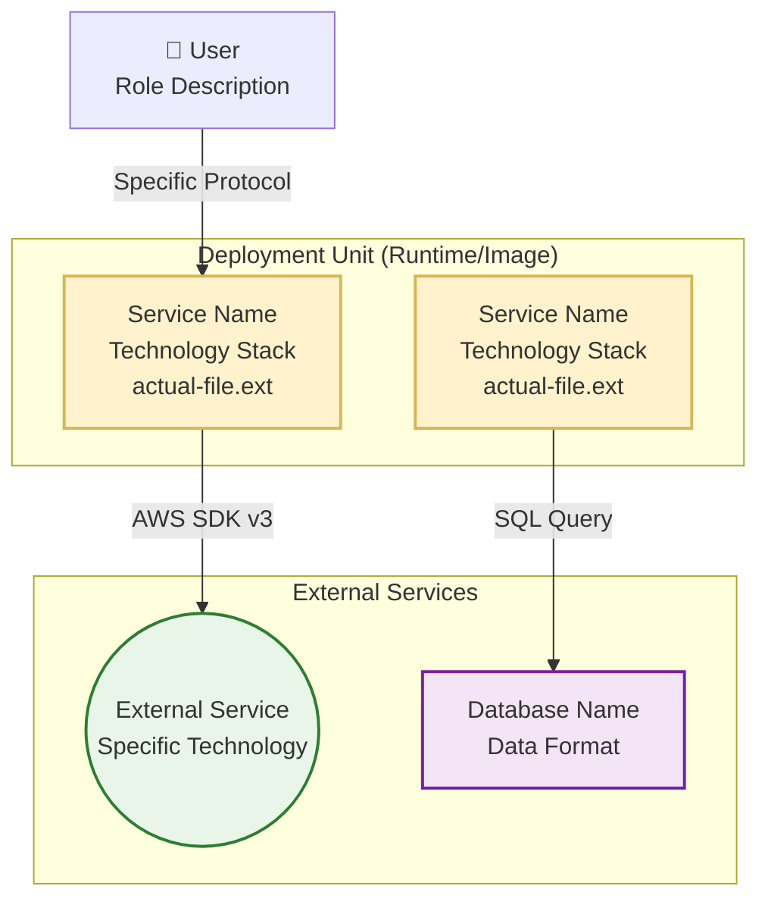

# Catalyst Architecture Brief

## Description

As part of this task, you will analyze a codebase and generate a comprehensive architecture brief document. This is an agentic process that creates a simple, easy-to-read big picture architecture brief that bridges the gap between technical implementation and business understanding, providing a single source of truth for architecture documentation.

**⚠️ CRITICAL: This workflow requires completing ALL steps (1-9) and ALL 3 validation rounds without exception. You may NOT skip steps or validation rounds. Each round validates from different perspectives and catches issues that single-pass reviews miss. Completing all validation rounds is MANDATORY.**

**IMPORTANT: This is a CODE ANALYSIS and DOCUMENTATION task**. This task involves:

1. Analyzing codebase structure, dependencies, and configurations
2. Identifying business context, problem statements, and integration points
3. Creating C4 architecture diagrams (System Context, Container, Sequence) following best practices
4. Documenting data models with ER diagrams
5. Documenting API endpoints organized by functional area
6. Validating technical accuracy through mandatory 3-round review process

**This task does NOT involve**:

1. Modifying or refactoring application code
2. Running or deploying the application
3. Making architectural changes to the system
4. Creating test files or test data
5. Implementing new features or fixing bugs
6. Installing dependencies or running builds

## Rialto Repository Baseline

When this prompt is used in the Rialto repository, treat these files as baseline
architecture sources that must be reviewed and reconciled:
- `docs/architecture-brief.md`
- `serverManager/architecture-brief.md`
- `logging/architecture.md`
- `serverManager/SME-notes.md`

Refinement rule:
- Update and extend the existing architecture narrative; do not discard verified
    module-specific facts from these files unless code evidence contradicts them.

## ⚠️ CRITICAL: READ-ONLY ANALYSIS AND DOCUMENTATION

**Your ONLY output is a comprehensive architecture brief document.**

This workflow is for **ANALYSIS AND DOCUMENTATION ONLY**. Your role is to:

1. **READ** and analyze existing code, configuration, and infrastructure files
2. **IDENTIFY** key architectural patterns, dependencies, and integrations
3. **CREATE** visual diagrams following C4 model and Mermaid best practices
4. **DOCUMENT** findings in a structured architecture brief (typically `docs/architecture-brief.md`)
5. **VALIDATE** accuracy through mandatory 3-round systematic review process

**You must NEVER**:

1. Edit, modify, or refactor any application code
2. Create or modify configuration files beyond the architecture brief document
3. Install dependencies or update package files
4. Run build commands, tests, or deployment scripts
5. Apply fixes or changes to the codebase
6. Skip any of the 9 steps or 3 validation rounds
7. Make ANY changes to the application itself

**All output must be in a single architecture brief document only.**

## Purpose & Audience

### Purpose

The architecture brief serves multiple critical purposes:

1. **Onboarding**: New developers can quickly understand the system architecture
2. **Knowledge Transfer**: Creates institutional knowledge independent of individual team members
3. **Decision Making**: Provides context for architectural and technical decisions
4. **Stakeholder Communication**: Bridges technical and business understanding
5. **Documentation**: Single source of truth that stays current with the codebase
6. **Time Savings**: Automatically generates what would take days or weeks to create manually

### Audience

The architecture brief you create will be used by:

- **Developers**: Need to understand system architecture for development and debugging
- **Product/Business**: Need to understand capabilities, limitations, and integration points
- **Operations/SRE**: Need deployment architecture, scaling characteristics, and dependencies
- **Security Teams**: Need to understand data flow, authentication, and external integrations
- **New Team Members**: Need comprehensive onboarding documentation
- **Future Maintainers**: Will work with and update the architecture brief

### Document Quality Standards

Your architecture brief must be:

- **Accurate**: All information verified against actual codebase
- **Complete**: No placeholders remaining, all sections filled
- **Visual**: Professional diagrams with proper syntax and styling
- **Specific**: Actual versions, filenames, protocols documented
- **Actionable**: Clear enough for developers to onboard and operators to deploy
- **Validated**: Passed all 3 validation rounds with documented improvements

## What the Architecture Brief Will Produce

The completed Architecture Brief document contains:

**WHAT & WHY:**
- Problem Statements and Business Contexts
- Primary Users and Use Cases
- Non-Functional Requirements
- Integration Points

**HOW:**
- C4 System Context Diagram (external interactions)
- C4 Container Diagram (internal architecture with deployment units)
- Critical User Journey Sequence Diagram
- Data Model ER Diagram
- Technology Stack (with specific versions)
- API Endpoints (organized by functional area)
- Deployment Architecture

**Key Benefits:**

- 🎯 Saves Time: Automatically generates comprehensive documentation
- 📊 Accurate & Current: Based on actual code analysis, not outdated docs
- 🎨 Visually Appealing: Professional diagrams with color coding and emojis
- 🏢 Business-Friendly: Understandable by non-technical stakeholders
- ✅ Self-Validating: Mandatory 3-round validation ensures quality

## Architecture Brief Template Structure

The architecture brief you create must include:

### Required Sections

1. **Table of Contents** - Include a table of contents for all markdown headings
2. **Overview** - Overview of the system on who uses this for what
3. **Problem Definitions & Business Context**
   - Problem Statement
   - Primary Users and Use Cases
   - Non Functional Requirements (availability, performance, security, scalability)
   - Integration Points with external systems
4. **C4 System Context Diagram** - Visually appealing system context using Mermaid graph TD format with color-coded categories, emojis, and descriptive connection labels
5. **System Overview**
   - C4 Container Diagram showing internal architecture with deployment units
   - Container diagram explanation with detailed component descriptions
   - Critical user journey sequence diagram (Request Flow Sequence)
6. **Technology Stack** - Runtime & Languages, Data Storage, Infrastructure, AI/ML Services (if applicable), Monitoring & Security - all with specific versions
7. **System Data Models** - ER diagram with comprehensive entity relationships, storage formats, and data flow explanation
8. **API Endpoints** - Complete API documentation organized by functional area (Public, Internal, Authentication, AI/ML, Data Processing)
9. **Deployment Architecture** - Container images, scaling units, network topology

## Steps

### 1. Analyze the Codebase Structure

First, explore the repository structure to understand the service architecture:

```bash
find . -type f -name "*.kt" -o -name "*.java" -o -name "*.py" -o -name "*.js" -o -name "*.ts" -o -name "*.go" | head -20
```

```bash
ls -la
```

Look for key files:
- Build files (`build.gradle.kts`, `pom.xml`, `package.json`, `requirements.txt`, `go.mod`)
- Configuration files (`application.conf`, `application.yml`, `config.json`)
- Docker files (`Dockerfile`, `docker-compose.yml`)
- Infrastructure files (`terraform/`, `k8s/`, `.github/workflows/`)

### 2. Copy the Architecture Brief Template

Copy the template to start your documentation:

```bash
cp docs/architecture-brief-template.md docs/architecture-brief.md
```

### 3. Gather Service Information

Collect the following information about your microservice:

#### Basic Service Information
- Service name and primary purpose
- Technology stack (language, framework, database)
- Target organization/team
- Primary users and use cases

#### Business Context
- Problems the service solves
- Business requirements and scale
- Integration points with other services

**⚠️ Integration Points Identification Guide:**

Only include systems with **actual programmatic integration**:
- ✅ API calls, database connections, message queue exchanges
- ✅ Direct network communication with protocols (HTTP, gRPC, TCP)
- ✅ Data exchange via files, streams, or shared storage
- ✅ Authentication/authorization service integrations

Do **NOT** include systems that are only:
- ❌ Mentioned in UI text, documentation, or conversation responses
- ❌ Recommended as external tools without API integration
- ❌ Referenced by URL links without programmatic connection
- ❌ Future planned integrations not yet implemented

#### Technical Architecture
- Core technologies and versions
- External service dependencies
- Database schema and data models
- API endpoints and operations

### 4. Fill in the Template Placeholders

Replace all placeholder values in the template with actual service information:

#### Replace Basic Information Placeholders:
- `[SERVICE_NAME]` - Actual service name
- `[TECHNOLOGY_STACK]` - e.g., "Kotlin-based", "Python Flask-based"
- `[PRIMARY_PURPOSE]` - Main business function
- `[TARGET_ORGANIZATION]` - Your organization name
- `[KEY_CAPABILITIES]` - Main features/capabilities

#### Replace Problem & Business Context:
- `[ORGANIZATION]` - Your organization
- `[PROBLEM_1-4]` - Specific problems addressed
- `[USER_GROUPS]` - Who uses the service
- `[USE_CASE_1-3]` - Primary use cases
- `[AVAILABILITY_REQUIREMENTS]` - SLA/availability needs
- `[EXTERNAL_SERVICE_1-2]` - External dependencies
- `[DOWNSTREAM_CONSUMERS]` - Services that consume this service

#### Replace Technical Details:
- `[PROGRAMMING_LANGUAGE]` and `[VERSION]` - e.g., "Kotlin 2.0.21"
- `[WEB_FRAMEWORK]` - e.g., "Http4k", "Spring Boot", "FastAPI"
- `[DATABASE_TYPE]` - e.g., "Apache Cassandra", "PostgreSQL"
- `[SERVER_IMPLEMENTATION]` - e.g., "Netty", "Tomcat", "Uvicorn"
- `[BUILD_TOOL]` - e.g., "Gradle", "Maven", "pip"

#### Replace Integration Details:
- `[EXTERNAL_SERVICE_1-2]` - Names of external services
- `[EXT_SERVICE_1-2_PURPOSE]` - What each service provides
- `[EXT_SERVICE_1-2_PROTOCOL]` - Communication protocol (HTTPS, gRPC, etc.)
- `[AUTH_SERVICE]` - Authentication service name
- `[DATABASE_NAME]` - Database instance name

### 5. Create System Diagrams

Follow the architecture diagram best practices to create visually appealing, deployment-accurate diagrams:

#### System Context Diagram (Enhanced Mermaid Graph TD)
- **Use Mermaid graph TD format** instead of C4Context for better visual appeal
- **Color-code by component type**: users (orange), core system (blue), external services (green)
- **Add relevant emojis/icons** to make components instantly recognizable
- **Group related services** in subgraphs with clear boundaries
- **Use descriptive connection labels** with real examples and specific protocols
- **Show actual user interactions** with example queries/actions

#### Container Diagram (Mermaid Graph TD)
- **Group by deployment units**, not logical layers
- Use `subgraph "Runtime/Technology (version)"` for actual deployment boundaries
- Include specific implementation details:
  - Actual filenames (`chat.ts`, `execute-sql.ts`)
  - Technology versions (`Node.js 18+`, `React 18`)
  - Data formats (`Parquet Format`, `JSON`)
- Use precise protocols (`HTTPS POST/GET`, `AWS SDK v3`, `OAuth 2.0/OIDC`)
- Apply consistent color coding

#### Sequence Diagram
- Include actual service names and filenames
- Show specific endpoints and request/response formats
- Use precise protocols and data formats

### 6. Document Data Models

Create the Entity Relationship diagram:
- Replace `[ENTITY_1-5]` with actual domain entities
- Update field names and data types
- Define actual relationships between entities
- Include database-specific entities

### 7. List API Endpoints

Document all REST endpoints:
- Replace `[HTTP_METHOD]` with actual methods (GET, POST, PUT, DELETE)
- Replace `[ENDPOINT_1-5]` with actual endpoint paths
- Provide clear descriptions of each endpoint's purpose

### 8. Validate Technical Accuracy and Diagram Syntax

Review the completed document using the comprehensive validation checklist:

#### Technical Accuracy:
- [ ] **Deployment Accuracy**: Does the diagram match actual container/process deployment?
- [ ] **Communication Reality**: Are the protocols and directions correct?
- [ ] **Scaling Representation**: Does it show what scales together vs. independently?
- [ ] **Technology Stack**: Are the actual technologies/versions referenced?
- [ ] **Implementation Details**: Are actual filenames, data formats included?
- [ ] **Visual Hierarchy**: Is color coding consistent and meaningful?
- [ ] **Protocol Specificity**: Are communication patterns precisely labeled?
- [ ] **Visual Clarity**: Can someone unfamiliar understand the architecture?
- [ ] **Operational Relevance**: Does it help with deployment, debugging, or scaling decisions?

#### Mermaid Syntax Validation:
- [ ] **Mermaid Syntax**: All diagrams render without errors in preview
- [ ] **Subgraph Identifiers**: Use camelCase identifiers (e.g., `StackApp` followed by optional display name `["Stack App"]`)
- [ ] **Node Labels**: Properly quoted with double quotes for multi-line content with emojis
- [ ] **Shape Consistency**: Standardized bracket notation for external systems `[("text")]`
- [ ] **Color Classes**: All `classDef` definitions match referenced node classes
- [ ] **Connection Labels**: No line breaks (`<br/>`) in edge labels - use spaces instead
- [ ] **Special Characters**: Proper escaping of `{}` and `[]` in labels
- [ ] **Preview Test**: Each diagram renders correctly in Mermaid live editor or IDE preview
- [ ] **Subgraph Structure**: Proper nesting and closure of all subgraph blocks

#### Quick Syntax Reference:
```mermaid
// ❌ WRONG - causes parse errors when using subgraph ID/name without square brackets
subgraph StackAnalyser "Stack Analyser System (Node.js 20.19.3)"
    CLI[Service]
end
A -->|HTTPS GET<br/>/v1/partners/{partnerId}/whoami| B

// ✅ CORRECT - clean syntax
subgraph StackAnalyser ["Stack Analyser System (Node.js 20.19.3)"]
    CLI[Service]
end
A -->|HTTPS GET /v1/partners/ID/whoami| B
```

### 9. Review and Refine

Perform a final review:
- Ensure all placeholders are replaced
- Verify diagram accuracy
- Check for consistency across sections
- Validate external service references
- Confirm data model accuracy

## Architecture Diagram Best Practices

### 1. Analyze Actual Deployment Architecture

Before creating diagrams, understand the real deployment model:
- **Container Images**: Identify how many actual container images are used
- **Process Grouping**: Understand which components run in the same process/container
- **Network Boundaries**: Map actual network communication patterns
- **Scaling Units**: Identify what scales together vs. independently

### 2. Choose Appropriate Diagram Type

**Use C4 Model for high-level views:**
- System Context: External interactions
- Container: Deployment units and technology choices

**Use Graph/Flowchart for detailed technical flows:**
- Internal component relationships
- Communication protocols
- Data flow patterns

### 3. Group Components by Deployment Reality

**Group by actual deployment units:**
```mermaid
subgraph "Web Nodes (image:tag)"
    Component1
    Component2
end

subgraph "Worker Nodes (image:tag)"
    Component3
    Component4
end
```

**Not by logical separation:**
```mermaid
subgraph "Web Layer"
    WebUI
end
subgraph "API Layer"  
    API
end
```

### 4. Show Real Communication Patterns

**Be specific about protocols:**
- `SSH Tunnel` instead of generic "communicates"
- `HTTP/HTTPS REST API` instead of "API calls"
- `gRPC` vs `HTTP` vs `TCP`

**Show direction and purpose:**
- `Worker1 <-->|SSH Tunnel| TSA` (bidirectional)
- `API -->|Read/Write| Database` (unidirectional)

### 5. Use Consistent Visual Hierarchy

**Color coding by type:**
```mermaid
classDef component fill:#e1f5fe,stroke:#0277bd,stroke-width:2px;
classDef database fill:#f3e5f5,stroke:#7b1fa2,stroke-width:2px;
classDef external fill:#e8f5e8,stroke:#2e7d32,stroke-width:2px;
classDef user fill:#fff3e0,stroke:#ef6c00,stroke-width:2px;
```

**Shape conventions:**
- `[(Database)]` for databases
- `[Component]` for services
- `((External))` for external systems

### 6. Include Deployment Context

**Show container/runtime/technology in subgraph titles:**

**Include actual implementation details:**
```mermaid
subgraph "Web Nodes (concourse/concourse:local)"
```

**Show data formats and protocols:**
```mermaid
Worker1[Worker 1 + Baggageclaim]
Worker2[Worker 2 + Baggageclaim]  
WorkerN[Worker N + Baggageclaim]
```

### 7. Validation Checklist

Before finalizing diagrams, verify:

- [ ] **Deployment Accuracy**: Does the diagram match actual container/process deployment?
- [ ] **Communication Reality**: Are the protocols and directions correct?
- [ ] **Scaling Representation**: Does it show what scales together vs. independently?
- [ ] **Technology Stack**: Are the actual technologies/versions referenced?
- [ ] **Implementation Details**: Are actual filenames, data formats included?
- [ ] **Visual Hierarchy**: Is color coding consistent and meaningful?
- [ ] **Visual Clarity**: Can someone unfamiliar understand the architecture?
- [ ] **Operational Relevance**: Does it help with deployment, debugging, or scaling decisions?

### 8. Common Anti-Patterns to Avoid

**❌ Logical vs. Physical Confusion:**
```mermaid
// ❌ WRONG - causes parse errors when using subgraph ID/name without square brackets
subgraph StackAnalyser "Stack Analyser System (Node.js 20.19.3)"
    CLI[Service]
end
A -->|HTTPS GET<br/>/v1/partners/{partnerId}/whoami| B

// ❌ WRONG - parentheses in node labels cause parse errors
Service[Database Server<br/>hostname:5432 (primary)<br/>hostname:5433 (replica)]

// ✅ CORRECT - clean syntax
subgraph StackAnalyser ["Stack Analyser System (Node.js 20.19.3)"]
    CLI[Service]
end
A -->|HTTPS GET /v1/partners/ID/whoami| B

// ✅ CORRECT - avoid parentheses in node labels
Service[Database Server<br/>hostname:5432 primary<br/>hostname:5433 replica]
```

**❌ Generic Relationships:**
```mermaid
A --> B
```

**✅ Specific Protocols:**
```mermaid
A -->|gRPC/TLS| B
```

**❌ Missing External Context:**
```mermaid
API --> Database
```

**✅ Complete Picture:**
```mermaid
User -->|HTTPS| API
API -->|PostgreSQL| Database
API -->|OAuth| AuthProvider
```

### 9. Tools and Syntax

**Prefer Mermaid graph TD for container/technical diagrams:**
- Better control over layout and visual hierarchy
- Superior subgraph support for deployment boundaries
- More flexible styling with classDef
- Can include actual filenames and implementation details
- Better representation of scaling units

**Use C4 syntax for system context diagrams:**
- Standardized notation for high-level business view
- Clear stakeholder communication
- Good for external system relationships

**Container Diagram Best Practice Example:**


### 10. Mermaid Syntax Best Practices

**Critical Syntax Rules to Avoid Parse Errors:**

**❌ Avoid Parentheses in Node Labels:**
```mermaid
// WRONG - causes parse errors
Service[Database<br/>host:5432 (primary)]
Engine[TTS Engine<br/>v1.0 (deprecated)]

// CORRECT - use alternative formatting
Service[Database<br/>host:5432 primary]
Engine[TTS Engine<br/>v1.0 deprecated]
```

**❌ Avoid Curly Braces in Edge Labels:**
```mermaid
// WRONG - causes parse errors
A -->|GET /api/{id}/data| B

// CORRECT - use placeholder format
A -->|GET /api/ID/data| B
```

**✅ Safe Characters in Labels:**
- Use spaces, hyphens, underscores, colons
- Use `v1`, `v2` instead of `(v1)`, `(v2)`
- Use `primary`, `secondary` instead of `(primary)`, `(secondary)`
- Use `ID` or `param` instead of `{id}` or `{param}`

**✅ Subgraph Naming:**
```mermaid
// CORRECT - always use square brackets for display names
subgraph ServiceGroup ["Service Group (Docker Swarm)"]
    Service1[Service]
end
```

### 11. Iterative Improvement

1. **Start with deployment reality** (containers, processes)
2. **Add communication patterns** (protocols, directions)
3. **Include external dependencies** (databases, APIs, services)
4. **Apply consistent styling** (colors, shapes, labels)
5. **Validate Mermaid syntax** (test in preview before finalizing)
6. **Validate with team** (accuracy, clarity, usefulness)

## Quality Assurance: Multi-Round Validation Process

**⚠️ CRITICAL: ALL THREE VALIDATION ROUNDS ARE MANDATORY. You MUST complete each round and document improvements before proceeding to the next. This is NOT optional.**

The architecture brief MUST go through 3 validation rounds. After completing Steps 1-8, you will execute this 3-round validation process:

### Validation Round 1: Gap Analysis & Completeness

**Objective:** Identify missing elements, vague descriptions, and incomplete sections.

**Process:**
1. Re-read the entire architecture brief from start to finish
2. Check every section against the validation points below
3. Document ALL gaps found in a "Round 1 Findings" section
4. Fix ALL identified gaps before proceeding to Round 2
5. Update architecture brief with fixes

**Validation Points:**

**Completeness Check:**
- [ ] All placeholders replaced with actual values (no `[PLACEHOLDER]` text remains)
- [ ] Technology versions specified throughout (e.g., "PostgreSQL 15", not just "PostgreSQL")
- [ ] All external integrations documented with protocols
- [ ] Database schema complete with field types
- [ ] API documentation comprehensive with all endpoints

**Specificity Check:**
- [ ] No generic terms like "the database" - specify PostgreSQL 15, MongoDB 6.0, etc.
- [ ] No vague protocols - specify HTTPS REST, gRPC/TLS, WebSocket, etc.
- [ ] No generic "file storage" - specify AWS S3, Azure Blob Storage, etc.
- [ ] Actual filenames included where relevant (chat.ts, worker.py, etc.)
- [ ] Deployment units clearly identified with container images or runtime info

**Diagram Validation:**
- [ ] All Mermaid diagrams render without errors in preview
- [ ] Subgraph syntax correct with square brackets: `subgraph ID ["Display Name"]`
- [ ] No line breaks (`<br/>`) in connection labels - use spaces instead
- [ ] No parentheses in node labels causing parse errors
- [ ] Color coding consistent across all diagrams
- [ ] All classDef definitions match referenced node classes

**Missing Information:**
- [ ] Deployment architecture documented (containers, scaling, networking)
- [ ] Scaling approach explained (what scales together vs. independently)
- [ ] Monitoring and observability mentioned
- [ ] Security and authentication comprehensive
- [ ] Error handling and resilience patterns documented

**Actions:** 
- Document all gaps found in "Round 1 Validation Findings" section at end of brief
- Fix ALL gaps before proceeding to Round 2
- Update "Last Updated" timestamp in document

### Validation Round 2: Adversarial Challenge (Critical Review)

**Objective:** Challenge architecture decisions, identify logical flaws, and verify technical accuracy.

**Process:**
1. Take an adversarial stance - actively look for mistakes and inconsistencies
2. Challenge every major architectural decision
3. Verify all integration points exist in codebase
4. Cross-check diagrams against actual deployment
5. Document ALL challenges in a "Round 2 Findings" section
6. Address ALL challenges with evidence or corrections
7. Update architecture brief with fixes

**Challenge Points:**

**Architecture Decisions:**
- Why this technology stack over alternatives? Is it justified?
- Are all dependencies truly necessary or could some be eliminated?
- Is the scaling approach appropriate for documented load requirements?
- Are there single points of failure not addressed?
- Does the deployment architecture match what's documented?

**Integration Patterns:**
- Are ALL integration points correctly identified and verified in code?
- Any false positives (UI-only references incorrectly listed as integrations)?
- Are authentication flows actually secure as described?
- Is data flow efficient or are there bottlenecks?
- Do the protocols match what's actually implemented?

**Data Model Accuracy:**
- Are entity relationships correct according to actual schema?
- Any missing foreign keys or indexes?
- Is data normalization appropriate and correctly documented?
- Do field types match actual database schema?
- Are vector/embedding fields documented if using AI/ML?

**API Design Verification:**
- Are ALL endpoints documented (check codebase for missing routes)?
- Are HTTP methods correct for each endpoint?
- Are authentication requirements accurate?
- Is the distinction between public/internal/admin APIs correct?
- Do request/response formats match actual implementations?

**Deployment Reality Check:**
- Do diagrams match ACTUAL deployment (not theoretical)?
- Are container groupings accurate (what runs together)?
- Are network boundaries correct?
- Are scaling units properly identified?
- Does the technology stack match actual versions in production?

**Actions:**
- Document all challenges and their resolutions in "Round 2 Validation Findings"
- Address challenges with evidence from codebase or make corrections
- Update architecture brief with all fixes
- Update "Last Updated" timestamp

### Validation Round 3: Stakeholder Readiness & Final Polish

**Objective:** Ensure the document is understandable, actionable, and ready for all audiences.

**Process:**
1. Read the brief from each stakeholder perspective (Developer, Product, Ops, Security)
2. Verify the document serves each audience's needs
3. Check professional presentation and polish
4. Document final improvements in "Round 3 Findings" section
5. Apply final polish and corrections
6. Create final validation summary

**Audience-Specific Checks:**

**For Developers:**
- [ ] Technical details accurate and complete enough to onboard new developers
- [ ] Onboarding information clear (where to start, how to run locally)
- [ ] Architecture patterns explained with examples
- [ ] Code organization mappable to diagrams (filenames, module structure)
- [ ] Development workflows documented (build, test, deploy)

**For Product/Business:**
- [ ] Business context clearly articulated in non-technical language
- [ ] Problem statements resonate with business objectives
- [ ] Use cases well-defined and understandable
- [ ] Integration points explained in business terms (what they enable)
- [ ] Capabilities and limitations clearly stated

**For Operations/SRE:**
- [ ] Deployment architecture clear and complete
- [ ] Scaling characteristics documented (vertical vs horizontal, limits)
- [ ] Dependencies and external services listed with connection details
- [ ] Monitoring and observability hooks mentioned
- [ ] Failure modes and resilience patterns documented

**For Security:**
- [ ] Authentication and authorization mechanisms clear
- [ ] Data flow and storage documented (what data goes where)
- [ ] External integrations identified with protocols
- [ ] Security boundaries shown clearly in diagrams
- [ ] Sensitive data handling explained

**Professional Presentation:**
- [ ] Table of contents generated and accurate
- [ ] All internal links working (no broken references)
- [ ] Consistent terminology throughout (not switching between names)
- [ ] Professional tone and clear language
- [ ] No spelling or grammar errors
- [ ] Diagrams visually appealing with consistent styling
- [ ] Proper markdown formatting (headings, lists, code blocks)

**Actions:**
- Document final improvements in "Round 3 Validation Findings"
- Apply all final polish and corrections
- Create "Validation Summary" section documenting:
  - Total issues found in Round 1 and resolution summary
  - Total challenges addressed in Round 2 and key improvements
  - Final refinements from Round 3
  - Confirmation all 3 rounds completed
- Update "Last Updated" timestamp
- Mark document as "Validation: Complete ✅"

### Validation Completion Requirements

**The architecture brief is NOT complete until:**

1. ✅ All 3 validation rounds executed and documented
2. ✅ "Round 1 Validation Findings" section exists with gap analysis
3. ✅ "Round 2 Validation Findings" section exists with adversarial review
4. ✅ "Round 3 Validation Findings" section exists with stakeholder readiness
5. ✅ "Validation Summary" section exists documenting all improvements
6. ✅ All identified issues from all rounds have been addressed
7. ✅ Document marked as "Validation: Complete ✅"
8. ✅ Final "Last Updated" timestamp reflects completion

**If any validation round is skipped or incomplete, the entire architecture brief is considered invalid and must be restarted.**

## Tips for Success

- **Be Specific**: Use actual names, versions, and configurations rather than generic terms
- **Create Visually Appealing Diagrams**: Use color coding, icons, and logical grouping for better readability
- **Show Real Examples**: Include actual user queries, filenames, and data formats in diagrams
- **Document AI/ML Patterns**: For AI-powered systems, document vector search, embeddings, and LLM integration patterns
- **Distinguish API Types**: Clearly separate public user-facing APIs from internal system APIs
- **Include Operational Details**: Document monitoring, security, and access control patterns early
- **Validate with Team**: Have other team members review for accuracy and completeness

## Common Pitfalls to Avoid

- Leaving placeholder text in the final document
- Using outdated technology versions
- Missing critical external dependencies
- Incomplete or inaccurate data models
- Generic descriptions that don't reflect actual implementation
- **Poor diagram aesthetics**: Using basic C4Context instead of enhanced Mermaid visualizations
- **Missing AI/ML considerations**: Not documenting vector search, embeddings, or LLM integration patterns
- **Logical vs. physical confusion**: Grouping by business logic instead of actual deployment units
- **Generic API documentation**: Not distinguishing between public and internal endpoints
- **Skipping validation rounds**: Attempting to complete without all 3 validation rounds
- **Rushing through validation**: Not thoroughly checking all validation points
- **Not documenting findings**: Skipping validation findings sections

## Completion

Upon completing all 9 steps and 3 mandatory validation rounds, you will have:

1. ✅ A comprehensive architecture brief document in `docs/architecture-brief.md` (or similar location)
2. ✅ Multiple C4 diagrams showing different architectural views (System Context, Container, Sequence)
3. ✅ Complete API documentation organized by functional area
4. ✅ Detailed data models with ER diagrams
5. ✅ Three validation findings sections documenting improvements from each round
6. ✅ A validation summary section showing the quality assurance process
7. ✅ Document marked as "Validation: Complete ✅"
8. ✅ A document ready to share with all stakeholders

**CRITICAL COMPLETION CHECKLIST:**

Before marking this task complete, verify:

- [ ] ALL 9 steps completed (no steps skipped)
- [ ] ALL 3 validation rounds completed (no rounds skipped)
- [ ] "Round 1 Validation Findings" section exists in document
- [ ] "Round 2 Validation Findings" section exists in document
- [ ] "Round 3 Validation Findings" section exists in document
- [ ] "Validation Summary" section exists documenting all improvements
- [ ] All placeholders removed from document
- [ ] All diagrams render without errors
- [ ] All integration points verified in codebase
- [ ] Technology versions specified throughout
- [ ] Document marked as "Validation: Complete ✅"
- [ ] Final "Last Updated" timestamp present

**IF ANY ITEM ABOVE IS NOT CHECKED, THE TASK IS INCOMPLETE.**

The architecture brief serves as the single source of truth for the service's architecture and should be maintained alongside the codebase.
