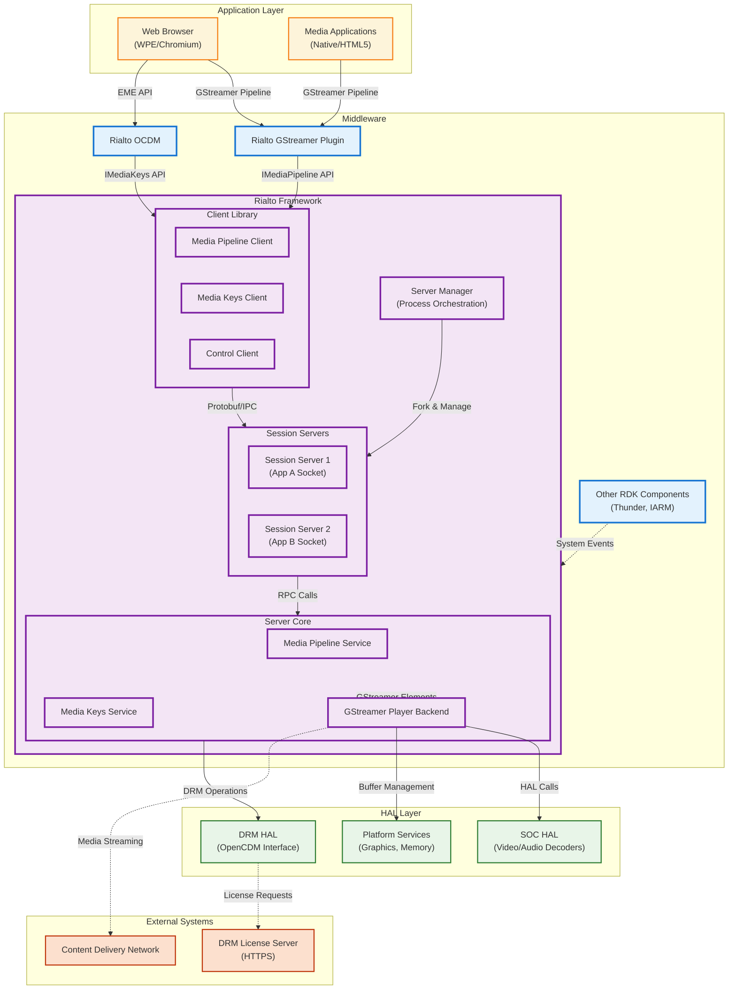
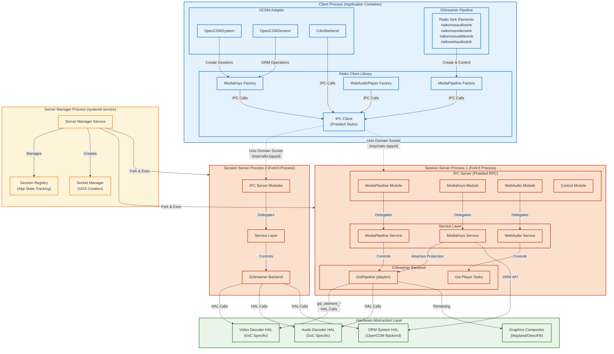
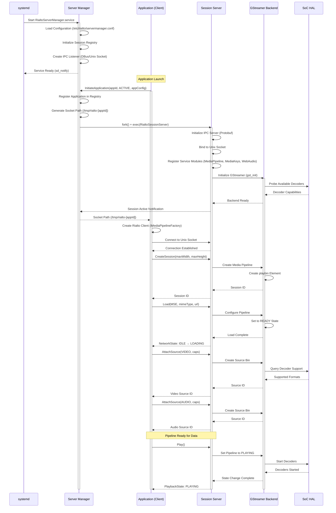
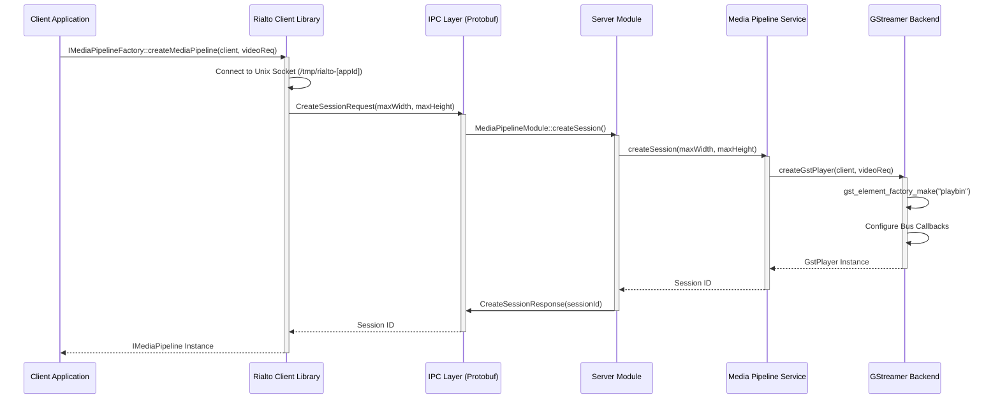
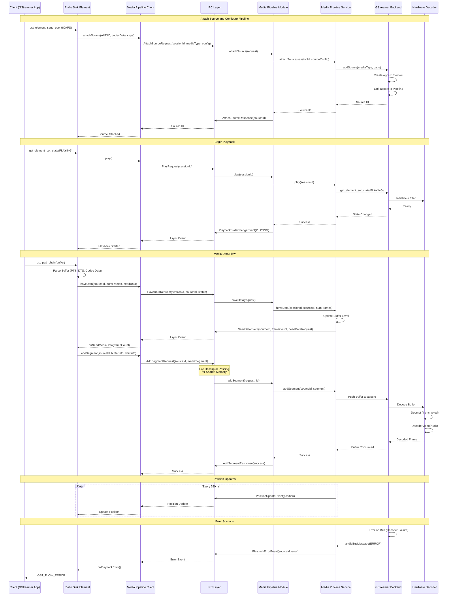
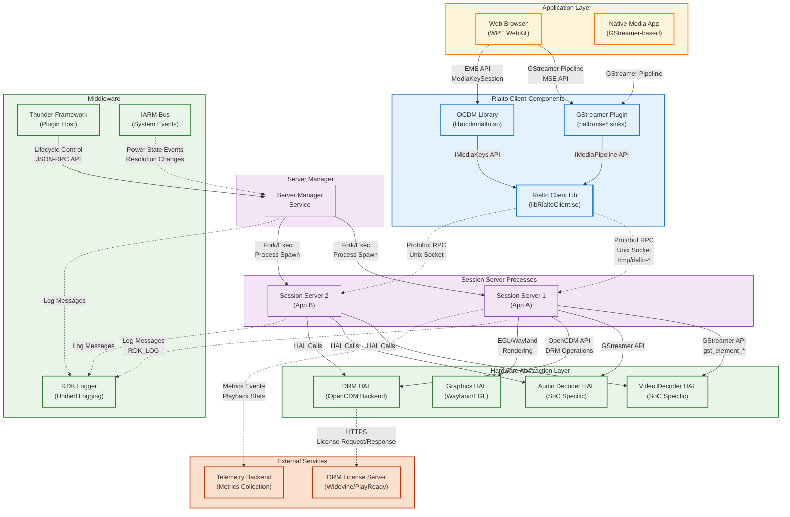
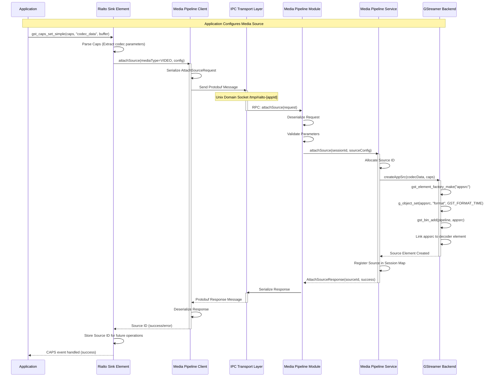
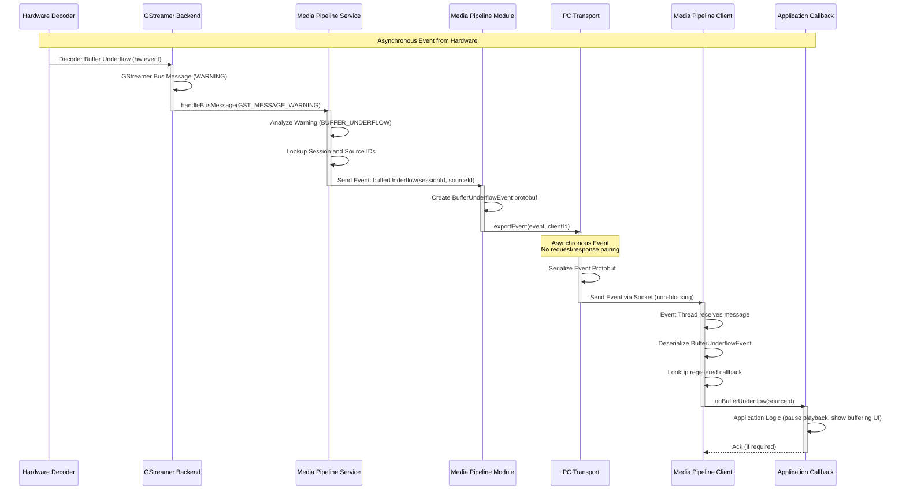

# Rialto Media Framework Documentation

Rialto is a modular media framework for RDK Entertainment  platforms that provides an out-of-process media playback solution with a client-server architecture. The framework separates media processing into dedicated server processes, enabling better resource management, security isolation, and system stability for video devices.

Rialto consists of three main components:

**Rialto Core** - The main framework providing client-server IPC infrastructure, media pipeline services, and server management capabilities. This component forms the backbone of the architecture, managing multiple session servers, coordinating resource allocation, and providing the fundamental APIs for media playback and DRM operations.

**Rialto GStreamer Plugin** - Integration layer that bridges GStreamer-based applications with the Rialto media server. This plugin provides custom GStreamer sink elements (rialtomseaudiosink, rialtomsevideosink, rialtomsesubtitlesink, rialtowebaudiosink) for GStreamer pipelines in web browsers and native applications.

**Rialto OCDM** - OpenCDM (Content Decryption Module) adapter enabling DRM functionality through the Rialto framework. This component implements the standard OpenCDM interface expected by EME (Encrypted Media Extensions) implementations, routing all DRM operations through Rialto's MediaKeys service for centralized license management and secure content decryption.

Rialto enables multiple applications to share hardware media decoders efficiently while maintaining process isolation. The Server Manager orchestrates multiple RialtoSessionServer instances, each dedicated to a specific application, with each session assigned a unique Unix domain socket for IPC communication. The design provides scalability, fault isolation, and resource utilization across the middleware stack. Media processing isolation prevents application crashes from affecting media playback, and system resources are managed based on application priority and state.

**Rialto Framework**

The following diagram shows the Rialto media framework architecture, illustrating the relationships between client applications, the Rialto framework components, and the hardware abstraction layers.


This diagram shows the complete Rialto architecture including:

 - Client applications (Web Browser, Native Apps) using GStreamer pipelines
 - Rialto GStreamer sink elements integration
 - Rialto Client Library (IMediaPipeline, IMediaKeys APIs)
 - Server Manager orchestrating Session Servers
 - Session Server processes with IPC, Service Layer, and GStreamer Backend
 - HAL layer integration (Video/Audio Decoders, DRM, Graphics)
 - External services (DRM License Servers, CDN)



**Key Features & Responsibilities**: 

- **Out-of-Process Media Playback**: Isolates media processing in dedicated server processes, preventing application crashes from affecting media playback and improving system stability and security. Each session server runs independently, providing fault isolation so that issues in one application's media pipeline do not impact others.

- **Multi-Session Management**: Server Manager orchestrates multiple RialtoSessionServer instances, each serving a specific application with dedicated Unix domain sockets for IPC. Supports configurable session limits, application state tracking (ACTIVE/INACTIVE/NOT_RUNNING), and dynamic resource allocation based on priority.

- **GStreamer Integration**: Provides custom GStreamer sink elements (rialtomsevideosink, rialtomseaudiosink, rialtomsesubtitlesink, rialtowebaudiosink) for GStreamer-based applications. Implements Media Source Extensions (MSE) data flow model with pull and push mode support for buffer management.

- **DRM Support**: OpenCDM adapter (rialto-ocdm) supports encrypted content playback with multiple DRM systems (Widevine, PlayReady, ClearKey) through the EME (Encrypted Media Extensions) API. Provides DRM session management with hardware-backed decryption and secure key storage.

- **Protobuf-based IPC**: Communication using Protocol Buffers over Unix domain sockets, supporting RPC calls, asynchronous events, and file descriptor passing for zero-copy buffer sharing. Strongly-typed message definitions provide protocol compatibility across versions.

- **Media Pipeline Services**: APIs for media source attachment, playback control (play/pause/seek/stop), rendering, volume control, and playback state management. Supports multiple simultaneous audio and video sources with synchronization and timing control.

- **WebAudio Support**: Dedicated WebAudio player service for low-latency audio rendering required by Web Audio API implementations. Optimized for interactive audio applications with precise timing control and minimal buffering delays.

- **Resource Optimization**: Efficient hardware decoder sharing across applications with configurable session limits and application state management. ACTIVE applications receive hardware resources, while INACTIVE applications release decoders but maintain pipeline state for rapid resume.

## Design

Rialto implements a client-server architecture that separates media processing from application logic. The design is built on three principles: process isolation for fault tolerance, protocol-based IPC for language-agnostic communication, and hardware resource abstraction for platform portability.

The framework operates in three distinct layers. 
- At the top, client libraries (embedded in applications through GStreamer plugins or OCDM adapters) provide standard media APIs that applications already understand. 
- In the middle, the Server Manager acts as a process orchestrator, spawning and managing RialtoSessionServer instances based on application lifecycle and resource availability. 
- At the bottom, each session server contains the actual media processing logic built on GStreamer, interfacing with platform-specific HAL implementations for hardware acceleration.

The IPC mechanism is central to Rialto's design. Unlike traditional shared-memory approaches, Rialto uses Protocol Buffers serialized over Unix domain sockets for strong type safety, version compatibility, and clear interface definitions. Protobuf definitions in the `/proto` directory define all service interfaces: MediaPipelineModule for A/V playback, MediaKeysModule for DRM, WebAudioPlayerModule for audio rendering, and ServerManagerModule for lifecycle management. This approach provides language-agnostic communication, automatic serialization/deserialization, and the ability to pass file descriptors for zero-copy buffer sharing.

Data persistence and state management are handled at multiple levels. The Server Manager maintains application registration and socket assignments, storing the mapping between application IDs and their corresponding session server processes. Each session server tracks media pipeline state, buffering levels, playback position, and attached sources. DRM session data is persisted through the OpenCDM backend, interfacing with secure storage provided by the DRM HAL for license caching and key material protection. Configuration is primarily file-based, with session parameters passed during initialization and runtime adjustments made through the IPC control interface.

The north-bound interface exposes standard GStreamer and OpenCDM APIs, allowing applications to use familiar media frameworks without modification. Web browsers can use EME APIs for DRM and MSE APIs for adaptive streaming, while native applications interact through standard GStreamer pipelines. The south-bound interface abstracts hardware through GStreamer element plugins and HAL function calls, enabling portability across different SoC platforms. The layered design keeps applications platform-agnostic while the server implementation can be optimized for specific hardware capabilities like hardware decoders, secure video path, and trusted execution environments.

IPC integration uses a non-blocking event-driven model. Client requests are serialized to protobuf format and transmitted over Unix domain sockets to the session server. The server's IPC dispatcher thread receives messages, deserializes them, and invokes the appropriate service layer method. Responses follow the reverse path. Asynchronous events (playback state changes, buffer notifications, errors) are pushed from server to client without requiring a request, enabling real-time status updates. File descriptor passing allows shared memory regions to be efficiently transferred between processes for media buffer data without copying.

### Component Architecture



**Threading Model** 

Rialto employs a multi-threaded design optimized for IPC handling, media processing, and event dispatching. The threading architecture varies between client and server components to match their respective responsibilities.

- **Threading Architecture**: Multi-threaded with event-driven I/O model using epoll/poll for socket monitoring and GLib main loop for GStreamer event processing

- **Client Library Threads**:
  - **Main Application Thread**: Hosts the GStreamer pipeline and processes application callbacks. Public API calls (play, pause, attachSource) are invoked from this thread and marshalled to the IPC layer
  - **IPC Event Thread**: Dedicated thread created by EventThread class for monitoring Unix domain socket events using poll/epoll. Dispatches incoming protobuf messages and events from the server to registered callbacks
  - **Timer Thread**: Handles timeout operations for IPC request/response cycles and retry logic. Implements exponential backoff for connection attempts

- **Server Manager Threads**:
  - **Main Service Thread**: Processes application registration requests via DBus or Unix socket, manages session server lifecycle (fork/exec), and maintains the session registry with application state
  - **IPC Listener Thread**: Monitors incoming control connections from RDK components requesting session server operations (initiateApplication, changeSessionServerState)
  - **Health Monitor Thread**: Periodically checks session server process health via waitpid and socket connectivity

- **Session Server Threads**:
  - **IPC Dispatcher Thread**: Processes incoming RPC calls from clients, deserializes protobuf messages, and invokes service layer methods. Handles concurrent requests from multiple clients (though typically one client per session)
  - **GStreamer Main Loop Thread**: Runs the GStreamer pipeline event loop (g_main_loop), handling bus messages, state changes, and buffer flow events
  - **Media Worker Threads**: GStreamer internally creates decoder threads, demuxer threads, and rendering threads based on pipeline configuration and platform capabilities
  - **Event Notification Thread**: Sends asynchronous events (playback state changes, buffer underflow, position updates) to connected clients without blocking media processing

- **Synchronization**: 
  - Mutex-based locking protects shared state (session registry, pipeline objects, client connection map) using std::mutex
  - Condition variables coordinate thread startup/shutdown sequences and blocking operations
  - Atomic operations for reference counting in shared_ptr usage across thread boundaries
  - Lock-free queues for high-throughput event dispatching between IPC and service layers to minimize contention

### Prerequisites and Dependencies

**RDK Platform and Integration Requirements**

- **RDK Components**: 
  - Thunder/WPEFramework (for plugin integration and service management via JSON-RPC)
  - OCDM (OpenCDM interface for DRM system integration)
  - RDK Logger (optional, for unified logging across RDK components)
  - IARM Bus (for system-wide event notifications)

- **HAL Dependencies**: 
  - SoC-specific video/audio decoder HAL implementation (platform-dependent GStreamer plugins)
  - OpenCDM DRM system implementation for the target platform (Widevine, PlayReady, or ClearKey)
  - Graphics compositor HAL (Wayland or DirectFB) for video frame presentation
  - Shared memory support in kernel (CONFIG_SYSVIPC, /dev/shm mounted)

- **Configuration Files**: 
  - `/etc/rialto/servermanager.conf` - Server Manager configuration (JSON format)
  - `/etc/rialto/logging.conf` - Logging levels and output configuration (optional)
  - `/opt/drm/` or platform-specific secure storage for DRM licenses


### Component State Flow

**Initialization to Active State**

The Rialto framework follows a multi-stage initialization process coordinated between the Server Manager, Session Servers, and client applications. The lifecycle begins with system boot and progresses through application registration, session establishment, and media pipeline activation.



**Runtime State Changes and Context Switching**

Rialto session servers transition between multiple states in response to system resource pressure, application lifecycle events, and media pipeline conditions. The Server Manager coordinates these transitions to optimize hardware decoder utilization across concurrent applications.

### MSE Player Session Streaming State Machine

The Rialto Client MSE (Media Source Extensions) Player implements a sophisticated state machine to manage the complete lifecycle of media playback sessions. This state machine coordinates buffer management, playback control, and pipeline state transitions.


This diagram illustrates:
 - **Initial States**: UNKNOWN → IDLE states during session creation
 - **Loading States**: Transition from IDLE to LOADING when media source is configured
 - **Buffer Management States**: BUFFERING states when data is being accumulated
 - **Active Playback States**: PLAYING, PAUSED states during normal operation
 - **Seeking States**: FLUSHING and SEEKING states during position changes
 - **End States**: END_OF_STREAM when playback completes, FAILURE on errors
 - **State Transitions**: Arrows showing valid state transitions triggered by:
   - Client API calls (load, play, pause, seek, stop)
   - Buffer level events (underflow, sufficient data)
   - Pipeline events (EOS, errors, state changes)
   - Network events (data availability, connection issues)

 The state machine ensures that:
 - Invalid state transitions are rejected
 - Resources are properly allocated/deallocated at each state
 - Synchronization between client and server state is maintained
 - Error conditions trigger appropriate recovery or cleanup actions

 Key states include:
 - **IDLE**: Initial state after session creation, no media loaded
 - **LOADING**: Media source is being configured and initial metadata loaded
 - **BUFFERING**: Accumulating sufficient data before playback (initial or mid-stream)
 - **PLAYING**: Active playback with data flowing through pipeline
 - **PAUSED**: Playback suspended, pipeline ready to resume
 - **SEEKING**: Pipeline flushing and repositioning to new playback position
 - **END_OF_STREAM**: All media data played, pipeline at end
 - **FAILURE**: Fatal error occurred, session requires cleanup and restart

**State Change Triggers:**

- **Application Backgrounding**: When an application moves to background (user switches apps or minimizes browser), the Server Manager sends `ChangeSessionServerState(appId, INACTIVE)`, causing the session server to release hardware decoder resources while maintaining pipeline state and buffered data in memory for rapid resume
- **Resource Contention**: If hardware decoder limits are reached and a foreground application requires resources, the Server Manager preempts lower-priority sessions, transitioning them to INACTIVE state and reallocating decoders to higher-priority applications
- **Network Buffering**: Media pipeline detects buffer underflow (< 2 seconds of playback data available), triggering `BufferUnderflow` event to the client and transitioning internal state to buffering mode until sufficient data is received
- **Pipeline Errors**: Fatal GStreamer errors (decoder hardware failure, unsupported codec format, memory allocation failure) trigger automatic pipeline teardown, error notification to the client via `PlaybackErrorEvent`, and session cleanup
- **Graceful Shutdown**: Application termination or explicit `DestroySession` call triggers orderly pipeline destruction, hardware decoder release, DRM session cleanup, socket closure, and process termination

**Context Switching Scenarios:**

- **ACTIVE ↔ INACTIVE Transitions**: When switching to INACTIVE state, the session server detaches hardware decoders using GStreamer state transitions (PLAYING → PAUSED → READY) but maintains pipeline structure, source attachments, and buffered media data. Reactivation (INACTIVE → ACTIVE) reattaches decoders via READY → PAUSED → PLAYING transitions and resumes playback from the last known position without re-initialization overhead
- **Session Server Restart**: If a session server crashes (segmentation fault, uncaught exception), the Server Manager detects process termination via SIGCHLD signal, cleans up the Unix socket, and can optionally respawn a new session server instance based on configuration policy
- **DRM Session Migration**: During INACTIVE state, DRM sessions remain valid in the OpenCDM backend but license refresh operations are suspended to save bandwidth. Upon ACTIVE transition, license validity is revalidated, expired licenses are renewed, and playback resumes with updated keys
- **Configuration Updates**: Runtime logging level changes propagate from Server Manager to all active session servers via Control module IPC messages without requiring process restart, enabling dynamic debugging

### Call Flow

**Initialization Call Flow:**



**Request Processing Call Flow:**

Media data transfer and playback control sequence demonstrating the MSE (Media Source Extensions) use case where the client application feeds encrypted media data to the server for decryption and rendering.



## Internal Modules

Rialto's architecture is organized into functionally distinct modules that handle specific aspects of media processing, IPC communication, and system integration. Each module encapsulates related functionality and exposes well-defined interfaces for inter-module communication.

**Core Framework Modules:**

| Module/Class | Description | Key Files |
|-------------|------------|-----------|
| **IPC Client** | Implements client-side protobuf RPC communication over Unix domain sockets. Manages connection lifecycle (connect, reconnect, disconnect), message serialization/deserialization using protobuf-generated stubs, and asynchronous event handling via event thread. Supports file descriptor passing for shared memory buffers using SCM_RIGHTS ancillary data. | `ipc/client/source/IpcClient.cpp`<br/>`ipc/client/include/IIpcClient.h`<br/>`ipc/common/proto/rialtoipc.proto` |
| **IPC Server** | Server-side IPC infrastructure that listens on Unix sockets (stream-oriented, SOCK_STREAM), manages client connections with per-client state tracking, dispatches RPC calls to registered service modules based on protobuf service definitions, and sends asynchronous events to connected clients. Handles concurrent client connections using epoll/poll multiplexing. | `ipc/server/source/IpcServerImpl.cpp`<br/>`ipc/server/include/IIpcServer.h`<br/>`ipc/server/source/IpcClientImpl.cpp` |
| **Media Pipeline Client** | Client library implementation of IMediaPipeline interface providing high-level media operations. Translates application calls (play, pause, seek, setVolume) into protobuf RPC calls via IPC layer. Manages media source lifecycle including attachment, data submission, and flush operations. Implements callback interface for receiving server events. | `media/client/ipc/source/MediaPipelineIpc.cpp`<br/>`media/client/main/source/MediaPipeline.cpp`<br/>`media/public/include/IMediaPipeline.h` |
| **Media Pipeline Service** | Server-side media pipeline orchestration layer. Creates and manages GStreamer playbin pipelines for each session, coordinates source attachment (video/audio/subtitle), handles playback state transitions (IDLE → LOADING → PLAYING → PAUSED), manages buffer levels, and reports events back to clients via IPC. Implements MSE data flow model. | `media/server/service/source/MediaPipelineService.cpp`<br/>`media/server/service/include/IMediaPipelineService.h` |
| **Media Keys Client** | DRM client implementation providing EME-compatible API for license acquisition, key management, and content decryption operations. Interfaces with server-side DRM modules for session creation, update operations, and key status tracking. Supports multiple DRM systems (Widevine, PlayReady, ClearKey). | `media/client/ipc/source/MediaKeysIpc.cpp`<br/>`media/client/main/source/MediaKeys.cpp`<br/>`media/public/include/IMediaKeys.h` |
| **Media Keys Service** | Server-side DRM service that interfaces with OpenCDM backend for actual DRM operations. Manages DRM session lifecycle (create, update, close), license requests/responses, key rotation, and attaches protection metadata to GStreamer pipelines for hardware-based decryption. Handles secure storage of key material. | `media/server/service/source/MediaKeysService.cpp`<br/>`media/server/service/include/IMediaKeysService.h` |
| **WebAudio Player** | Dedicated audio player service specifically designed for WebAudio API requirements. Provides low-latency PCM audio rendering with precise timing control, sample-accurate playback, and minimal buffering. Optimized for interactive audio applications like games and music production tools requiring real-time audio processing. | `media/server/main/source/WebAudioPlayer.cpp`<br/>`media/server/main/include/IWebAudioPlayer.h`<br/>`proto/webaudioplayermodule.proto` |
| **Server Manager** | Process orchestrator that manages session server lifecycle across the system. Handles application registration from Thunder or other RDK components, spawns session server processes via fork/exec, assigns unique Unix socket paths per application, monitors session health, and enforces resource limits. Maintains application state machine (NOT_RUNNING → ACTIVE → INACTIVE). | `serverManager/service/source/ServerManager.cpp`<br/>`serverManager/public/include/IServerManagerService.h`<br/>`proto/servermanagermodule.proto` |
| **Control Module** | Provides system-wide control APIs for application state management, runtime logging configuration, health monitoring, and diagnostics. Enables coordination between Server Manager and session servers. Supports queries for session status, pipeline state, and resource utilization. | `media/server/ipc/source/ControlModuleService.cpp`<br/>`media/public/include/IControl.h`<br/>`proto/controlmodule.proto` |
| **GStreamer Player Backend** | Abstraction layer over GStreamer playbin providing consistent interface for media operations. Manages pipeline construction (source bins, decoder selection, sink configuration), bus message handling (EOS, errors, state changes), dynamic source linking for adaptive streaming, and hardware decoder integration via GStreamer element queries. Platform-specific optimizations occur here. | `media/server/gstplayer/source/GstGenericPlayer.cpp`<br/>`media/server/gstplayer/include/IGstGenericPlayer.h` |
| **Common Utilities** | Shared infrastructure components used across client and server. Includes event threading (EventThread) for non-blocking event processing, timer management (Timer) for timeout operations and periodic tasks, and Linux-specific utilities (shared memory creation, file descriptor handling, signal management). | `common/source/EventThread.cpp`<br/>`common/source/Timer.cpp`<br/>`common/interface/LinuxUtils.h` |

**Integration Modules:**

| Module/Class | Description | Key Files |
|-------------|------------|-----------|
| **Rialto GStreamer Sinks** | Custom GStreamer sink elements that bridge GStreamer pipelines in applications to Rialto client API. Implements MSE (Media Source Extensions) data flow model with pull/push mode support for optimal buffer management. Includes specialized sink variants: video sink (handles video buffers with protection metadata), audio sink (handles audio buffers), subtitle sink (handles text/WebVTT subtitles), and WebAudio sink (low-latency PCM audio). | `rialto-gstreamer/source/RialtoGStreamerMSEBaseSink.cpp`<br/>`rialto-gstreamer/source/RialtoGStreamerMSEVideoSink.cpp`<br/>`rialto-gstreamer/source/RialtoGStreamerMSEAudioSink.cpp`<br/>`rialto-gstreamer/source/RialtoGStreamerWebAudioSink.cpp` |
| **OCDM Adapter** | OpenCDM interface implementation that routes DRM operations through Rialto's MediaKeys API instead of direct OpenCDM backend access. Provides standard OpenCDM C functions (opencdm_create_session, opencdm_session_update, opencdm_gstreamer_session_decrypt) expected by EME implementations in web browsers. Enables centralized DRM management through Rialto framework. | `rialto-ocdm/library/source/open_cdm.cpp`<br/>`rialto-ocdm/library/source/OpenCDMSessionPrivate.cpp`<br/>`rialto-ocdm/library/include/OpenCDMSystem.h` |
| **Protection Metadata Handler** | Manages GStreamer protection events and metadata for encrypted content playback. Extracts encryption parameters (initialization vectors, key IDs, subsample information) from demuxed streams, creates GStreamer protection metadata structures, and attaches them to buffers for hardware-based decryption during decode pipeline processing. | `rialto-gstreamer/source/GStreamerEMEUtils.cpp`<br/>`rialto-ocdm/library/include/RialtoGStreamerEMEProtectionMetadata.h` |

### Module Breakdown Diagram

Layered module organization within Rialto, showing separation between client-side, server-side, and integration components:

```mermaid
flowchart LR
    subgraph IntegrationLayer ["Integration Layer"]
        direction TB
        GstSinks["GStreamer Sink Elements<br/>(rialtomse*, rialtowebaudio*)"]
        OCDMAdapter["OCDM Adapter<br/>(OpenCDM Interface)"]
    end
    
    subgraph ClientSide ["Client-Side Framework"]
        direction TB
        
        subgraph ClientAPI ["Public API"]
            direction TB
            IMediaPipeline["IMediaPipeline"]
            IMediaKeys["IMediaKeys"]
            IWebAudioPlayer["IWebAudioPlayer"]
            IControl["IControl"]
        end
        
        subgraph ClientImpl ["Client Implementation"]
            direction TB
            MediaPipelineClient["MediaPipeline Client"]
            MediaKeysClient["MediaKeys Client"]
            WebAudioClient["WebAudio Client"]
            ControlClient["Control Client"]
        end
        
        subgraph ClientIPC ["Client IPC"]
            direction TB
            IPCClientLib["IPC Client Library<br/>(Protobuf Stubs)"]
            EventDispatcher["Event Dispatcher<br/>(Async Callbacks)"]
        end
        
        ClientAPI --> ClientImpl
        ClientImpl --> ClientIPC
    end
    
    subgraph ServerManager ["Server Manager Process"]
        direction TB
        ServerMgrService["Server Manager Service"]
        SessionRegistry["Session Registry<br/>(App State)"]
        ProcessManager["Process Manager<br/>(Fork/Exec)"]
        
        ServerMgrService --> SessionRegistry
        ServerMgrService --> ProcessManager
    end
    
    subgraph SessionServer ["Session Server Process"]
        direction LR
        
        subgraph ServerIPC ["Server IPC"]
            direction TB
            IPCServerLib["IPC Server Library<br/>(RPC Dispatcher)"]
            ServiceStubs["Protobuf Service Stubs"]
        end
        
        subgraph ServerModules ["Service Modules"]
            direction TB
            MediaPipelineModule["MediaPipeline Module"]
            MediaKeysModule["MediaKeys Module"]
            WebAudioModule["WebAudio Module"]
            ControlModule["Control Module"]
            CapabilitiesModule["Capabilities Module"]
        end
        
        subgraph ServiceLayer ["Service Implementation"]
            direction TB
            MediaPipelineService["MediaPipeline Service"]
            MediaKeysService["MediaKeys Service"]
            WebAudioService["WebAudio Service"]
        end
        
        subgraph Backend ["Backend Layer"]
            direction TB
            GstPlayer["GStreamer Player<br/>(playbin management)"]
            DRMBackend["DRM Backend<br/>(OpenCDM integration)"]
            BufferManager["Buffer Manager<br/>(Shared memory)"]
        end
        
        ServerIPC --> ServerModules
        ServerModules --> ServiceLayer
        ServiceLayer --> Backend
    end
    
    subgraph CommonInfra ["Common Infrastructure"]
        direction TB
        EventThread["Event Thread"]
        Timer["Timer Service"]
        LinuxUtils["Linux Utilities<br/>(SHM, FD passing)"]
        Logging["Logging Framework"]
    end
    
    GstSinks -->|Uses| IMediaPipeline
    OCDMAdapter -->|Uses| IMediaKeys
    
    ClientIPC -.->|Unix Socket| ServerIPC
    
    ServerManager -->|Spawns| SessionServer
    
    ClientSide -.->|Uses| CommonInfra
    SessionServer -.->|Uses| CommonInfra


    classDef integration fill:#fdf4da,stroke:#f57f17,stroke-width:2px;
    classDef client fill:#e3f2fd,stroke:#1976d2,stroke-width:2px;
    classDef manager fill:#f3e5f5,stroke:#7b1fa2,stroke-width:2px;  %% purple unchanged
    classDef server fill:#e8f5e8,stroke:#2e7d32,stroke-width:2px;
    classDef common fill:#fce0ce,stroke:#bf360c,stroke-width:2px;
    
    class IntegrationLayer,GstSinks,OCDMAdapter integration;
    class ClientSide,ClientAPI,ClientImpl,ClientIPC,IMediaPipeline,IMediaKeys,IWebAudioPlayer,IControl,MediaPipelineClient,MediaKeysClient,WebAudioClient,ControlClient,IPCClientLib,EventDispatcher client;
    class ServerManager,ServerMgrService,SessionRegistry,ProcessManager manager;
    class SessionServer,ServerIPC,ServerModules,ServiceLayer,Backend,IPCServerLib,ServiceStubs,MediaPipelineModule,MediaKeysModule,WebAudioModule,ControlModule,CapabilitiesModule,MediaPipelineService,MediaKeysService,WebAudioService,GstPlayer,DRMBackend,BufferManager server;
    class CommonInfra,EventThread,Timer,LinuxUtils,Logging common;
```



## Component Interactions

Rialto's component interactions span multiple layers of the RDK stack, from application-level GStreamer pipelines down to hardware-specific HAL implementations. The framework acts as a central orchestrator for media operations, DRM management, and inter-process communication across the video platform.

Primary interaction patterns include application-to-client library communication through standard APIs, client-to-server IPC via Unix domain sockets with protobuf serialization, server-to-HAL integration for hardware acceleration, and external service communication for DRM licensing and content delivery. Each interaction is designed with specific performance, security, and reliability requirements.



### Interaction Matrix

Component interactions with purposes and key APIs/endpoints:

| Target Component/Layer | Interaction Purpose | Key APIs/Endpoints |
|------------------------|-------------------|------------------|
| **Middleware Components** |
| Thunder Framework | Plugin lifecycle management, service discovery, configuration updates, and system-wide coordination | Thunder JSON-RPC API via `/jsonrpc` endpoint<br/>`org.rdk.RialtoServerManager` plugin interface<br/>`activate()`, `deactivate()`, `getState()` methods |
| RDK Logger | Unified logging across all Rialto components with configurable verbosity levels and output routing | `RDK_LOG()` macro with module prefixes<br/>`rdk_logger_init()` for initialization<br/>Log levels: FATAL, ERROR, WARN, MIL, INFO, DEBUG, TRACE |
| IARM Bus | System-wide event notifications for power state changes, display resolution updates, HDCP status, and application lifecycle events | `IARM_Bus_Connect()` for bus connection<br/>`IARM_Bus_RegisterEventHandler()` for event subscription<br/>Events: `IARM_BUS_PWRMGR_EVENT_MODECHANGED`, `IARM_BUS_DSMGR_EVENT_RES_PRECHANGE` |
| **System & HAL Layers** |
| SoC Video Decoder HAL | Hardware-accelerated video decoding for H.264, H.265/HEVC, VP9, and AV1 codecs with platform-specific optimizations | GStreamer elements via registry: `v4l2h264dec`, `omxh264dec`, `brcmvideodec`<br/>Platform-specific decoder plugins discovered dynamically<br/>`gst_element_factory_make()` for decoder instantiation |
| SoC Audio Decoder HAL | Hardware-accelerated audio decoding for AAC, EAC3, AC3, Opus, MP3 codecs with multi-channel support | GStreamer elements: `brcmaudiosink`, `amlhalasink`, `westerossink`<br/>Platform-specific audio sinks with HDMI/SPDIF passthrough support |
| OpenCDM DRM HAL | Secure content decryption, license management, key storage in TEE, and hardware-backed content protection | `opencdm_create_system(keySystem)` for DRM system initialization<br/>`opencdm_session_update(session, key, keyLength)` for license updates<br/>`opencdm_gstreamer_session_decrypt()` for buffer decryption |
| Graphics Compositor | Video frame presentation, surface management, z-order control, and vsync synchronization | Wayland protocol: `wl_surface_attach()`, `wl_surface_commit()`, `wl_display_dispatch()`<br/>EGL: `eglSwapBuffers()`, `eglMakeCurrent()`<br/>DirectFB (legacy platforms): `IDirectFBSurface` interface |
| Shared Memory Manager | Zero-copy buffer sharing between client and server processes for media data transfer | POSIX shared memory: `shm_open()`, `ftruncate()`, `mmap()`, `munmap()`<br/>File descriptor passing via `sendmsg()` with `SCM_RIGHTS` ancillary data<br/>Shared memory regions named: `/rialto-shm-[pid]-[id]` |
| **Platform Services** |
| systemd | Service lifecycle management, dependency ordering, process supervision, and health monitoring | `RialtoServerManager.service` unit file configuration<br/>`Type=notify` with `sd_notify("READY=1")` integration<br/>`Restart=on-failure` for automatic recovery<br/>`WatchdogSec=30` for watchdog monitoring |
| DBus System Bus | Inter-component communication for RDK services and system-wide event broadcasting | DBus service: `com.sky.RialtoServerManager`<br/>Object path: `/com/sky/RialtoServerManager`<br/>Interface: `com.sky.RialtoServerManager.Control`<br/>Methods: `initiateApplication()`, `changeSessionServerState()` |

**Events Published by Rialto:**

| Event Name | Event Topic/Path | Trigger Condition | Subscriber Components |
|------------|-----------------|-------------------|---------------------|
| `PlaybackStateChangeEvent` | Protobuf event via IPC socket | Pipeline state transitions: IDLE → PLAYING → PAUSED → STOPPED → END_OF_STREAM | Rialto Client Library → Application (via IMediaPipelineClient::notifyPlaybackState callback) |
| `BufferUnderflowEvent` | Protobuf event via IPC socket | Media buffer level drops below 2 seconds of playback data available | Rialto Client → GStreamer Sink Elements (triggers buffering state and UI notification) |
| `PositionUpdateEvent` | Protobuf event via IPC socket (every 250ms) | Periodic position reporting during active playback state | Rialto Client → Application (for progress bar updates and seek bar positioning) |
| `NeedMediaDataEvent` | Protobuf event via IPC socket | Server requests more data from client for MSE workflows when buffer space available | Rialto Client → GStreamer Sink (triggers needData callback for buffer submission) |
| `QosEvent` | Protobuf event via IPC socket | Quality of Service metrics reporting: dropped frames, decode latency, rendering delays | Rialto Client → Application (for adaptive bitrate streaming decisions) |
| `SessionServerStateChangeEvent` | DBus signal on system bus | Session server transitions between ACTIVE/INACTIVE/NOT_RUNNING states | Thunder RialtoServerManager Plugin, System Monitor, Resource Manager |
| `PlaybackErrorEvent` | Protobuf event via IPC socket | Fatal errors: decoder hardware failure, unsupported format, DRM license error, pipeline error | Rialto Client → Application (error handler for user notification and recovery) |
| `SourceFlushedEvent` | Protobuf event via IPC socket | Media source flush operation completed successfully (used during seeks and discontinuities) | Rialto Client → GStreamer Sink (synchronization point for resuming data submission) |

### IPC Flow Patterns

**Primary IPC Flow - Media Source Attachment:**



**Event Notification Flow:**



## Implementation Details

### Major HAL APIs Integration

Rialto integrates with platform-specific Hardware Abstraction Layers (HAL) to leverage hardware-accelerated media processing capabilities. The integration primarily occurs within the GStreamer backend, where platform-specific decoder elements and rendering sinks are dynamically selected based on capabilities queried at runtime.

**Core HAL APIs:**

| HAL API | Purpose | Implementation File |
|---------|---------|-------------------|
| **GStreamer Decoder Elements** | Hardware video decoding via platform-specific GStreamer plugins (e.g., `v4l2h264dec`, `omxh264dec`, `brcmvideodec`) dynamically selected based on SoC capabilities | `media/server/gstplayer/source/GstDecryptionElement.cpp`<br/>`media/server/gstplayer/source/GstGenericPlayer.cpp`<br/>Element selection via `gst_element_factory_find()` and capability negotiation |
| **GStreamer Audio Sinks** | Platform-specific audio rendering through ALSA, PulseAudio, or proprietary sinks (e.g., `brcmaudiosink`, `amlhalasink`) with passthrough support | `media/server/gstplayer/source/GstGenericPlayer.cpp`<br/>Configures `audio-sink` property on playbin element<br/>Runtime selection based on `GST_PLAY_FLAG_AUDIO` |
| **OpenCDM APIs** | DRM session management and content decryption through standardized OpenCDM interface with TEE integration | `media/server/service/source/MediaKeysService.cpp`<br/>API calls: `opencdm_construct_session()`, `opencdm_session_update()`, `opencdm_gstreamer_session_decrypt()`<br/>Key system mapping for Widevine, PlayReady, ClearKey |
| **GStreamer Protection System** | Attaches DRM context to GStreamer pipeline for hardware-based decryption during decode process | `media/server/gstplayer/source/GstProtectionMetadata.cpp`<br/>Uses `gst_element_send_event()` with `GST_EVENT_PROTECTION` type<br/>Protection metadata attached to encrypted buffers |
| **Graphics Rendering** | Video frame presentation through Wayland compositor or DirectFB with vsync synchronization | Configured via `GST_GL_WINDOW` environment variable and platform-specific video sinks<br/>`media/server/gstplayer/source/GstGenericPlayer.cpp`<br/>Wayland surface creation and buffer submission |
| **Shared Memory APIs** | Zero-copy buffer transfer between processes using POSIX shared memory with mmap | `common/interface/LinuxUtils.h`: `createSharedMemory()`, `mapSharedMemory()`, `closeSharedMemory()`<br/>`media/client/main/source/MediaPipeline.cpp` for client-side SHM management<br/>File descriptor passing via SCM_RIGHTS |

### Key Implementation Logic

The Rialto implementation employs several mechanisms to handle media pipeline management, state transitions, and event processing across process boundaries.

- **State Machine Engine**: The media pipeline state machine is implemented in `MediaPipelineService` using a combination of GStreamer's built-in state management and custom application-level states. The core logic resides in:
  - State transition orchestration in `media/server/service/source/MediaPipelineService.cpp` with explicit state validation and transition guards
  - GStreamer state change handling in `media/server/gstplayer/source/GstGenericPlayer.cpp` using `gst_element_set_state()` with async state change callbacks
  - State synchronization between client and server via `PlaybackStateChangeEvent` protobuf messages ensuring consistent view across process boundary
  - State transition handlers in `media/server/gstplayer/source/GstGenericPlayerPrivate.cpp` for async state change callbacks from GStreamer bus messages (GST_MESSAGE_STATE_CHANGED)
  - Error recovery logic that transitions to ERROR state and cleans up resources before notifying clients
  
- **Event Processing**: Hardware and pipeline events are processed through multiple layers with specific threading considerations:
  - GStreamer bus messages are monitored on a dedicated GLib main loop thread via `gst_bus_add_watch()` callback mechanism in `media/server/gstplayer/source/GstGenericPlayer.cpp`
  - Bus messages are dispatched to type-specific handlers: `handleEosMessage()`, `handleErrorMessage()`, `handleStateChangeMessage()`, `handleQosMessage()`, `handleWarningMessage()`
  - Events are translated to protobuf format and queued for transmission to clients via the IPC event notification system with priority handling
  - Client-side event reception occurs on the IPC event thread (EventThread), with callbacks marshalled to the application's main thread if required
  - Asynchronous event processing ensures non-blocking notification delivery even under high message volume, with internal queue depth limits to prevent memory exhaustion
  
- **Error Handling Strategy**: Errors are detected at multiple levels with specific propagation and recovery mechanisms:
  - GStreamer fatal errors (GST_MESSAGE_ERROR) trigger immediate pipeline teardown via `gst_element_set_state(GST_STATE_NULL)` and client notification via `PlaybackErrorEvent`
  - Non-fatal warnings (buffer underflow, QoS violations, clock sync issues) generate warning events but allow playback to continue with degraded performance
  - IPC transport errors (broken socket, EPIPE, serialization failure) are logged with ERROR level and trigger automatic reconnection attempts with exponential backoff (100ms, 200ms, 400ms, max 5s)
  - Timeout handling for RPC calls uses configurable timeout values (default 5 seconds) with error codes (TIMEOUT) returned to caller for application-level handling
  - Retry logic for transient failures (e.g., decoder initialization, license acquisition) implements 3-attempt retry with 100ms delays before propagating failure to application
  
- **Logging & Debugging**: Comprehensive logging infrastructure supports troubleshooting across all components:
  - RDK Logger integration provides unified logging with component-specific prefixes: `RIALTO_CLIENT`, `RIALTO_SERVER`, `RIALTO_IPC`, `RIALTO_COMMON`
  - Configurable log levels (FATAL, ERROR, WARN, MIL, INFO, DEBUG, TRACE) can be adjusted at runtime via Control API `setLogLevels()` method
  - GStreamer debug categories are registered for pipeline-specific logging: `GST_DEBUG=rialto-player:5,rialto-sink:4` for granular control
  - Protobuf message tracing can be enabled via `RIALTO_IPC_LOG_LEVEL=DEBUG` to log all IPC messages for protocol-level debugging
  - Debug hooks for troubleshooting include state dump APIs that output current pipeline state, buffer levels, attached sources, and active sessions to assist field debugging

### Key Configuration Files

Configuration for Rialto is distributed across system-level files, application-specific parameters, and runtime environment variables.

| Configuration File | Purpose | Override Mechanisms |
|--------------------|---------|---------------------|
| `/etc/rialto/servermanager.conf` | Server Manager configuration including max sessions (default: 2), socket base path, default application state (ACTIVE/INACTIVE), session timeout, resource limits, and health monitoring settings | Environment variables: `RIALTO_SOCKET_PATH`, `RIALTO_MAX_SESSIONS`, `RIALTO_SESSION_TIMEOUT`<br/>Runtime updates via Control API: `setConfiguration()` method (limited subset) |
| `/etc/rialto/logging.conf` | Per-component logging levels and output targets (syslog, file, console) with rotation policy | Environment: `RIALTO_LOG_LEVEL`, `RDK_LOG_LEVEL`, `GST_DEBUG`<br/>Runtime: `IClientLogControl::setLogLevels()` for dynamic adjustment without restart |
| Application Launch Parameters | Session-specific configuration passed during `initiateApplication()`: max video resolution (1080p/4K), socket permissions, enable features (WebAudio, subtitles), resource priorities | Passed via `AppConfig` protobuf structure in Server Manager IPC calls<br/>Thunder plugin configuration for default values |
| GStreamer Environment Variables | GStreamer plugin paths, debug levels, registry configuration, and feature flags | `GST_PLUGIN_PATH=/opt/rialto/lib/gstreamer-1.0`<br/>`GST_DEBUG=3` (default warning level)<br/>`GST_REGISTRY=/tmp/gst-registry.bin`<br/>`GST_DEBUG_FILE=/var/log/gstreamer.log` |
| `/tmp/rialto-[appId]` | Unix domain socket path for client-server IPC (created dynamically per application instance) | Socket path template configured in `servermanager.conf` (socketBasePath + appId)<br/>Actual path returned by `getAppConnectionInfo()` API call<br/>Permissions: 0660 (owner + group only) |
| Protected DRM Storage | Secure storage for DRM licenses and key material in TEE-protected partition (platform-specific location) | Managed by OpenCDM backend, typically `/opt/drm/`, `/data/drm/`, or secure partition<br/>No user override (security requirement enforced by DRM HAL)<br/>Persistent across reboots for offline playback |

**Configuration Precedence**: Environment variables > Runtime API calls > Configuration files > Compiled defaults

**Example Server Manager Configuration** (`/etc/rialto/servermanager.conf`):
```json
{
  "maxSessions": 2,
  "socketBasePath": "/tmp/rialto",
  "defaultState": "INACTIVE",
  "sessionTimeout": 3600,
  "enableHealthMonitoring": true,
  "logLevel": "INFO",
  "resourceLimits": {
    "maxMemoryMB": 512,
    "maxCPUPercent": 80
  }
}
```

## Deployment Context

Rialto is deployed as a multi-process system integrated into the middleware stack. The deployment architecture consists of a persistent Server Manager daemon and dynamically spawned Session Server processes, all orchestrated through systemd and configured via Yocto build recipes.

**Process Topology**:
- **RialtoServerManager** (PID 1 child, systemd-managed): Single instance per device, starts at boot with system-critical services. Runs as dedicated `rialto` user for security isolation
- **RialtoSessionServer** instances: One per active application, forked by Server Manager on demand. Each session runs under application-specific user ID (UID) for privilege separation
- Client libraries (`.so` files) loaded in-process within applications: `libRialtoClient.so`, `libgstrialtosinks.so`, `libocdmrialto.so` loaded dynamically by applications (browsers, media players)

**Runtime Requirements**:
- Minimum 64MB RAM per session server (varies by codec and resolution: 1080p ~64MB, 4K ~128MB, with additional overhead for DRM and buffering)
- Unix domain socket support in kernel (CONFIG_UNIX=y, standard on all Linux systems)
- Shared memory support (CONFIG_SYSVIPC=y, /dev/shm mounted with tmpfs, minimum 128MB size)
- GStreamer 1.14+ runtime libraries with platform-specific plugin packages
- Platform-specific decoder firmware loaded (e.g., `/lib/firmware/video/*.bin` for hardware decoders)
- Graphics server running (Wayland compositor or DirectFB) for video rendering

**Integration Points**:
- Thunder Framework: RialtoServerManager registered as Thunder plugin (`libRialtoServerManagerPlugin.so`) for lifecycle control via JSON-RPC
- systemd: Service unit `RialtoServerManager.service` with `Type=notify` for proper startup synchronization and dependency ordering
- Yocto recipes: `rialto_git.bb`, `rialto-gstreamer_git.bb`, `rialto-ocdm_git.bb` in `meta-rdk-video` layer with PACKAGECONFIG options for features
- D-Bus system bus: Service name `com.sky.RialtoServerManager` for inter-component communication

**Security Considerations**:
- Session servers run under application-specific user IDs (UID mapping) for privilege separation and resource isolation
- Unix sockets created with restrictive permissions (0660, owner-only access) to prevent unauthorized IPC access
- DRM operations isolated to secure DRM HAL with TEE (Trusted Execution Environment) integration for key protection
- No root privileges required for normal operation (except initial socket directory creation at `/tmp/rialto/` during boot)
- AppArmor/SELinux profiles can further restrict process capabilities and file system access

**Systemd Service Configuration** (`/lib/systemd/system/RialtoServerManager.service`):
```ini
[Unit]
Description=Rialto Server Manager
After=dbus.service network.target
Requires=dbus.service

[Service]
Type=notify
ExecStart=/usr/bin/RialtoServerManager
Restart=on-failure
RestartSec=5
WatchdogSec=30
User=rialto
Group=rialto

[Install]
WantedBy=multi-user.target
```

**Yocto Integration**:

**Rialto Core Recipe** (`meta-rdk-video/recipes-extended/rialto/rialto_git.bb`):
- Dependencies: `gstreamer1.0`, `protobuf`, `jsoncpp`, `opencdm`
- PACKAGECONFIG options: `servermanager`, `client`
- Installed components: Server Manager, Client Library, IPC infrastructure
- Install paths: `/usr/lib/libRialtoClient.so`, `/usr/bin/RialtoServerManager`, `/etc/rialto/`

**Rialto GStreamer Plugin Recipe** (`meta-rdk-video/recipes-extended/rialto/rialto-gstreamer_git.bb`):
- Dependencies: `rialto`, `gstreamer1.0-plugins-base`
- Installed components: GStreamer sink elements (rialtomseaudiosink, rialtomsevideosink, rialtomsesubtitlesink, rialtowebaudiosink)
- Install paths: `/usr/lib/gstreamer-1.0/`

**Rialto OCDM Adapter Recipe** (`meta-rdk-video/recipes-extended/rialto/rialto-ocdm_git.bb`):
- Dependencies: `rialto`, `opencdm`
- Installed components: OpenCDM adapter library
- Install paths: `/usr/lib/libocdmrialto.so`

---

**Rialto Media Framework** provides a media playback solution for RDK platforms. Its client-server architecture with process isolation, protobuf-based IPC, and HAL integration supports hardware resource sharing while maintaining stability and security. The modular design supports multiple applications, DRM systems, and platform variants in the middleware stack.