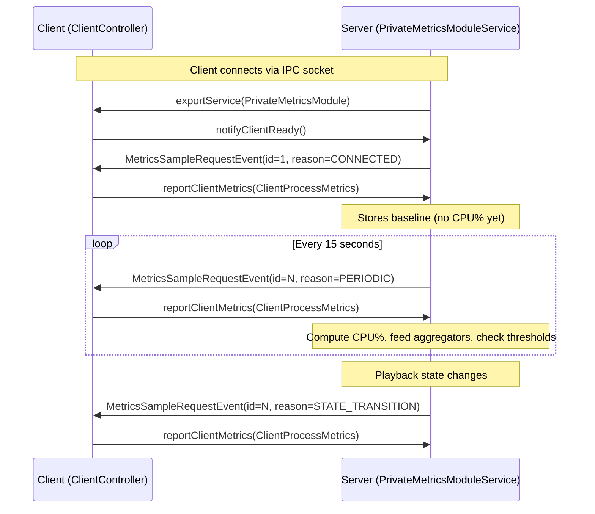
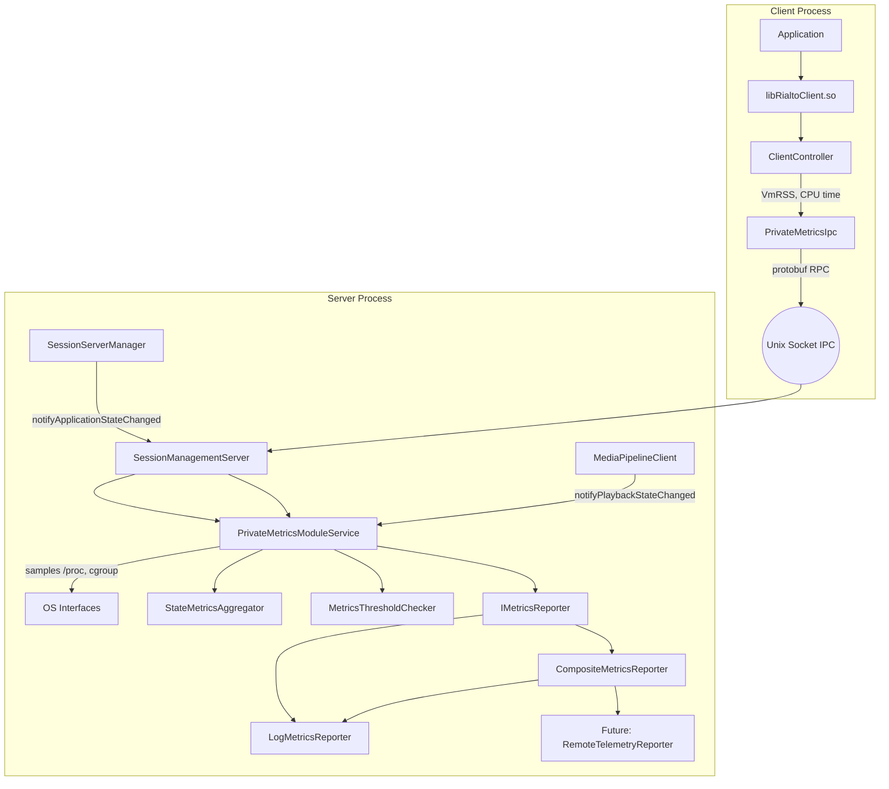

# Metrics Gathering System Design

## Overview

The Rialto metrics system provides CPU and memory usage monitoring for both client and server processes, with state-aware aggregation, configurable thresholds, and pluggable output.

The system is built on top of the `PrivateMetricsModule` — a dedicated IPC service channel between the Rialto client library and the Rialto server that is separate from the media pipeline control path. It is "private" in the sense that it is an internal implementation detail not exposed to application developers.

## Why "Private" Metrics

Rialto uses a client-server architecture where the client library (`libRialtoClient.so`) runs inside the application process and communicates with a separate `rialto-server` process via protobuf-over-Unix-socket IPC. The metrics system needs data from *both* processes:

- **Client process**: CPU time and memory of the application hosting the media pipeline
- **Server process**: CPU time, memory, and cgroup resource limits of the renderer

Since these are different processes, the server cannot simply read `/proc/self/...` to get client data — it must ask the client to report it. The `PrivateMetricsModule` provides this request/response channel.

## PrivateMetrics IPC Protocol

### Proto Definition (`privatemetricsmodule.proto`)

```protobuf
enum MetricsSampleReason {
    METRICS_SAMPLE_REASON_UNKNOWN = 0;
    METRICS_SAMPLE_REASON_CONNECTED = 1;
    METRICS_SAMPLE_REASON_PERIODIC = 2;
    METRICS_SAMPLE_REASON_STATE_TRANSITION = 3;
}

message ClientProcessMetrics {
    optional uint64 sample_id = 1;
    optional MetricsSampleReason reason = 2;
    optional string app_name = 3;
    optional uint32 process_id = 4;
    optional uint64 monotonic_time_ms = 5;
    optional uint64 epoch_time_ms = 6;
    optional uint64 process_cpu_time_ms = 7;
    optional uint64 process_memory_kb = 8;
}

message MetricsSampleRequestEvent {
    optional uint64 sample_id = 1;
    optional MetricsSampleReason reason = 2;
}

service PrivateMetricsModule {
    rpc notifyClientReady(NotifyClientReadyRequest) returns (NotifyClientReadyResponse);
    rpc reportClientMetrics(ReportClientMetricsRequest) returns (ReportClientMetricsResponse);
}
```

### Communication Pattern

The protocol uses a **server-initiated push** model:



Key design points:
- The **server drives timing** — the client never spontaneously reports; it only responds to requests
- The `sample_id` field correlates requests with responses and provides ordering
- The `reason` field is echoed back by the client so the server knows how to handle the response
- The service is exported per-client on connection, allowing multi-client support

### Client Side (`ClientController` + `PrivateMetricsIpc`)

When the client library initializes (via `ClientController`), it:
1. Creates a `PrivateMetricsIpc` that subscribes to `MetricsSampleRequestEvent`
2. Calls `notifyClientReady()` to signal the server it can accept sample requests
3. On each `MetricsSampleRequestEvent`, gathers:
   - `monotonic_time_ms`: `CLOCK_MONOTONIC` in milliseconds
   - `epoch_time_ms`: wall-clock time (for log correlation)
   - `process_cpu_time_ms`: `CLOCK_PROCESS_CPUTIME_ID` (total user+system CPU)
   - `process_memory_kb`: VmRSS from `/proc/self/status`
   - `app_name`: from `/proc/self/comm`
   - `process_id`: `getpid()`
4. Sends the data back via `reportClientMetrics()`

### Server Side (`PrivateMetricsModuleService`)

The server maintains per-client state:

```cpp
struct ClientMetricsState {
    bool isReady{false};
    std::optional<MetricsSamplePair> latestMetrics;  // previous sample for delta computation
};
```

On receiving `reportClientMetrics`:
1. Takes its own `ProcessMetricsSample` (server CPU, memory, cgroup)
2. If a previous sample exists, computes CPU percentages from time deltas
3. Passes the paired client+server data through the reporting/aggregation pipeline
4. Stores the sample as `latestMetrics` for next delta computation

### Threading Model

```
┌─────────────────────────────────────────────────────────────┐
│  m_metricsThread (sampler)                                  │
│    - Sleeps 15s via condition_variable                      │
│    - Wakes and sends MetricsSampleRequestEvent to clients   │
│    - Can be woken early by m_wakeup.notify_all() on stop    │
└─────────────────────────────────────────────────────────────┘

┌─────────────────────────────────────────────────────────────┐
│  IPC event loop thread                                      │
│    - Receives reportClientMetrics RPC calls                 │
│    - Calls logMetrics() → reporter → aggregator → threshold │
│    - Receives notifyPlaybackState events                    │
│    - Calls notifyPlaybackStateChanged()                     │
└─────────────────────────────────────────────────────────────┘
```

The `m_mutex` protects shared state (`m_clients`, `m_sessionStates`, `m_globalAggregator`) accessed from both threads.

### Lifecycle

1. **Server start**: `SessionManagementServer` creates `PrivateMetricsModuleService` via factory
2. **Client connects**: `clientConnected()` → registers client, exports service
3. **Client ready**: `notifyClientReady()` → marks client ready, requests initial sample
4. **Periodic collection**: sampler thread fires every 15s
5. **State changes**: `MediaPipelineClient` and `SessionServerManager` notify as states transition
6. **Client disconnects**: `clientDisconnected()` → removes client state
7. **Server stop**: destructor sets `m_isRunning=false`, wakes sampler thread, joins it

## System Architecture



## Components

### Data Collection

| Component | Role |
|-----------|------|
| `ClientController` | Reads client VmRSS from `/proc/self/status` and CPU time via `clock_gettime(CLOCK_PROCESS_CPUTIME_ID)` |
| `PrivateMetricsModuleService` | Reads server CPU time via `times()`, server VmRSS from `/proc/self/status`, cgroup memory from `/sys/fs/cgroup/.../memory.current` |
| `privatemetricsmodule.proto` | Defines `ClientProcessMetrics` message with `process_memory_kb` field and `MetricsSampleReason` enum |

### Sampling

- **Periodic**: Every 15 seconds, the server requests a sample from connected clients
- **On connection**: Baseline sample taken immediately (no CPU % computed)
- **State transitions**: Immediate sample requested for clean state boundaries (reported but not fed into aggregators due to unreliable CPU data from tiny time deltas)

### CPU Percentage Calculation

```
CPU% = (cpu_time_delta_ms / wall_time_delta_ms) × 100
```

- Computed independently for client, server, and combined (client+server)
- Multi-core systems can exceed 100% (acceptable)
- **Minimum elapsed time**: 100ms threshold; returns 0% if wall-clock delta is too small to prevent division artifacts

### Cgroup Memory

Resolved dynamically from `/proc/self/cgroup`:
1. Parse cgroup v2 line (`0::<path>`)
2. Read `/sys/fs/cgroup/<path>/memory.current` and `memory.max`
3. Fall back to cgroup v1 paths if v2 unavailable
4. Value of "max" (unlimited) → reported as 0

### State-Aware Aggregation

#### MetricsAccumulator (Welford's Algorithm)

Header-only implementation providing O(1) memory online computation of:
- Count, min, max, mean, standard deviation

#### StateMetricsAggregator

Wraps 6 `MetricsAccumulator` instances (one per metric dimension):
- Client CPU %, Server CPU %, Combined CPU %
- Client memory KB, Server memory KB, Cgroup memory KB

Lifecycle:
1. `begin(stateName, startTimeMs)` — reset and start accumulating
2. `addSample(MetricsSample)` — feed each periodic sample
3. `finalize(endTimeMs)` → `StateMetricsReport` with duration and all stats

#### Per-Session Tracking

Each media pipeline session has a `SessionMetricsState` containing:
- Current `PlaybackState`
- A `StateMetricsAggregator`

On playback state change:
1. Finalize the old state's aggregator → emit report
2. Begin a new accumulation period for the new state
3. On terminal states (STOPPED, END_OF_STREAM, FAILURE) — remove session

#### Global Tracking

A single `StateMetricsAggregator` tracks the RUNNING application state period.
On transition from RUNNING → INACTIVE, the report is emitted.

### Threshold Checking

`MetricsThresholdChecker` evaluates each PERIODIC sample against configured limits:

| Metric | Warning | Critical |
|--------|---------|----------|
| Client CPU % | 80 | 95 |
| Server CPU % | 80 | 95 |
| Combined CPU % | 150 | 190 |
| Client memory KB | 512,000 | 768,000 |
| Server memory KB | 512,000 | 768,000 |
| Cgroup memory % | 80 | 95 |

**Debounce**: An alert fires once when exceeded. It can fire again only after the metric drops below the threshold for 2 consecutive samples.

### Output (IMetricsReporter)

Abstract interface with three report types:

| Method | When |
|--------|------|
| `reportPeriodicSample` | Every sampling interval |
| `reportStateTransition` | On playback/application state change |
| `reportThresholdExceeded` | When a metric breaches a threshold |

Implementations:
- **LogMetricsReporter** — writes to Rialto server log (default)
- **CompositeMetricsReporter** — fans out to multiple reporters (for adding remote telemetry)

## Data Flow

```
┌─ Every 15s ─────────────────────────────────────────────────────────────┐
│                                                                          │
│  Timer fires → requestMetricsSample(PERIODIC) to all ready clients       │
│  Client responds with ClientProcessMetrics (CPU time, memory, etc.)      │
│  Server takes its own sample (CPU, memory, cgroup)                       │
│  logMetrics():                                                           │
│    1. Compute CPU percentages from deltas                                │
│    2. Report via IMetricsReporter::reportPeriodicSample                  │
│    3. Feed sample into all active session aggregators                    │
│    4. Feed sample into global aggregator (if RUNNING)                    │
│    5. Check thresholds                                                   │
│                                                                          │
└──────────────────────────────────────────────────────────────────────────┘

┌─ On State Change ───────────────────────────────────────────────────────┐
│                                                                          │
│  MediaPipelineClient::notifyPlaybackState(newState)                      │
│    → notifyPlaybackStateChanged(sessionId, oldState, newState)           │
│    → Finalize old state aggregator                                       │
│    → IMetricsReporter::reportStateTransition (aggregated stats)          │
│    → Begin new state aggregator                                          │
│    → Request STATE_TRANSITION sample (for log visibility only)           │
│                                                                          │
└──────────────────────────────────────────────────────────────────────────┘
```

## Example Output

### Periodic Sample
```
Metrics sample=5, reason=PERIODIC, app='python3', client_pid=11708,
  client_cpu=0.47%, server_cpu=23.13%, combined_cpu=23.60%,
  client_cpu_ms=440, server_cpu_ms=4250,
  client_mem_kb=59648, server_mem_kb=216684, cgroup_mem_kb=209016/0
```

### State Transition Report
```
Metrics state report [session=0] state='PLAYING', duration_ms=30607, samples=2,
  client_cpu={min=0.47, max=10.11, mean=5.29, stddev=6.81}%,
  server_cpu={min=23.13, max=26.40, mean=24.77, stddev=2.31}%,
  combined_cpu={min=23.60, max=36.52, mean=30.06, stddev=9.13}%,
  client_mem_kb={min=59520, max=59648, mean=59584},
  server_mem_kb={min=214704, max=216684, mean=215694},
  cgroup_mem_kb={min=206332, max=209016, mean=207674}
```

### Threshold Alert
```
Metrics threshold WARNING: server_cpu=88.24 exceeds 80.00
```

## Extension Points

1. **Remote telemetry**: Implement `IMetricsReporter` and add to `CompositeMetricsReporter`
2. **Custom thresholds**: Pass a different `MetricsThresholdConfig` to the constructor
3. **JSON config loading**: Add a loader that reads `MetricsThresholdConfig` from a file
4. **Per-session threshold tuning**: Different limits for different pipeline types
5. **QoS metrics**: Separate data path for dropped frames / buffer underruns

## File Inventory

### Client Side

| File | Purpose |
|------|---------|
| `media/client/ipc/interface/IPrivateMetricsIpc.h` | Client-side metrics IPC interface |
| `media/client/ipc/include/PrivateMetricsIpc.h` | Client-side IPC implementation header |
| `media/client/ipc/source/PrivateMetricsIpc.cpp` | Subscribes to sample requests, gathers and sends metrics |
| `media/client/main/include/ClientController.h` | Client initialization, owns PrivateMetricsIpc |
| `media/client/main/source/ClientController.cpp` | Reads VmRSS, reports metrics on request |

### Server Side

| File | Purpose |
|------|---------|
| `media/server/ipc/include/IPrivateMetricsModuleService.h` | Server metrics service interface |
| `media/server/ipc/include/PrivateMetricsModuleService.h` | Concrete service with sampler thread and aggregators |
| `media/server/ipc/source/PrivateMetricsModuleService.cpp` | Core sampling, aggregation, wiring |
| `media/server/ipc/source/MediaPipelineClient.cpp` | Playback state hook |
| `media/server/ipc/source/MediaPipelineModuleService.cpp` | Passes metrics service to pipeline clients |
| `media/server/ipc/source/SessionManagementServer.cpp` | Application state hook, owns metrics service |
| `media/server/service/source/SessionServerManager.cpp` | Triggers app state notifications |

### Metrics Framework

| File | Purpose |
|------|---------|
| `media/server/ipc/include/MetricsAccumulator.h` | Welford's online mean/variance |
| `media/server/ipc/include/StateMetricsAggregator.h` | Per-state multi-metric accumulation |
| `media/server/ipc/include/IMetricsReporter.h` | Reporter interface + report structs |
| `media/server/ipc/include/LogMetricsReporter.h` | Log-based reporter |
| `media/server/ipc/include/CompositeMetricsReporter.h` | Multi-reporter fanout |
| `media/server/ipc/include/MetricsThresholdChecker.h` | Threshold config + checker |
| `media/server/ipc/source/LogMetricsReporter.cpp` | Reporter implementation |
| `media/server/ipc/source/CompositeMetricsReporter.cpp` | Fanout implementation |
| `media/server/ipc/source/MetricsThresholdChecker.cpp` | Threshold checking logic |

### Protocol

| File | Purpose |
|------|---------|
| `proto/privatemetricsmodule.proto` | IPC message and service definitions |
