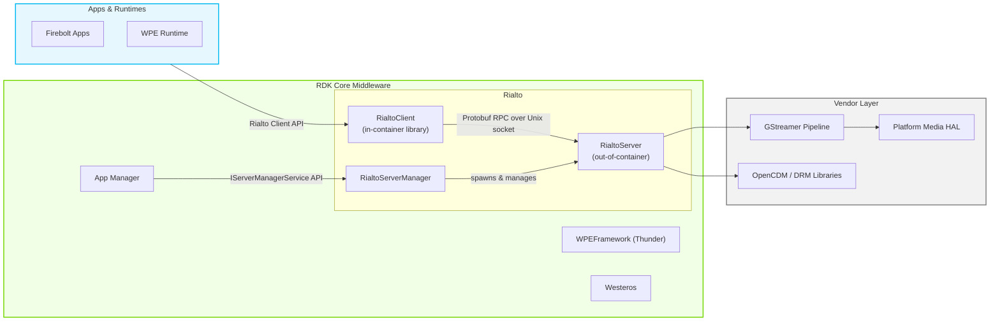
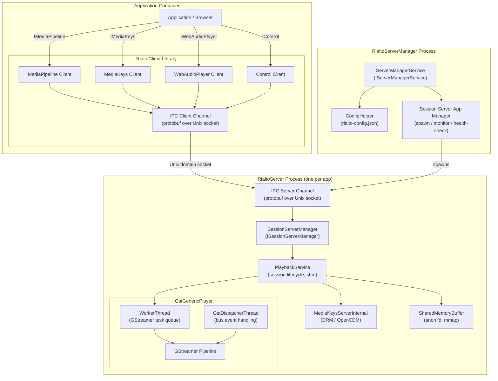
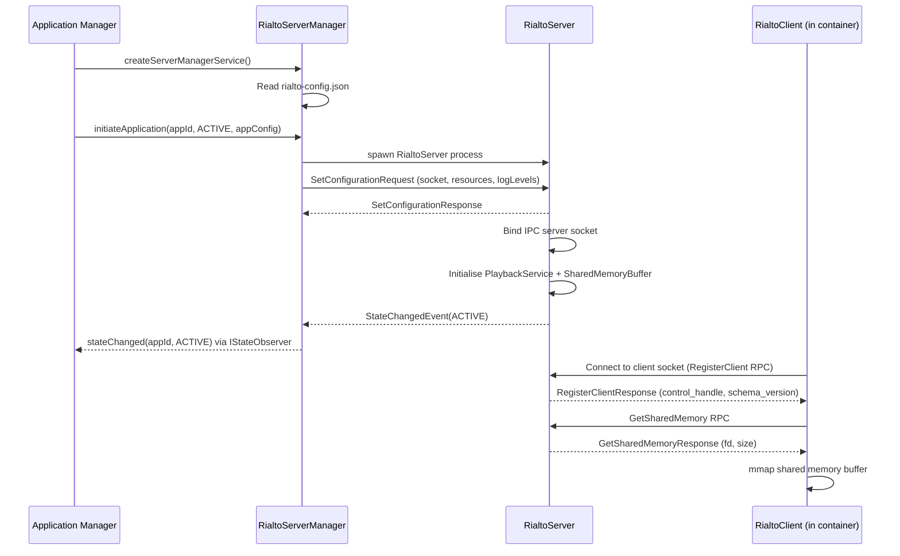
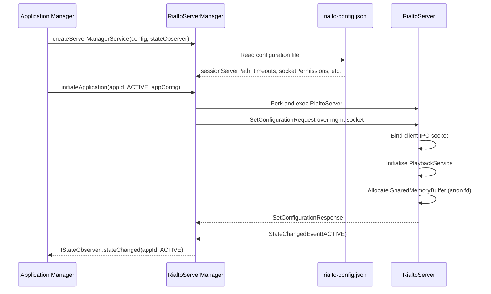
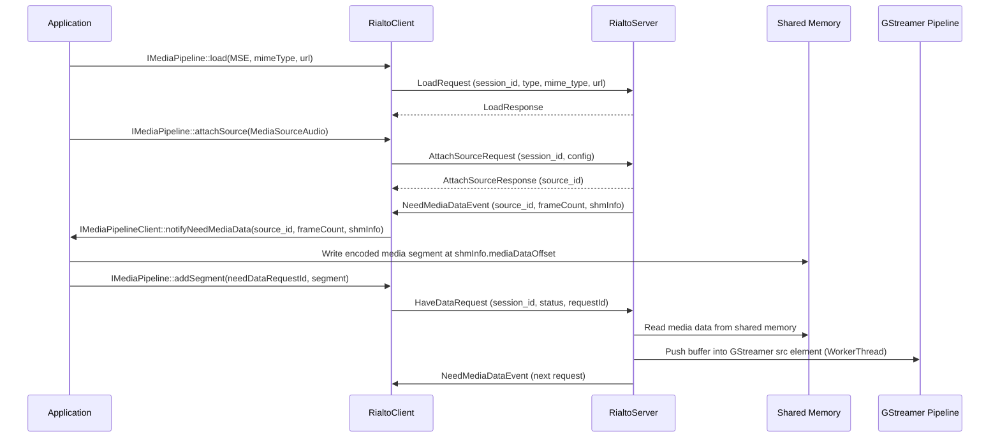
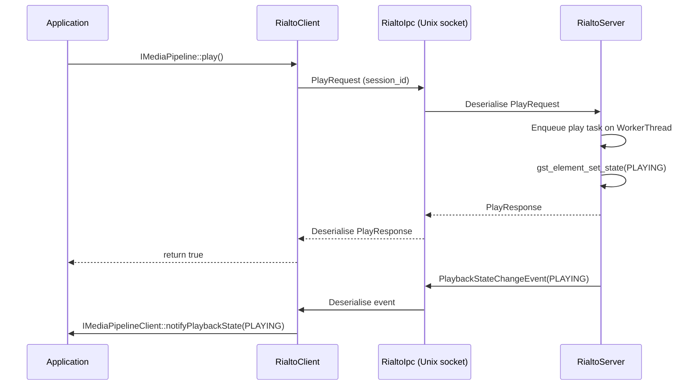
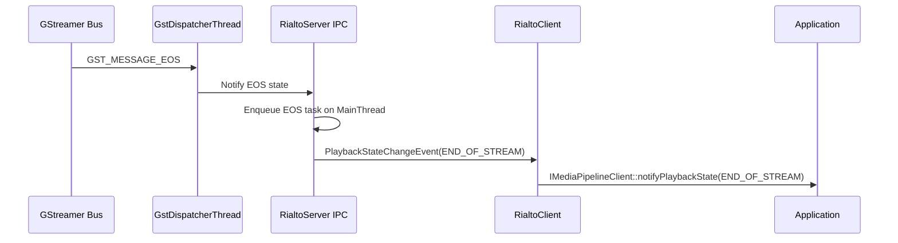

# Rialto

Rialto provides a solution for implementing AV (audio and video) pipelines of containerised native applications and browsers while keeping hardware-specific handles and system resources within the trusted server process. It acts as an out-of-process media pipeline service: applications running inside containers communicate with a trusted server process that has direct access to the underlying media hardware, GStreamer infrastructure, and DRM subsystems.

At the product level, Rialto enables containerised browser runtimes and native applications to perform encrypted and unencrypted AV playback and web audio mixing, with full Media Source Extensions (MSE) support, while keeping hardware access and platform resource management within the trusted server process. At the module level, Rialto is structured as a client library (`RialtoClient`), a session server binary (`RialtoServer`), and a server manager library and simulator (`RialtoServerManager`/`RialtoServerManagerSim`), all communicating over protobuf-based IPC on Unix domain sockets.



**Key Features & Responsibilities:**

- **AV Pipeline Management**: Exposes `IMediaPipeline` for creating, loading, and controlling AV playback sessions with support for separate audio and video source attachment, MSE data feeding via shared memory, playback rate control, seeking, and quality-of-service reporting.
- **EME / DRM Key Management**: Exposes `IMediaKeys` for managing Encrypted Media Extension (EME) key sessions, including key generation, licence updates, session persistence, DRM store management, and cipher mode configuration (CENC, CBC1, CENS, CBCS).
- **Web Audio Playback**: Exposes `IWebAudioPlayer` for mixing PCM audio streams into the current audio output, with priority-based resource allocation for platforms with a limited number of concurrent audio mixers.
- **Shared Memory Data Channel**: Provides a shared memory buffer whose file descriptor is passed from server to client via the `GetSharedMemory` control RPC, allowing media segment data to be transferred without redundant data copies across process boundaries.
- **Container Lifecycle Management**: `RialtoServerManager` spawns and manages one `RialtoServer` process per application, applies resource limits (maximum simultaneous playback sessions and web audio players), manages session server states (INACTIVE, ACTIVE, NOT_RUNNING, ERROR), and performs periodic health checks via a ping/ack protocol.
- **Capability Discovery**: Exposes `IMediaPipelineCapabilities` and `IMediaKeysCapabilities` for querying supported MIME types and DRM key systems at runtime.
- **Subtitle and Text Track Support**: When the platform provides a text track plugin, Rialto attaches a dedicated GStreamer text track sink and manages subtitle rendering through a `TextTrackAccessor`.

---

## Design

Rialto is designed around strict process isolation. The `RialtoClient` library runs inside the containerised application and translates every media operation into a protobuf RPC call sent over a Unix domain socket. The `RialtoServer` process runs outside any container, holds access to GStreamer and DRM resources, and executes those operations on behalf of the client. This split ensures that hardware handles, DRM contexts, and GStreamer pipelines remain contained within the trusted server process.

The IPC layer is purpose-built to meet Rialto's specific requirements: per-connection client identity (pid/uid), in-band file descriptor passing for sharing memory buffer descriptors, and first-class asynchronous event delivery from server to client. The protobuf service definitions in `proto/` describe all RPC methods and events for the media pipeline, DRM, web audio, control, and server manager channels.

Shared memory is used for the media data path. When a client session is established, the server allocates a `SharedMemoryBuffer` backed by an anonymous file descriptor, which is passed to the client via a `GetSharedMemory` RPC call. The client maps this buffer and writes encoded media segments directly into it; the server reads from the same buffer to feed GStreamer. This design avoids double-copying large AV buffers across process boundaries.

On the server side, GStreamer integration is managed by `GstGenericPlayer`, which wraps GStreamer pipeline construction and element management. The player is driven by a task queue to keep all GStreamer operations on a single dedicated worker thread. A separate `GstDispatcherThread` processes GStreamer bus messages (state changes, errors, end-of-stream) and translates them into server-side events. DRM operations are handled through the OpenCDM wrapper (`OcdmSystem`/`OcdmSession`).

The `RialtoServerManager` reads its configuration from a JSON file (`rialto-config.json`) at startup and uses it to set environment variables, paths, timeouts, and socket parameters for each spawned `RialtoServer`. It supports pre-loading a configurable number of server processes to reduce application startup latency.

Northbound interaction is through the public C++ factory and interface APIs in `media/public/include/` and `serverManager/public/include/`. Southbound interaction on the server side is through GStreamer, OpenCDM, and optional RDK GStreamer utilities, all abstracted by thin wrapper classes under `wrappers/`.



#### Threading Model

- **Threading Architecture**: Multi-threaded, with distinct threads for the server's main task dispatch, GStreamer operations, and GStreamer bus event handling.
- **Main Thread (`MainThread`)**: A shared event-loop thread on the server side that serialises all non-GStreamer server operations. It accepts tasks from any registered client via `enqueueTask()` or `enqueueTaskAndWait()` and processes them sequentially from a `std::deque`. This thread owns the `MediaPipelineServerInternal`, `MediaKeysServerInternal`, and `WebAudioPlayerServerInternal` objects and ensures they are accessed from a single thread.
- **Worker Threads**:
  - _`WorkerThread`_: One per `GstGenericPlayer` instance; processes GStreamer player tasks (attach source, push buffer, seek, set rate, flush, etc.) from a `std::queue`. All GStreamer element state changes and data operations are posted to this thread.
  - _`GstDispatcherThread`_: One per GStreamer pipeline; polls the GStreamer bus for messages (EOS, errors, state changes, QoS events) and dispatches them to the `GstGenericPlayer` client callbacks.
- **Synchronization**: `MainThread` uses a `std::mutex` and `std::condition_variable` to protect the task queue. `WorkerThread` uses the same pattern. `GstDispatcherThread` is driven by a polling loop with an atomic `m_isGstreamerDispatcherActive` flag for shutdown coordination.
- **Async / Event Dispatch**: Client notifications (playback state changes, need-data requests, QoS events) are produced on the worker and dispatcher threads and forwarded over the IPC server channel as protobuf event messages, delivering them asynchronously to the client-side event loop.

### Prerequisites and Dependencies

#### Platform and Integration Requirements

- **Build Dependencies**: `protobuf`, `protobuf-native`, `openssl`, `jsoncpp`, `gstreamer1.0`, `gstreamer1.0-plugins-base`, `glib-2.0`, `rdk-gstreamer-utils`, `virtual/vendor-rdk-gstreamer-utils-platform`. The `servermanager` package additionally depends on `mongoose`.
- **HAL**: Rialto accesses the platform media pipeline directly through GStreamer elements and the RDK GStreamer utilities wrapper (`IRdkGstreamerUtilsWrapper`). DRM access is through the OpenCDM (`open_cdm.h`) interface.
- **Systemd Services**: The `RialtoServer` is spawned as a child process by `RialtoServerManager`. `RialtoServerManager` is expected to be launched by an application manager or framework integration layer.
- **Configuration Files**: `rialto-config.json` (installed from `rialto-config.in.json`). The file specifies environment variables for `RialtoServer`, the server binary path, startup timeout, health-check interval, socket permissions, and number of pre-loaded server processes. On debug builds, an override file at the configured `overrides` path is also read.
- **Startup Order**: `RialtoServerManager` must be running before any application requests `initiateApplication()`. The server manager spawns `RialtoServer` instances on demand; when `numOfPreloadedServers` is configured to a non-zero value, server processes are pre-launched at startup to reduce application connect latency.

---

### Component State Flow

#### Initialization to Active State

The lifecycle begins when an application manager or framework calls `ServerManagerServiceFactory::createServerManagerService()` to obtain an `IServerManagerService` instance. The server manager reads its configuration, then waits for `initiateApplication()` calls. On each call it spawns a `RialtoServer` process, sends it a `SetConfiguration` RPC over the server management socket (carrying resource limits, initial state, socket names, and log levels), and monitors its response. The `RialtoServer` receives the configuration, sets up its IPC server socket for client connections, initialises the `PlaybackService` and `SharedMemoryBuffer`, and emits a `StateChangedEvent`. The server manager forwards the state change to any registered `IStateObserver` and records the socket name returned by `getAppConnectionInfo()` for the client to connect to.

The component transitions through the following states during its lifecycle: **Initializing** (read config, allocate resources) → **Spawning** (fork RialtoServer process, send SetConfiguration) → **Active** (client-facing socket ready, accepting IPC connections) → **Shutdown** (deactivate sessions, unmap shared memory, terminate RialtoServer).



#### Runtime State Changes

During normal operation, the server manager sends periodic `PingRequest` messages to each `RialtoServer`. The server aggregates acknowledgements from its internal session objects and responds with an `AckEvent`. If the configured number of consecutive unanswered pings (`numOfPingsBeforeRecovery`) is exceeded, the server manager triggers recovery for that server instance.

**State Change Triggers:**

- Application manager calls `changeSessionServerState(appId, INACTIVE)` to suspend an active session; the server manager sends a `SetState` RPC to the corresponding `RialtoServer`, which transitions its services to inactive, releasing active decoder resources.
- Application manager calls `changeSessionServerState(appId, NOT_RUNNING)` to terminate a session; the server manager signals the `RialtoServer` to shut down cleanly.
- A `StateChangedEvent(ERROR)` from `RialtoServer` indicates an unrecoverable server-side failure; the server manager notifies the registered `IStateObserver` and may restart the server process.

**Context Switching Scenarios:**

- Transitioning from ACTIVE to INACTIVE suspends media pipeline processing and releases GStreamer decoder resources, while keeping the IPC socket and shared memory intact.
- Receiving an updated `setLogLevels()` call propagates new log level masks to all running `RialtoServer` instances at runtime via the server manager IPC channel.

---

### Call Flows

#### Initialization Call Flow



#### Request Processing Call Flow

The following shows the data path for an MSE playback session from client API call to GStreamer data injection.

The client writes encoded media data into the shared memory buffer at the offset indicated by `shmInfo` in the `notifyNeedMediaData` callback, then calls `addSegment()` to notify the server. The server reads the data from shared memory and pushes it into the GStreamer source element on the `WorkerThread`, completing the cycle without any additional data copy over the socket.



---

## Internal Modules

| Module / Class            | Description                                                                                                                                                                                                                                                                                                                           | Key Files                                                                             |
| ------------------------- | ------------------------------------------------------------------------------------------------------------------------------------------------------------------------------------------------------------------------------------------------------------------------------------------------------------------------------------- | ------------------------------------------------------------------------------------- |
| `RialtoClient`            | Client-side library providing factory implementations for all public interfaces. Translates API calls into protobuf IPC requests and receives asynchronous event notifications from the server.                                                                                                                                       | `media/client/main/`, `media/client/ipc/`                                             |
| `RialtoServer`            | Server-side binary hosting the media pipeline, DRM, and web audio services. Accepts IPC connections from `RialtoClient` instances, dispatches operations to GStreamer and OpenCDM, and manages the shared memory buffer.                                                                                                              | `media/server/main/`, `media/server/service/`                                         |
| `GstGenericPlayer`        | GStreamer pipeline manager. Constructs and controls a GStreamer pipeline for AV playback, including source, decryption, audio/video sink elements. Uses a `WorkerThread` for all player task execution and a `GstDispatcherThread` for bus message handling.                                                                          | `media/server/gstplayer/include/GstGenericPlayer.h`, `media/server/gstplayer/source/` |
| `GstWebAudioPlayer`       | GStreamer-based web audio player. Manages a separate GStreamer pipeline for PCM audio mixing with the main audio output. Supports priority-based activation.                                                                                                                                                                          | `media/server/gstplayer/include/GstWebAudioPlayer.h`                                  |
| `SharedMemoryBuffer`      | Allocates and manages the anonymous shared memory region used to transfer media segments from client to server. Maintains partitions for multiple concurrent playback sessions and web audio players.                                                                                                                                 | `media/server/main/include/SharedMemoryBuffer.h`                                      |
| `MainThread`              | Shared task-queue thread on the server. Serialises all server-side operations except GStreamer tasks. Supports synchronous (`enqueueTaskAndWait`) and asynchronous (`enqueueTask`) posting.                                                                                                                                           | `media/server/main/include/MainThread.h`                                              |
| `RialtoIpc`               | Custom protobuf-based IPC library implementing an RPC client and server over Unix domain sockets, with support for file descriptor passing and asynchronous server-to-client events. Both the client-side and server-side libraries are driven by an external event loop supplied by the caller.                                      | `ipc/client/`, `ipc/server/`, `ipc/common/`                                           |
| `RialtoServerManager`     | Library and simulator (`RialtoServerManagerSim`) that manages the lifecycle of `RialtoServer` processes. Reads `rialto-config.json`, spawns servers on demand, sends configuration, monitors health via ping/ack, and reports state changes to a registered `IStateObserver`.                                                         | `serverManager/service/`, `serverManager/public/`                                     |
| `MediaKeysServerInternal` | Server-side EME/DRM session manager. Manages OpenCDM key sessions, processes licence requests and updates, handles DRM store operations, and supports common encryption (CENC/CBCS).                                                                                                                                                  | `media/server/main/include/MediaKeysServerInternal.h`                                 |
| `Wrappers`                | Thin C++ interface wrappers around GStreamer (`GstWrapper`), GLib (`GlibWrapper`), OpenCDM (`OcdmSystem`, `OcdmSession`), the platform GStreamer utilities (`RdkGstreamerUtilsWrapper`), the text track plugin (`TextTrackPluginWrapper`), and WPEFramework Thunder (`ThunderWrapper`). Used to enable mock injection for unit tests. | `wrappers/include/`, `wrappers/source/`                                               |
| `Logging`                 | Component-scoped logging subsystem providing `RIALTO_LOG_*` macros at FATAL, ERROR, WARNING, MILESTONE, INFO, and DEBUG levels. Supports per-component log level control at runtime via `setLogLevels`.                                                                                                                               | `logging/include/RialtoLogging.h`                                                     |

---

## Component Interactions

Rialto interacts with platform and system components through three main paths: IPC with client applications (northbound), GStreamer and OpenCDM on the server side (southbound), and the server manager IPC channel for process lifecycle control.

### Interaction Matrix

| Target Component / Layer       | Interaction Purpose                                                                                                                   | Key APIs / Topics                                                                                     |
| ------------------------------ | ------------------------------------------------------------------------------------------------------------------------------------- | ----------------------------------------------------------------------------------------------------- |
| **Application / Browser**      |                                                                                                                                       |                                                                                                       |
| `RialtoClient`                 | Receives media pipeline, DRM, and web audio control calls from the application; delivers state change and data-request callbacks      | `IMediaPipeline`, `IMediaKeys`, `IWebAudioPlayer`, `IControl`                                         |
| **Server Manager**             |                                                                                                                                       |                                                                                                       |
| `IServerManagerService`        | Application manager controls session server lifecycle, state, and log levels                                                          | `initiateApplication()`, `changeSessionServerState()`, `getAppConnectionInfo()`, `setLogLevels()`     |
| `IStateObserver`               | Receives asynchronous state change notifications from RialtoServerManager                                                             | `stateChanged(appId, state)`                                                                          |
| **GStreamer / HAL**            |                                                                                                                                       |                                                                                                       |
| `IGstWrapper`                  | Wraps GStreamer C API for pipeline construction, element state control, buffer push, seek, and bus polling                            | `gst_element_set_state()`, `gst_app_src_push_buffer()`, GStreamer bus                                 |
| `IGlibWrapper`                 | Wraps GLib API for object property access and type system calls needed by GStreamer                                                   | `g_object_set()`, `g_object_get()`                                                                    |
| `IRdkGstreamerUtilsWrapper`    | Wraps platform-specific RDK GStreamer utility functions used for audio/video sink configuration                                       | RDK GStreamer utils functions                                                                         |
| **DRM**                        |                                                                                                                                       |                                                                                                       |
| `IOcdmSystem` / `IOcdmSession` | OpenCDM interface for DRM key system operations: version query, key session creation, key challenge/response, secure store management | `createSession()`, `getLdlSessionsLimit()`, `deleteKeyStore()`, `deleteSecureStore()`, `getDrmTime()` |
| **Text Track (optional)**      |                                                                                                                                       |                                                                                                       |
| `ITextTrackPluginWrapper`      | WPEFramework text track plugin interface for subtitle rendering, enabled when `RIALTO_ENABLE_TEXT_TRACK` is set                       | `TextTrackAccessor`, GStreamer text track sink                                                        |
| **IPC Transport**              |                                                                                                                                       |                                                                                                       |
| `RialtoIpc`                    | Protobuf RPC over Unix domain sockets; carries all media pipeline, DRM, web audio, control, and server manager messages               | Unix domain sockets, protobuf serialisation, fd passing                                               |

### Events Published

| Event Name                    | IPC Topic                   | Trigger Condition                                                          | Subscriber                                                       |
| ----------------------------- | --------------------------- | -------------------------------------------------------------------------- | ---------------------------------------------------------------- |
| `NeedMediaDataEvent`          | `mediapipelinemodule.proto` | Server requires the next batch of encoded frames for a source              | `RialtoClient` → `IMediaPipelineClient::notifyNeedMediaData()`   |
| `PlaybackStateChangeEvent`    | `mediapipelinemodule.proto` | GStreamer pipeline state transitions (PLAYING, PAUSED, EOS, FAILURE, etc.) | `RialtoClient` → `IMediaPipelineClient::notifyPlaybackState()`   |
| `NetworkStateChangeEvent`     | `mediapipelinemodule.proto` | Buffering or network state changes                                         | `RialtoClient` → `IMediaPipelineClient::notifyNetworkState()`    |
| `PositionChangeEvent`         | `mediapipelinemodule.proto` | Periodic playback position update (~every 250 ms)                          | `RialtoClient` → `IMediaPipelineClient::notifyPosition()`        |
| `QosEvent`                    | `mediapipelinemodule.proto` | Video frame or audio sample dropped                                        | `RialtoClient` → `IMediaPipelineClient::notifyQos()`             |
| `BufferUnderflowEvent`        | `mediapipelinemodule.proto` | Audio or video buffer underflow detected                                   | `RialtoClient` → `IMediaPipelineClient::notifyBufferUnderflow()` |
| `KeyStatusesChangedEvent`     | `mediakeysmodule.proto`     | DRM key status updated for a key session                                   | `RialtoClient` → `IMediaKeysClient::onKeyStatusesChanged()`      |
| `LicenceRenewalEvent`         | `mediakeysmodule.proto`     | DRM licence renewal required                                               | `RialtoClient` → `IMediaKeysClient::onLicenseRenewal()`          |
| `ApplicationStateChangeEvent` | `controlmodule.proto`       | Server application state transitions (RUNNING / INACTIVE)                  | `RialtoClient` → `IControlClient::notifyApplicationState()`      |
| `StateChangedEvent`           | `servermanagermodule.proto` | `RialtoServer` session state changes                                       | `RialtoServerManager` → `IStateObserver::stateChanged()`         |
| `AckEvent`                    | `servermanagermodule.proto` | Response to periodic server health-check ping                              | `RialtoServerManager` health-check handler                       |

### IPC Flow Patterns

**Primary Request / Response Flow:**

The client library serialises each API call into a protobuf request message and sends it over the per-application Unix domain socket. The server deserialises the request, executes the operation (typically enqueued onto `MainThread` or `WorkerThread`), and serialises the result back as a response message.



**Event Notification Flow:**

GStreamer bus events (EOS, state change, QoS, error) are received by the `GstDispatcherThread`, translated into server-side events, and forwarded over the IPC server channel as unsolicited event messages.



---

## Implementation Details

### Key External Library Integrations

Rialto accesses the platform media subsystem directly through the following wrapped interfaces:

| Wrapper / Interface                     | Purpose                                                                          | Implementation File                            |
| --------------------------------------- | -------------------------------------------------------------------------------- | ---------------------------------------------- |
| `IGstWrapper::gstInit()`                | Initialises the GStreamer library                                                | `wrappers/source/GstWrapper.cpp`               |
| `IGstWrapper::gstElementSetState()`     | Controls GStreamer pipeline and element state (NULL, READY, PAUSED, PLAYING)     | `wrappers/source/GstWrapper.cpp`               |
| `IGstWrapper::gstAppSrcPushBuffer()`    | Pushes encoded media buffers into the GStreamer appsrc element                   | `wrappers/source/GstWrapper.cpp`               |
| `IGstWrapper::gstElementSendEvent()`    | Sends seek and flush events to the GStreamer pipeline                            | `wrappers/source/GstWrapper.cpp`               |
| `IGstWrapper::gstBusTimedPopFiltered()` | Pops GStreamer bus messages with a timeout filter, used in `GstDispatcherThread` | `wrappers/source/GstWrapper.cpp`               |
| `IGlibWrapper::gObjectSet()`            | Sets GStreamer element properties (video geometry, audio parameters)             | `wrappers/source/GlibWrapper.cpp`              |
| `IRdkGstreamerUtilsWrapper`             | Provides platform-specific audio/video sink setup functions                      | `wrappers/source/RdkGstreamerUtilsWrapper.cpp` |
| `IOcdmSystem::createSession()`          | Creates an OpenCDM DRM session for a given key system                            | `wrappers/source/OcdmSystem.cpp`               |
| `IOcdmSystem::getLdlSessionsLimit()`    | Queries the maximum number of limited-duration licence sessions                  | `wrappers/source/OcdmSystem.cpp`               |
| `IOcdmSystem::deleteKeyStore()`         | Deletes the key store for the active key system                                  | `wrappers/source/OcdmSystem.cpp`               |
| `IOcdmSystem::deleteSecureStore()`      | Deletes the DRM secure store for the active key system                           | `wrappers/source/OcdmSystem.cpp`               |
| `IOcdmSystem::getDrmTime()`             | Returns the DRM system clock time                                                | `wrappers/source/OcdmSystem.cpp`               |

### Key Implementation Logic

- **State / Lifecycle Management**: Session server state (UNINITIALIZED, INACTIVE, ACTIVE, NOT_RUNNING, ERROR) is tracked in the `RialtoServerManager`. On the server side, the `IPlaybackService` interface exposes `switchToActive()` and `switchToInactive()` to change service availability. Playback state (IDLE, PLAYING, PAUSED, SEEKING, SEEK_DONE, STOPPED, END_OF_STREAM, FAILURE) is managed within `GstGenericPlayer` and propagated via the `GstDispatcherThread`.
  - State transition logic: `serverManager/service/source/`, `media/server/service/source/`

- **Event Processing**: GStreamer bus messages are polled by `GstDispatcherThread` in a loop and dispatched to `IGstDispatcherThreadClient` callbacks implemented by `GstGenericPlayer`. The player then enqueues corresponding state or notification events onto the `MainThread` for serialised processing and IPC dispatch. Need-data requests originate from the `GstSrc` element's need-data signal, also handled on the `WorkerThread`.

- **Error Handling Strategy**: GStreamer errors received as `GST_MESSAGE_ERROR` are translated into a `PlaybackState::FAILURE` notification to the client. OpenCDM errors are mapped to `MediaKeyErrorStatus` values (OK, FAIL, BAD_SESSION_ID, NOT_SUPPORTED, INVALID_STATE, BUFFER_TOO_SMALL, OUTPUT_RESTRICTED) returned synchronously from `IMediaKeys` methods. IPC-level failures result in the client receiving a failure response or a disconnect notification.

- **Logging & Diagnostics**: All Rialto components use `RIALTO_LOG_*` macros defined in `logging/include/RialtoLogging.h`. Log output is per-component (CLIENT, SERVER, IPC, SERVER_MANAGER, COMMON) and per-level (FATAL, ERROR, WARNING, MILESTONE, INFO, DEBUG). Log levels can be reconfigured at runtime via the `setLogLevels()` API on `IServerManagerService`. A custom `ILogHandler` can be registered to redirect server manager logs to an external sink.
  - RDK Logger component names: `RIALTO_COMPONENT_CLIENT`, `RIALTO_COMPONENT_SERVER`, `RIALTO_COMPONENT_IPC`, `RIALTO_COMPONENT_SERVER_MANAGER`, `RIALTO_COMPONENT_COMMON`.

---

## Configuration

### Key Configuration Files

| Configuration File                                   | Purpose                                                                                                                                                                             | Override Mechanism                                                                               |
| ---------------------------------------------------- | ----------------------------------------------------------------------------------------------------------------------------------------------------------------------------------- | ------------------------------------------------------------------------------------------------ |
| `/etc/rialto-config.json` (compiled-in default path) | Provides server manager runtime parameters: server binary path, environment variables, timeouts, socket permissions, pre-loaded server count, health-check interval, and log levels | On debug builds, a per-field override file at the configured `overrides` path is read and merged |

### Key Configuration Parameters

| Parameter                      | Type   | Default                                                                                                      | Description                                                                                                           |
| ------------------------------ | ------ | ------------------------------------------------------------------------------------------------------------ | --------------------------------------------------------------------------------------------------------------------- |
| `sessionServerPath`            | string | `/usr/bin/RialtoServer`                                                                                      | Path to the `RialtoServer` executable spawned for each application                                                    |
| `startupTimeoutMs`             | int    | `0`                                                                                                          | Maximum milliseconds to wait for a `RialtoServer` to become ready (0 = no timeout)                                    |
| `healthcheckIntervalInSeconds` | int    | `5`                                                                                                          | Interval in seconds between server health-check pings                                                                 |
| `socketPermissions`            | int    | `666`                                                                                                        | Unix permission bits applied to the client-facing IPC socket file                                                     |
| `socketOwner`                  | string | `""`                                                                                                         | User name applied via `chown` to the client-facing IPC socket file                                                    |
| `socketGroup`                  | string | `""`                                                                                                         | Group name applied via `chown` to the client-facing IPC socket file                                                   |
| `numOfPreloadedServers`        | int    | `0`                                                                                                          | Number of `RialtoServer` processes to pre-launch at startup to reduce application connect latency                     |
| `numOfPingsBeforeRecovery`     | int    | —                                                                                                            | Number of consecutive unanswered health-check pings before the server manager triggers recovery for a server instance |
| `logLevel`                     | uint   | —                                                                                                            | Default log level bitmask for all Rialto components at startup                                                        |
| `environmentVariables`         | list   | `XDG_RUNTIME_DIR=/tmp`, `GST_REGISTRY=/tmp/rialto-server-gstreamer-cache.bin`, `WESTEROS_SINK_USE_ESSRMGR=1` | Environment variables set for every spawned `RialtoServer` process                                                    |
| `extraEnvVariables`            | list   | `""`                                                                                                         | Additional environment variables merged into the server environment                                                   |

### Runtime Configuration

Log levels for all Rialto components can be changed at runtime without restarting any process:

```bash
# Via IServerManagerService API (called by the application manager integration)
setLogLevels(defaultLogLevels, clientLogLevels, sessionServerLogLevels,
             ipcLogLevels, serverManagerLogLevels, commonLogLevels)
```

### Configuration Persistence

Persistent configuration is read from `rialto-config.json` at `RialtoServerManager` startup. Runtime log level changes applied via `setLogLevels()` take effect immediately across all active Rialto processes.

---
