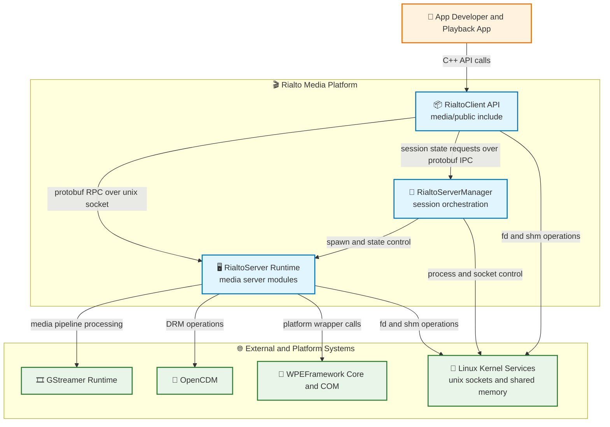
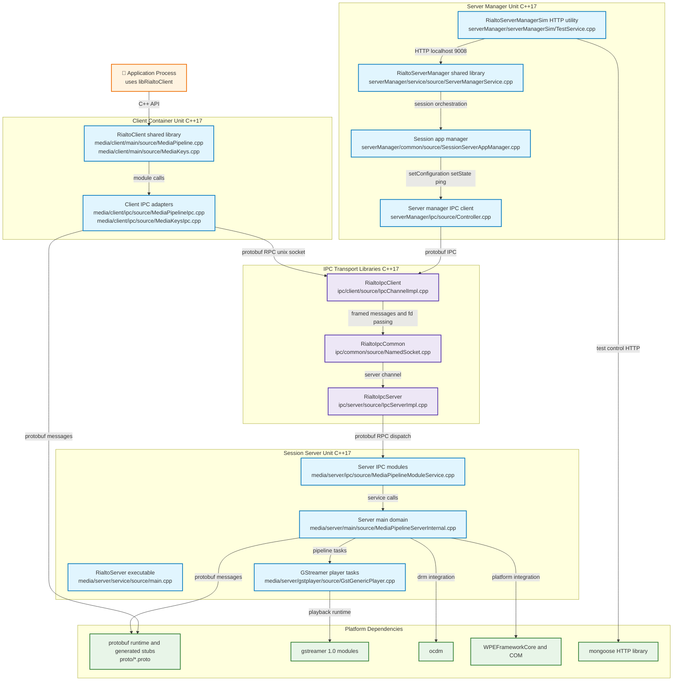
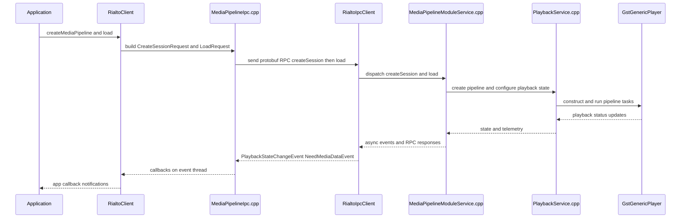
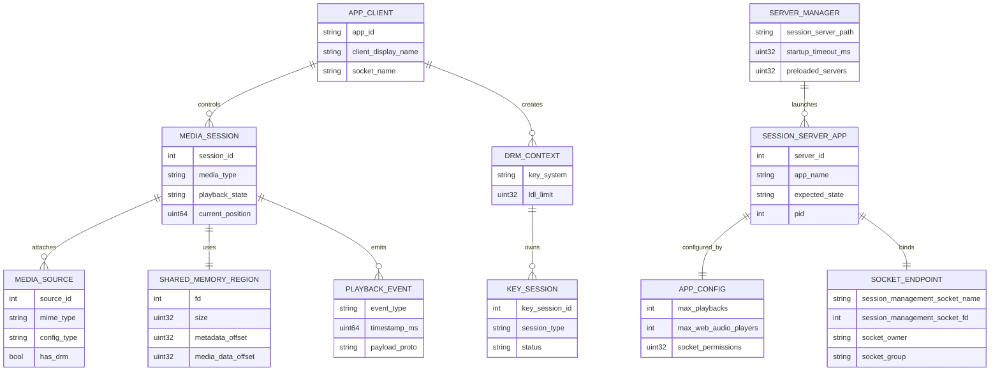

# Rialto Architecture Brief

Status: Validation: Complete ✅  
Last Updated: 2026-07-10

## Table of Contents
- [Overview](#overview)
- [Related Module Briefs](#related-module-briefs)
- [Problem Definitions and Business Context](#problem-definitions-and-business-context)
  - [Problem Statement](#problem-statement)
  - [Primary Users and Use Cases](#primary-users-and-use-cases)
  - [Non Functional Requirements](#non-functional-requirements)
  - [Integration Points](#integration-points)
- [C4 System Context Diagram](#c4-system-context-diagram)
- [System Overview](#system-overview)
  - [C4 Container Diagram](#c4-container-diagram)
  - [Container Explanation](#container-explanation)
  - [Critical User Journey Sequence](#critical-user-journey-sequence)
- [Technology Stack](#technology-stack)
- [System Data Models](#system-data-models)
- [API Endpoints](#api-endpoints)
  - [Public API](#public-api)
  - [Internal IPC API](#internal-ipc-api)
  - [Authentication and Authorization API](#authentication-and-authorization-api)
  - [AI and ML API](#ai-and-ml-api)
  - [Data Processing API](#data-processing-api)
- [Deployment Architecture](#deployment-architecture)
- [Round 1 Validation Findings](#round-1-validation-findings)
- [Round 2 Validation Findings](#round-2-validation-findings)
- [Round 3 Validation Findings](#round-3-validation-findings)
- [Validation Summary](#validation-summary)

## Overview
Rialto is a C++17 media platform that provides application-facing playback and DRM APIs through a client library, routes control and media operations over protobuf-based local IPC, and executes playback in a dedicated server runtime backed by GStreamer and platform wrappers.

Note: `docs/architecture-brief-template.md` is not present in this repository, so this brief was authored directly from source code and configuration analysis.

At runtime, the system is split into:
- Client SDK process integration via `RialtoClient` shared library.
- Session server runtime via `RialtoServer` executable.
- Session lifecycle orchestration via `RialtoServerManager` shared library.
- Reusable protobuf IPC transport libraries for client and server channels.

For detailed session lifecycle orchestration, state transitions, and healthcheck flow, see [ServerManager Architecture Brief](../serverManager/architecture-brief.md).

Primary operators are app teams integrating playback/DRM features and platform teams operating session lifecycle behavior.

## Related Module Briefs
- [Logging Architecture Brief](../logging/architecture.md)
- [ServerManager Architecture Brief](../serverManager/architecture-brief.md)

## Problem Definitions and Business Context
### Problem Statement
Rialto addresses these platform problems:
1. Delivering consistent A/V playback and DRM behavior across applications.
2. Isolating playback execution into a managed server process instead of embedding all media complexity in every app.
3. Providing low-overhead, deterministic local communication between app code and media runtime.
4. Centralizing session server lifecycle, health checks, and log-level controls.

### Primary Users and Use Cases
Primary users:
- Application developers integrating media playback and DRM.
- Platform middleware teams maintaining playback services.
- CI and release teams validating builds and tests.

Primary use cases:
1. Create media session, load source, control playback, receive async state/events.
2. Create and manage DRM key sessions, license exchange, and key store operations.
3. Configure session servers per app and transition session state between `INACTIVE`, `ACTIVE`, and `NOT_RUNNING`.

### Non Functional Requirements
Availability:
- Session health checks with ping and ack control loops are implemented through `ServerManagerModule.ping` and controller paths.
- Session restart handling is present in server manager common components.

Performance:
- Shared memory data path is used for media payload transfer to reduce copy overhead.
- Event-loop driven IPC avoids internal transport thread pools and keeps ownership explicit.

Security:
- IPC uses local Unix domain sockets with configurable permissions, owner, and group.
- Session/server communication is local-only by design.

Scalability:
- Session server lifecycle supports preloaded server instances and per-app session allocation.
- Scaling unit is per session server process, orchestrated by server manager logic.

### Integration Points
Only programmatic integrations present in code are listed.

External dependencies and integrations:
1. Protobuf compiler/runtime for RPC stubs and message serialization.
2. GStreamer runtime libraries for playback pipelines.
3. OpenCDM integration for DRM operations.
4. WPEFramework Core and COM integration through wrapper layer.
5. Mongoose HTTP server in `RialtoServerManagerSim` test utility.
6. POSIX OS services for Unix sockets, shared memory, process control, and environment variables.

## C4 System Context Diagram

## System Overview
### C4 Container Diagram

### Container Explanation
- `RialtoClient` is the application-facing shared library and exposes public playback and DRM interfaces.
- Client IPC modules convert API operations into protobuf request messages and subscribe to async event streams.
- IPC transport libraries provide channel control, server/client endpoint logic, buffer pools, and named socket handling.
- `RialtoServer` composes IPC module services, core media domain logic, and task-based GStreamer execution.
- `RialtoServerManager` supervises session server lifecycle, startup timeout behavior, state transitions, and ping/ack health checks.
- `RialtoServerManagerSim` provides lightweight HTTP control endpoints for test and simulation use.

### Critical User Journey Sequence

## Technology Stack
Runtime and languages:
- C++17 across core libraries and executables.
- CMake minimum 3.10 build system.
- Native CI build runner on Ubuntu 24.04.

Data serialization and IPC:
- Protocol Buffers with `cc_generic_services` and minimum protobuf version 3.6 documented in IPC docs.
- Unix domain sockets with file descriptor passing support in IPC layer.
- Shared memory buffer transport for media data flow.

Media and DRM:
- GStreamer 1.0 modules via `gstreamer-app-1.0`, `gstreamer-pbutils-1.0`, `gstreamer-audio-1.0`.
- OpenCDM integration via wrapper and media server.

Platform and integration libraries:
- WPEFramework Core and COM wrappers.
- jsoncpp optional config support when config-file feature is enabled.
- Mongoose library for ServerManager simulator HTTP endpoint.
- Optional EthanLog integration.

Infrastructure and delivery characteristics:
- No Dockerfile or Kubernetes manifests present in this repository.
- Install targets include `RialtoServer` binary and shared libraries under standard system paths.

Monitoring and security:
- Log-level control API via server manager module.
- Compile-time log category switches.
- Socket permissions, owner, and group are configurable.

AI and ML services:
- No AI or ML integrations detected.

## System Data Models
Rialto is largely RPC and in-memory state oriented. Persistent relational storage is not defined in this codebase. The ER model below documents runtime entities and ownership relationships.

Data flow notes:
- Control-plane state is represented in protobuf messages and in-memory manager structures.
- Media payload flow uses shared memory descriptors and offsets, not database records.
- Session state transitions are propagated via protobuf requests and async event messages.

## API Endpoints
### Public API
Source interfaces:
- `media/public/include/IMediaPipeline.h`
- `media/public/include/IMediaKeys.h`
- `media/public/include/IMediaKeysCapabilities.h`
- `media/public/include/IMediaPipelineCapabilities.h`
- `media/public/include/IWebAudioPlayer.h`

Representative public operations:
- Playback session lifecycle and controls: create, load, play, pause, stop, seek, volume, mute, buffering.
- DRM session lifecycle and key operations: create key sessions, generate requests, update, close, remove.
- Capability queries: mime type support, key-system support.

### Internal IPC API
Transport protocol:
- Protobuf RPC over Unix domain sockets with asynchronous events.

Control module service:
- `getSharedMemory`
- `registerClient`
- `ack`

Media pipeline module service:
- `createSession`
- `destroySession`
- `load`
- `attachSource`
- `removeSource`
- `allSourcesAttached`
- `setVideoWindow`
- `play`
- `pause`
- `stop`
- `setPosition`
- `getPosition`
- `setImmediateOutput`
- `getImmediateOutput`
- `getStats`
- `setPlaybackRate`
- `haveData`
- `renderFrame`
- `setVolume`
- `getVolume`
- `setMute`
- `getMute`
- `setTextTrackIdentifier`
- `getTextTrackIdentifier`
- `setLowLatency`
- `setSync`
- `getSync`
- `setSyncOff`
- `setStreamSyncMode`
- `getStreamSyncMode`
- `flush`
- `setSourcePosition`
- `setSubtitleOffset`
- `processAudioGap`
- `setBufferingLimit`
- `getBufferingLimit`
- `setUseBuffering`
- `getUseBuffering`
- `getDuration`

Media pipeline capabilities module service:
- `getSupportedMimeTypes`
- `isMimeTypeSupported`
- `getSupportedProperties`
- `isVideoMaster`

Media keys module service:
- `createMediaKeys`
- `destroyMediaKeys`
- `containsKey`
- `createKeySession`
- `generateRequest`
- `loadSession`
- `updateSession`
- `setDrmHeader`
- `closeKeySession`
- `removeKeySession`
- `deleteDrmStore`
- `deleteKeyStore`
- `getDrmStoreHash`
- `getMetricSystemData`
- `getKeyStoreHash`
- `getLdlSessionsLimit`
- `getLastDrmError`
- `getDrmTime`
- `getCdmKeySessionId`
- `releaseKeySession`

Media keys capabilities module service:
- `getSupportedKeySystems`
- `supportsKeySystem`
- `getSupportedKeySystemVersion`
- `isServerCertificateSupported`

Web audio player module service:
- `createWebAudioPlayer`
- `destroyWebAudioPlayer`
- `play`
- `pause`
- `setEos`
- `getBufferAvailable`
- `getBufferDelay`
- `writeBuffer`
- `getDeviceInfo`
- `setVolume`
- `getVolume`

Server manager module service:
- `setConfiguration`
- `setState`
- `setLogLevels`
- `ping`

Server manager simulator HTTP control API:
- `POST /SetState/AppName/NewState`
- `GET /GetState/AppName`
- `GET /GetAppInfo/AppName`
- `POST /SetLog/component/level`
- `POST /Quit`

### Authentication and Authorization API
- No dedicated authentication or authorization API exists in this repository.
- Trust boundary is local process and socket-permission based isolation.

### AI and ML API
- None. No vector, embedding, model inference, or ML endpoint surface exists.

### Data Processing API
- Primary data processing is media frame ingestion and playback operations through `MediaPipelineModule` and shared memory operations through `ControlModule`.

## Deployment Architecture
Runtime units and install artifacts:
1. `RialtoServer` executable installed to `bin`.
2. `RialtoClient` shared library installed to library directory.
3. `RialtoServerManager` shared library installed to library directory.
4. `RialtoServerManagerSim` executable installed to `bin`.
5. Static internal libraries linked into runtime units.

Container images:
- No container image definitions are present in repository files.
- CI uses a hosted Ubuntu 24.04 runner for native builds.

Scaling units:
- Session-server-per-application model managed by server manager.
- Optional preloaded session servers configured by `NUM_OF_PRELOADED_SERVERS`.

Network topology:
- Primary control and media IPC are local Unix domain sockets.
- Shared memory file descriptors are exchanged over IPC for payload transfer.
- Optional simulator endpoint exposed on `0.0.0.0:9008` using HTTP for test control.

Configuration controls:
- Session server path default `/usr/bin/RialtoServer`.
- Socket permission and ownership controls available through CMake options and server manager configuration.
- Environment variables can be forwarded to spawned session servers.

Operational hooks:
- Ping/ack health checks from server manager to session servers.
- Log-level runtime controls through server manager module and simulator API.

## Round 1 Validation Findings
Objective: Gap analysis and completeness check.

Findings discovered:
1. Initial draft lacked explicit mention that no template file existed in `docs`.
2. Initial API section did not enumerate all RPC operations in `MediaPipelineModule` and `MediaKeysModule`.
3. Initial technology section did not include CI runtime evidence.
4. Initial deployment section did not clearly separate local socket topology from simulator HTTP topology.

Fixes applied:
1. Added explicit statement that architecture brief was authored directly due to absent template file.
2. Expanded Internal IPC API section to include complete operation lists per module from proto definitions.
3. Added `ubuntu-24.04` CI runtime detail and native build script facts.
4. Split network topology into Unix socket plus optional simulator HTTP endpoint.

Round 1 completion check:
- All placeholders removed.
- Required sections present.
- Mermaid diagrams included for context, container, sequence, and ER models.

## Round 2 Validation Findings
Objective: Adversarial challenge and technical accuracy verification.

Challenges raised:
1. Challenge: Is there any true external network integration in production runtime.  
   Resolution: No external cloud API calls found; integrations are platform libraries and local IPC only.
2. Challenge: Could simulator HTTP endpoints be mistaken for production API.  
   Resolution: Marked simulator API explicitly as test utility under server manager simulator.
3. Challenge: Is database architecture missing.  
   Resolution: Verified no persistent DB integration in repository; data model documented as runtime in-memory plus protobuf message flow.
4. Challenge: Are scaling claims supported by code.  
   Resolution: Tied scaling statements to preloaded server support and per-application session server control paths.
5. Challenge: Could auth claims be overstated.  
   Resolution: Explicitly documented that dedicated auth APIs are absent and security boundary is local process/socket permissions.

Corrections made after challenge:
- Refined integration language to avoid implying non-existent external SaaS dependencies.
- Added explicit production vs simulation distinction.
- Clarified persistence model and security boundary details.

## Round 3 Validation Findings
Objective: Stakeholder readiness and final polish.

Developer readiness refinements:
1. Added concrete source filenames in container and sequence diagrams.
2. Grouped APIs by module for faster code-to-doc mapping.

Product and business readiness refinements:
1. Tightened problem statements into business-impact language.
2. Clarified what capabilities are included and what is out of scope.

Operations and SRE readiness refinements:
1. Added install artifact inventory and topology split.
2. Added health-check and runtime control hooks.

Security readiness refinements:
1. Clarified local trust boundary and socket permission controls.
2. Avoided claiming token-based or identity-provider controls.

Presentation refinements:
1. Added complete table of contents.
2. Standardized terminology around client, session server, and server manager.
3. Reviewed Mermaid syntax rules and removed risky edge-label formatting patterns.

## Validation Summary
Round 1 summary:
- Issues found: 4
- All 4 resolved by expanding completeness and explicit evidence mapping.

Round 2 summary:
- Challenges addressed: 5
- Key improvements: tighter integration scope, corrected assumptions about persistence and auth, clearer production vs simulator boundaries.

Round 3 summary:
- Final refinements: 8
- Result: document is readable by developer, product, operations, and security audiences.

Validation process completion:
1. Round 1 completed ✅
2. Round 2 completed ✅
3. Round 3 completed ✅
4. Validation findings sections present ✅
5. Validation summary present ✅
6. Document status marked complete ✅

Final validation state: Validation: Complete ✅
