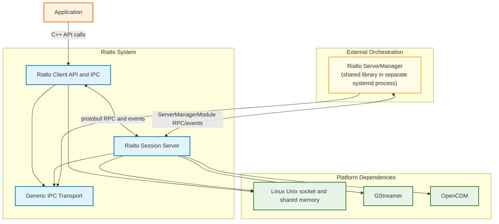
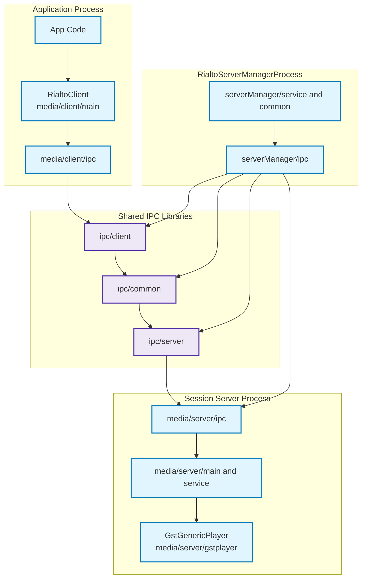
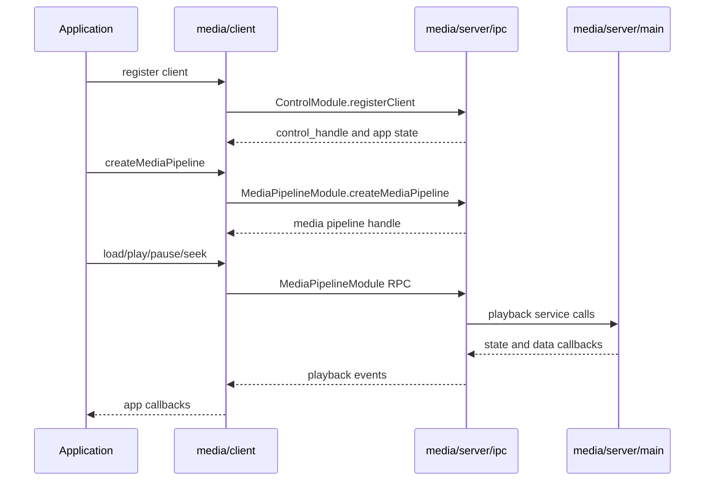
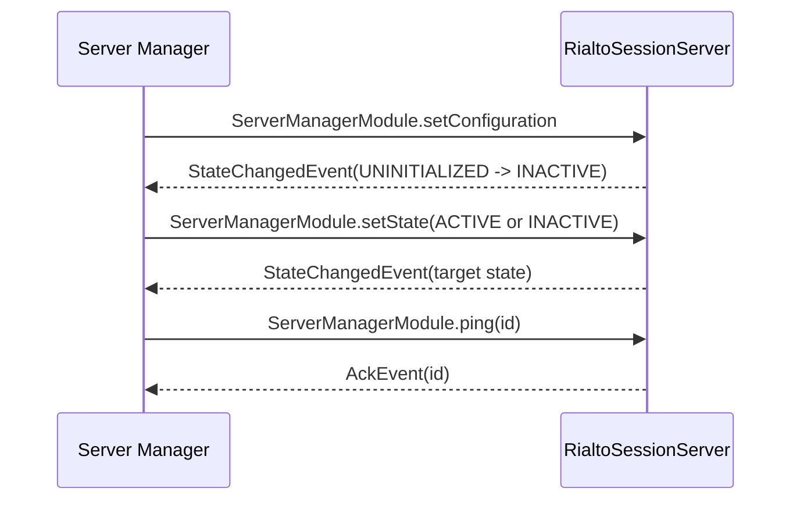
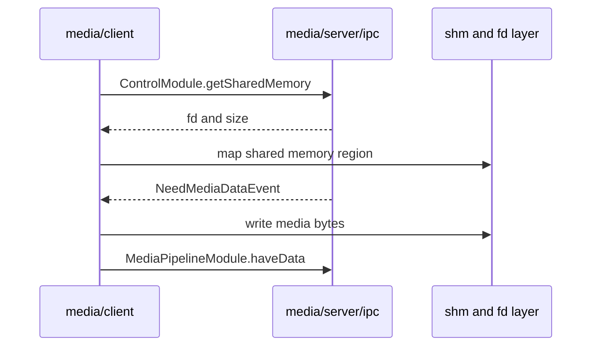

# Rialto System Architecture

Status: Validation Complete ✅
Last Updated: 2026-08-07

## Table of Contents
- [Overview](#overview)
- [How To Use This Architecture](#how-to-use-this-architecture)
- [Architecture Partitioning](#architecture-partitioning)
- [Module Architecture Briefs](#module-architecture-briefs)
- [C4 System Context](#c4-system-context)
- [C4 Container View](#c4-container-view)
- [Primary Runtime Flows](#primary-runtime-flows)
  - [Flow 1: Application Playback Lifecycle](#flow-1-application-playback-lifecycle)
  - [Flow 2: ServerManager Session Lifecycle and Healthcheck](#flow-2-servermanager-session-lifecycle-and-healthcheck)
  - [Flow 3: Shared Memory Data Path](#flow-3-shared-memory-data-path)
- [Cross-Cutting Design Rules](#cross-cutting-design-rules)
- [Configuration and Environment](#configuration-and-environment)
- [Technology Stack Summary](#technology-stack-summary)
- [Validation Summary](#validation-summary)

## Overview
This document reframes Rialto architecture as a system map built from module-level architecture briefs.

Instead of duplicating each subsystem internals, this page answers:
1. Which module owns what responsibilities.
2. How client, session server, and server manager interact end-to-end.
3. Which detailed brief to read next for each concern.

## How To Use This Architecture
Suggested reading path:
1. Read this file for system boundaries and runtime interactions.
2. Open the module brief that matches your current task.
3. Use module docs for detailed APIs, data models, and validation notes.

## Architecture Partitioning
Rialto is partitioned into the following main areas:

1. Server
- `media/server/*` contains the session server runtime and media/DRM execution logic.

2. Client
- `media/client/*` contains client-side APIs and adapters used by applications.

3. Server manager
- `serverManager/*` controls session lifecycle, health checks, and runtime orchestration.

4. IPC
- `ipc/*` provides generic local transport primitives used by the platform.
- `media/client/ipc`, `media/server/ipc`, and `serverManager/ipc` provide domain-specific IPC adapters.

5. Public API
- `rialto/media/public/include` defines the public Rialto C++ API surface.

6. Common
- `common/*` contains shared functions and structures used across the project.

## Module Architecture Briefs
Primary architecture references:
- Client architecture: `../media/client/architecture.md`
- Session server IPC architecture: `../media/server/ipc/architecture.md`
- Generic IPC transport architecture (root IPC module): `../ipc/architecture.md`
- IPC server transport deep dive: `../ipc/server/architecture.md`
- Server manager architecture: `../serverManager/architecture-brief.md`
- Logging architecture: `../logging/architecture.md`

These briefs are intentionally complementary:
- `docs/architecture.md` defines cross-module views.
- Module briefs define component internals and APIs.

## C4 System Context

## C4 Container View

## Primary Runtime Flows
### Flow 1: Application Playback Lifecycle

### Flow 2: ServerManager Session Lifecycle and Healthcheck

### Flow 3: Shared Memory Data Path (Media Pipeline)

WebAudio uses a different SHM flow (push mode): no `NeedMediaDataEvent` round-trip. The app writes PCM data into the WebAudio ring buffer and notifies the server using `WebAudioPlayerModule.writeBuffer`.

## Cross-Cutting Design Rules
1. Layered separation
- Domain logic should not depend on transport internals.

2. Local-only communication
- All runtime RPC is local IPC over Unix socket transport.

3. Explicit ownership and cleanup
- Session/key/player resources are tracked per client and cleaned up on disconnect.

4. Schema compatibility
- Client/server schema compatibility is validated during client registration.

5. Event-driven runtime
- Async events are processed through dedicated event threads and callbacks.

## Configuration and Environment
Key runtime configuration inputs:
1. Session manager configuration file (JSON):
- Contains application/service limits, socket settings, ping/recovery controls, and logging levels.

2. Client connection environment:
- `RIALTO_SOCKET_PATH` or `RIALTO_SOCKET_FD` for control/media IPC attachment.

3. Session socket permissions:
- Optional owner/group/permission settings configured for runtime IPC sockets.

## Technology Stack Summary
- Language: C++17
- Build: CMake
- IPC serialization: Protocol Buffers
- Local transport: Unix domain sockets with fd passing
- Media runtime: GStreamer
- DRM integration: OpenCDM

## Validation Summary
This reframed document was validated for:
1. Boundary clarity between client, server IPC, server runtime, and server manager.
2. Consistency with module-level architecture briefs created in this repository.
3. Mermaid syntax correctness for context, container, and sequence diagrams.
4. Practical onboarding value: clear "where to look" map before module deep dives.
