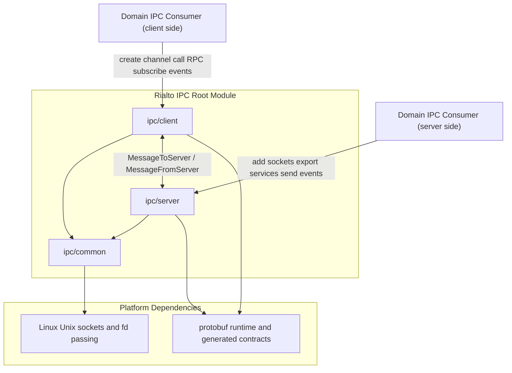
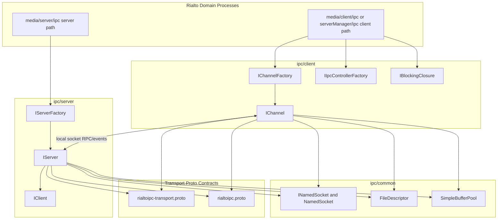
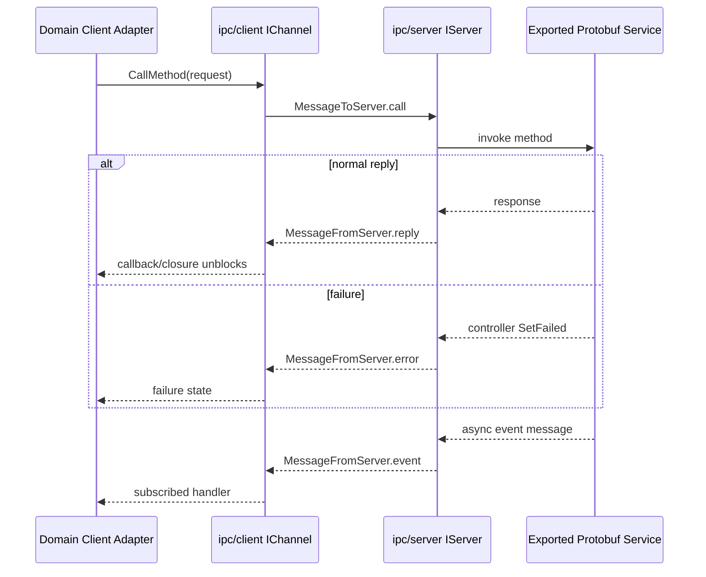
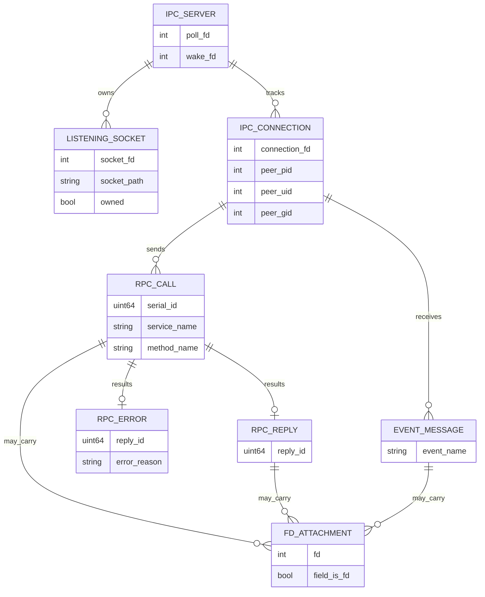
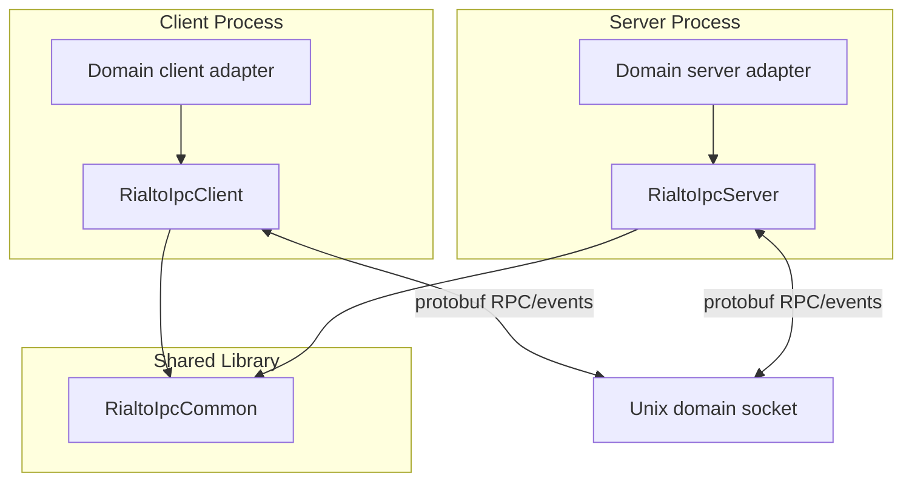

# Rialto IPC Architecture Brief

Status: Validation Complete
Last Updated: 2026-08-07

## Table of Contents
- [Overview](#overview)
- [Scope and Folder Ownership](#scope-and-folder-ownership)
- [Problem Definitions and Business Context](#problem-definitions-and-business-context)
  - [Problem Statement](#problem-statement)
  - [Primary Users and Use Cases](#primary-users-and-use-cases)
  - [Non Functional Requirements](#non-functional-requirements)
  - [Integration Points](#integration-points)
- [C4 System Context Diagram](#c4-system-context-diagram)
- [System Overview](#system-overview)
  - [C4 Container Diagram](#c4-container-diagram)
  - [Container Explanation](#container-explanation)
  - [Critical Transport Sequence](#critical-transport-sequence)
- [Technology Stack](#technology-stack)
- [Transport Data Model](#transport-data-model)
- [API Surface](#api-surface)
  - [Client API](#client-api)
  - [Server API](#server-api)
  - [Transport Contract Extensions](#transport-contract-extensions)
- [Deployment Architecture](#deployment-architecture)
- [Validation Summary](#validation-summary)

## Overview
`ipc` is Rialto's generic local transport layer, implemented as three libraries:
1. `RialtoIpcClient` (`ipc/client`)
2. `RialtoIpcServer` (`ipc/server`)
3. `RialtoIpcCommon` (`ipc/common`)

This layer provides protobuf RPC transport, async server-to-client events, and Unix file descriptor passing. It is domain-agnostic and reused by media client, media server IPC services, and server manager IPC paths.

## Scope and Folder Ownership
- `ipc/client`: Channel creation and RPC/event handling on client side (`IChannel`, controller and blocking closure support).
- `ipc/server`: Socket listeners, client lifecycle, service dispatch, reply/error/event emission (`IServer`, `IClient`).
- `ipc/common`: Shared low-level primitives (`NamedSocket`, descriptor wrapper, buffer pool).
- `ipc/examples`: Minimal example programs for local verification and understanding.

For server-specific deep dive, see `ipc/server/architecture.md`.

## Problem Definitions and Business Context
### Problem Statement
The IPC root module solves these platform concerns:
1. Provide low-latency local RPC transport independent of media domain code.
2. Support protobuf service invocation and asynchronous event delivery.
3. Support passing Unix file descriptors (for shared memory and related handles).
4. Enable processes to act as client and server without symbol collisions.

### Primary Users and Use Cases
Primary users:
- Domain modules in `media/client/ipc`, `media/server/ipc`, and `serverManager/ipc`.
- Platform developers implementing protobuf services.
- Test tooling using IPC examples.

Primary use cases:
1. Client creates channel by socket path or connected fd and issues RPC calls.
2. Server accepts client connections and exports protobuf services per client.
3. Server sends async event messages to subscribed client handlers.
4. Request/reply/event messages carry fd fields when proto options mark them.

### Non Functional Requirements
Availability:
- No internal hidden ownership loops in API consumers; caller drives wait/process loops.
- Explicit disconnection and lifecycle callbacks for server-side client tracking.

Performance:
- `SOCK_SEQPACKET` transport preserves message boundaries and avoids stream framing complexity.
- Shared-memory-oriented fd passing minimizes heavy payload copies.

Security:
- Local Unix socket transport only.
- Server can expose peer pid/uid/gid for policy decisions.

Scalability:
- One server can host multiple listening sockets.
- One server can manage multiple concurrent client connections.

### Integration Points
1. Protobuf runtime and generated service/message code.
2. Linux kernel primitives (`epoll`, `eventfd`, Unix sockets, fd passing).
3. Root `proto` transport contracts:
- `proto/rialtoipc.proto`
- `proto/rialtoipc-transport.proto`

## C4 System Context Diagram

## System Overview
### C4 Container Diagram

### Container Explanation
- `ipc/client` exposes channel and helper abstractions used by protobuf stubs to perform synchronous RPC calls and receive events.
- `ipc/server` exposes server and connected-client abstractions used to accept clients, export services, and send replies/events.
- `ipc/common` encapsulates low-level primitives shared across both sides.
- `proto/rialtoipc-transport.proto` defines wire envelope messages.
- `proto/rialtoipc.proto` defines proto options for fd fields and no-reply semantics.

### Critical Transport Sequence

## Technology Stack
- Language: C++17
- Build: CMake
- Serialization: Protocol Buffers
- Transport: Unix domain sockets (`SOCK_SEQPACKET`)
- OS primitives: `epoll`, `poll`, `eventfd`, `SCM_RIGHTS`, peer credentials

Produced libraries:
- `RialtoIpcCommon`
- `RialtoIpcClient`
- `RialtoIpcServer`

## Transport Data Model

## API Surface
### Client API
Key interfaces in `ipc/client/include`:
- `IChannelFactory`
- `IChannel`
- `IIpcControllerFactory`
- `IBlockingClosure`

Capabilities:
- Connect via socket path or preconnected fd.
- Call protobuf RPC methods.
- Subscribe/unsubscribe to server events.
- Wait/process event loop with external thread ownership.

### Server API
Key interfaces in `ipc/server/include`:
- `IServerFactory`
- `IServer`
- `IClient`

Capabilities:
- Add listening sockets by path or fd.
- Receive connect/disconnect callbacks.
- Export protobuf services per client.
- Send async events to selected clients.

### Transport Contract Extensions
Defined in `proto/rialtoipc.proto`:
- `field_is_fd`: marks an int32 field as file descriptor payload.
- `no_reply`: marks RPC methods that intentionally produce no reply.

Defined in `proto/rialtoipc-transport.proto`:
- `MessageToServer` and `MessageFromServer` envelopes.
- `MethodCall`, `MethodCallReply`, `MethodCallError`, `EventFromServer`.

## Deployment Architecture

## Validation Summary
This root IPC architecture brief was validated for:
1. Scope correctness across `ipc/client`, `ipc/server`, and `ipc/common`.
2. Alignment with current CMake targets and public interfaces.
3. Consistency with existing server-only IPC architecture brief.
4. Clear distinction between generic transport behavior and domain-specific module behavior.
