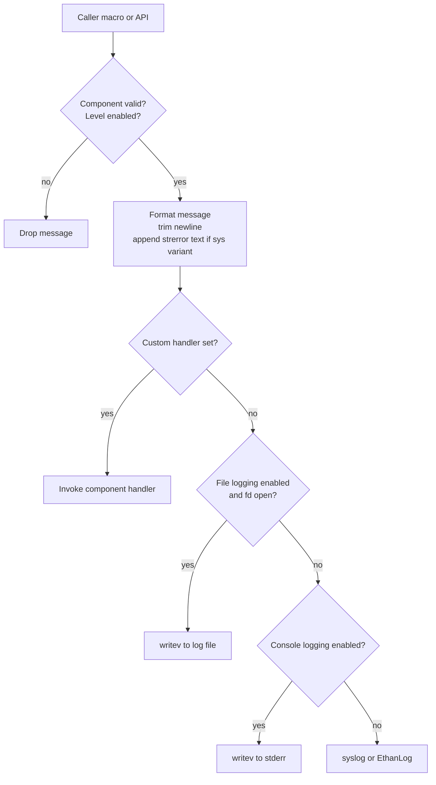

# Logging Architecture Brief

Status: Drafted from source analysis
Last Updated: 2026-07-16

## Overview
The `logging` module provides Rialto-wide logging primitives used by C and C++ code paths. It exposes:
- C logging entry points (`rialtoLogPrintf`, `rialtoLogVPrintf`, `rialtoLogSysPrintf`).
- Compile-time logging macros per severity (`RIALTO_LOG_FATAL`, `RIALTO_LOG_ERROR`, etc.).
- C++ control APIs to set/get per-component log levels and register component-specific handlers.

Primary goals:
- Keep logging low-overhead in hot paths.
- Allow per-component verbosity control.
- Support multiple sinks (custom handler, file, console, system logger).
- Preserve compatibility with both syslog and EthanLog builds.

## Module Structure
- `include/RialtoLogging.h`: public C macros/APIs and C++ control interface.
- `source/RialtoLogging.cpp`: core dispatch, filtering, formatting, sink routing.
- `source/EnvVariableParser.{h,cpp}`: startup configuration from environment.
- `source/LogFileHandle.{h,cpp}`: singleton file descriptor lifecycle for file sink.

## Build-Time Composition
The folder builds:
- `RialtoLogging` static library (default implementation).
- `RialtoEthanLog` static library when `EthanLog` is found and `RIALTO_ENABLE_ETHAN_LOG` is enabled.

Behavior switch:
- With `USE_ETHANLOG`, system sink maps to EthanLog severities.
- Without it, system sink maps to syslog severities.

## Core Data Model
### Log levels
Bitmask levels:
- `FATAL`, `ERROR`, `WARNING`, `MILESTONE`, `INFO`, `DEBUG`, `EXTERNAL`.
- Default mask: fatal + error + warning + milestone.

### Components
Component-scoped configuration for:
- `DEFAULT`, `CLIENT`, `SERVER`, `IPC`, `SERVER_MANAGER`, `COMMON`, `EXTERNAL`.

### Runtime state
Global process-local state in `RialtoLogging.cpp`:
- Atomic level mask per component.
- Optional custom handler per component.
- Per-component `ignoreLogLevels` flag for handler-driven routing.
- Environment parser singleton for initial defaults.

## Runtime Flow

Message formatting characteristics:
- Adds monotonic timestamp for fd-based sinks.
- Adds compact severity/component tags and thread id.
- Includes file/function/line metadata when available.
- External logs use reduced metadata format.

## Configuration Model
Environment variables parsed on first use:
- `RIALTO_DEBUG`
- `RIALTO_CONSOLE_LOG`
- `RIALTO_LOG_PATH`

`RIALTO_DEBUG` forms:
- Global numeric level (`0..5`) applies to all managed components.
- Component map form: `component:level;component:level`.
- Wildcard default supported via `*:<level>`, then overridden by explicit component entries.

Supported component keys in parser:
- `client`, `sessionserver`, `ipc`, `servermanager`, `common`.

Level mapping from numeric value:
- `0` fatal only
- `1` fatal+error
- `2` +warning
- `3` +milestone
- `4` +info
- `5` +debug

## Sink Priority and Selection
At log emission time, sink selection order is deterministic:
1. Component custom handler (if registered)
2. File sink (`RIALTO_LOG_PATH`, if opened)
3. Console sink (`RIALTO_CONSOLE_LOG=1`, stderr)
4. System sink (syslog or EthanLog)

Implications:
- Registering a handler bypasses default sinks for that component.
- `ignoreLogLevels=true` with a non-null handler forces delivery regardless of component mask.
- Clearing handler resets `ignoreLogLevels` behavior.

## Public Control Surface (C++)
- `setLogLevels(component, levels)`
- `getLogLevels(component)`
- `setLogHandler(component, handler, ignoreLogLevels)`
- `isConsoleLoggingEnabled()`

Behavior notes:
- `setLogLevels` fails for invalid component or when that component handler is configured to ignore levels.
- `getLogLevels` lazily initializes from parsed environment defaults.
- `EXTERNAL` component level is externally controlled and returned as `RIALTO_DEBUG_LEVEL_EXTERNAL`.

## Concurrency and Safety
- Level masks are stored atomically per component.
- Handler registration is mutex-protected.
- Handler invocation uses local handler copy to avoid lock-holding in hot path.
- Thread id is cached with `thread_local` for reduced syscall overhead.

## Known Constraints
- Message buffer is fixed-size (512 bytes) and truncates longer messages.
- File sink opens with truncate mode (`O_TRUNC`), so previous file content is overwritten at init.
- `writev` path currently ignores partial-write and EINTR retry handling.
- Environment config is process startup-time behavior through singleton initialization, not dynamic re-parse.

## Validation Pointers
- Verify level parsing for numeric, wildcard, and per-component formats.
- Verify sink routing precedence under handler/file/console/system combinations.
- Verify `ignoreLogLevels` semantics and interaction with `setLogLevels` return status.
- Verify truncation behavior and metadata formatting in long message scenarios.
- Verify behavior parity across syslog and EthanLog builds.
