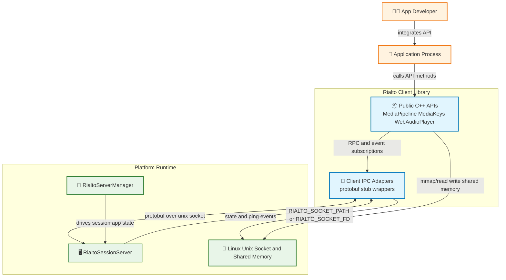
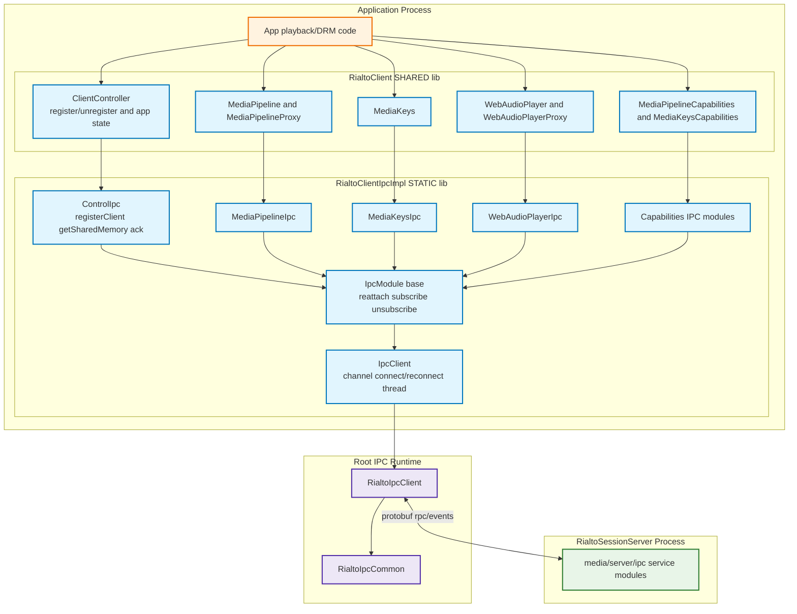
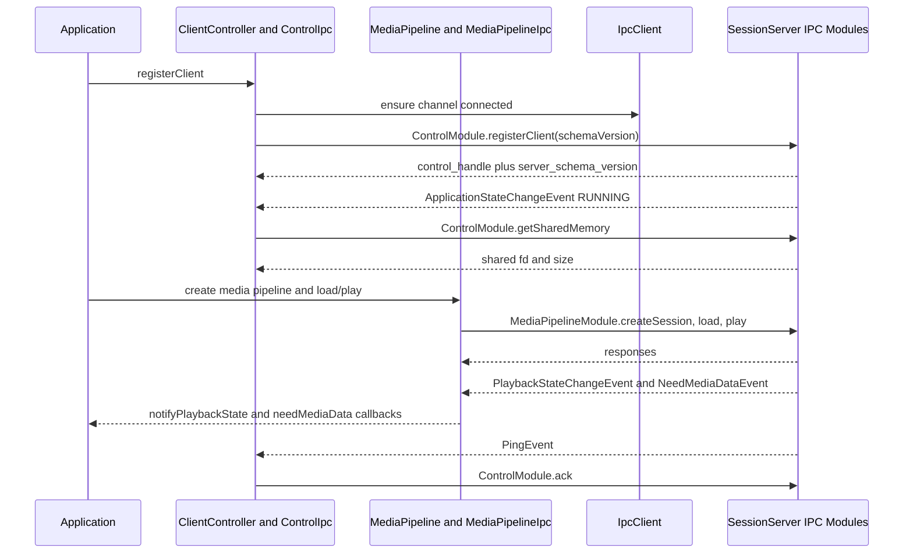
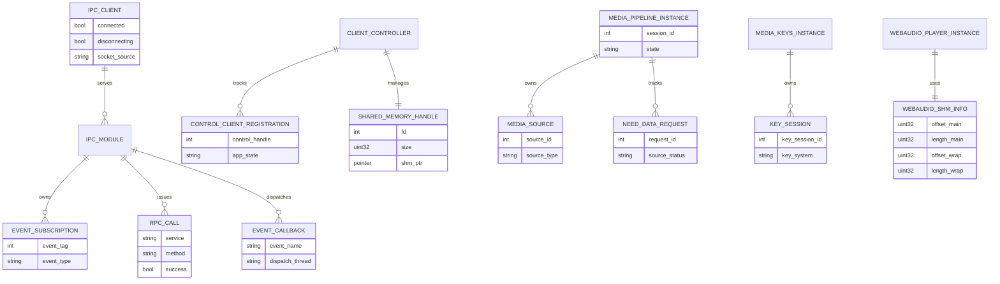
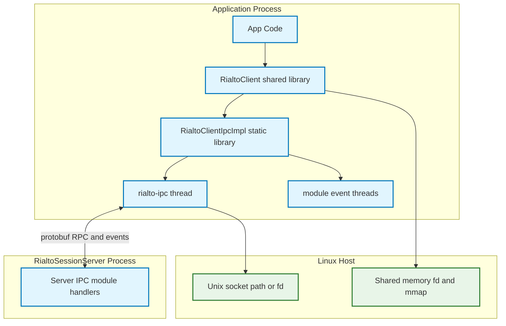

# Rialto Client Architecture Brief

Status: Validation Complete ✅
Last Updated: 2026-08-07

## Table of Contents
- [Overview](#overview)
- [Problem Definitions and Business Context](#problem-definitions-and-business-context)
  - [Problem Statement](#problem-statement)
  - [Primary Users and Use Cases](#primary-users-and-use-cases)
  - [Non Functional Requirements](#non-functional-requirements)
  - [Integration Points](#integration-points)
- [C4 System Context Diagram](#c4-system-context-diagram)
- [System Overview](#system-overview)
  - [C4 Container Diagram](#c4-container-diagram)
  - [Container Explanation](#container-explanation)
  - [Critical User Journey Sequence](#critical-user-journey-sequence)
- [Technology Stack](#technology-stack)
- [System Data Models](#system-data-models)
- [API Endpoints](#api-endpoints)
  - [Public API](#public-api)
  - [Internal IPC API](#internal-ipc-api)
  - [Authentication and Authorization API](#authentication-and-authorization-api)
  - [AI and ML API](#ai-and-ml-api)
  - [Data Processing API](#data-processing-api)
- [Deployment Architecture](#deployment-architecture)
- [Round 1 Validation Findings](#round-1-validation-findings)
- [Round 2 Validation Findings](#round-2-validation-findings)
- [Round 3 Validation Findings](#round-3-validation-findings)
- [Validation Summary](#validation-summary)

## Overview
`media/client` implements the application-facing Rialto client runtime (`RialtoClient` shared library). It provides C++ playback, DRM, and web-audio APIs, and translates those calls into protobuf RPC over local IPC to `RialtoSessionServer`.

The module is split into three sub-components:
- `media/client/main`: API object model (`MediaPipeline`, `MediaKeys`, `WebAudioPlayer`, controller/proxy classes).
- `media/client/ipc`: IPC adapters and protobuf stubs (`*Ipc` classes and `IpcClient`).
- `media/client/common`: shared logging/support utilities.

## Problem Definitions and Business Context
### Problem Statement
Rialto client addresses these concerns:
1. Expose stable media/DRM APIs to applications without embedding server complexity.
2. Hide protobuf/IPC transport details behind synchronous C++ APIs and callback interfaces.
3. Manage client lifecycle against server application-state changes and disconnections.
4. Provide shared-memory and event coordination for low-overhead media data transfer.

### Primary Users and Use Cases
Primary users:
- Application developers integrating playback, DRM, and WebAudio.
- Platform middleware teams consuming client API surface.

Primary use cases:
1. Create media pipeline, attach sources, load/play/pause/seek, receive async playback events.
2. Create media keys, manage key sessions, handle license request/renewal and key-status events.
3. Create web audio player, write shared-buffer audio frames, receive state updates.
4. React to application-state updates and health pings from session server.

### Non Functional Requirements
Availability:
- Dedicated IPC processing thread handles channel `process/wait` loop and disconnection detection.
- Module-level reconnect path (`reattachChannelIfRequired`) attempts transport recovery.
- Connection observer propagates broken-channel state to control client path.

Performance:
- Shared memory is acquired via control IPC and used for media/web-audio buffer paths.
- Event callbacks are processed on dedicated event threads per module to avoid blocking IPC thread.
- Transport reuses shared generic IPC runtime (`RialtoIpcClient`, `RialtoIpcCommon`).

Security:
- Local-only Unix socket communication (`RIALTO_SOCKET_PATH` or `RIALTO_SOCKET_FD` source).
- No remote network listener in client module.
- Protocol compatibility checks validate client/server schema versions during registration.

Scalability:
- Multiple client-side objects can register with `ClientController`.
- Per-object IPC adapters maintain session/media-key/player handles independently.
- Event subscription tags are tracked per module for deterministic teardown.

### Integration Points
Programmatic integrations in code:
1. Root IPC transport libraries (`RialtoIpcClient`, `RialtoIpcCommon`).
2. Protobuf contracts in `proto/*.proto` (media pipeline, control, keys, capabilities, web audio).
3. Session server IPC endpoints hosted by `media/server/ipc`.
4. Common shared-memory and frame writer utilities from `RialtoPlayerCommon`/`RialtoCommon`.
5. Logging integration via `RialtoEthanLog` and client logging macros.

## C4 System Context Diagram

## System Overview
### C4 Container Diagram

### Container Explanation
- `RialtoClient` (`media/client/main`) is the API object layer applications instantiate.
- `ClientController` owns control registration and shared-memory lifecycle tied to app state.
- Module IPC classes (`ControlIpc`, `MediaPipelineIpc`, `MediaKeysIpc`, `WebAudioPlayerIpc`, capability IPCs) create protobuf stubs and map synchronous calls + async events.
- `IpcClient` owns channel creation (`RIALTO_SOCKET_PATH` / `RIALTO_SOCKET_FD`), IPC thread, reconnect support, and controller/closure factories.
- `IpcModule` base class centralizes attach/reattach/detach behavior and event-subscription tracking.

### Critical User Journey Sequence

## Technology Stack
Runtime and language:
- C++17 (`RialtoClient` and `RialtoClientIpcImpl` builds).
- Shared and static library composition via CMake.

IPC and serialization:
- Protocol Buffers generated stubs (`RialtoProtobuf`).
- Local Unix socket channel from root IPC library.
- Blocking closure and RPC controller abstractions for call synchronization.

Key build/runtime dependencies:
- `RialtoIpcClient`, `RialtoIpcCommon`.
- `RialtoCommon`, `RialtoPlayerCommon`.
- `RialtoEthanLog`.
- POSIX/pthread primitives (`pthread_setname_np`, mutexes, thread lifecycle).

## System Data Models

## API Endpoints
### Public API
Rialto client is a C++ API surface, not HTTP. Main object families:

1. Playback API (`IMediaPipeline`)
- Session and source lifecycle, load/play/pause/stop/seek, rendering, buffering and telemetry controls.

2. DRM API (`IMediaKeys`)
- Media keys and key-session lifecycle, license exchanges, key-store/hash and DRM metadata queries.

3. Capabilities API
- Media pipeline capabilities and DRM capability discovery.

4. WebAudio API (`IWebAudioPlayer`)
- Player lifecycle, buffering, device info, and volume controls.

5. Control registration path
- Client registration, application-state updates, healthcheck ack, and shared-memory acquisition.

### Internal IPC API
Client module consumes these protobuf services through IPC stubs:

1. `ControlModule`
- `registerClient`, `getSharedMemory`, `ack`
- Events: `ApplicationStateChangeEvent`, `PingEvent`

2. `MediaPipelineModule`
- Session/source/playback/volume/sync/buffering RPC surface.
- Events include playback state, position/network updates, need-data, QoS, first frame, flush and playback error.

3. `MediaPipelineCapabilitiesModule`
- Mime type and property support queries.

4. `MediaKeysModule`
- Media keys and key-session operations, license and store APIs.
- Events include license request/renewal and key-status updates.

5. `MediaKeysCapabilitiesModule`
- Supported key systems, versions, cert support, robustness levels.

6. `WebAudioPlayerModule`
- Create/destroy/play/pause/eos, buffer available/delay/write, device info, volume.
- Events include web audio player state changes.

### Authentication and Authorization API
No token-based auth protocol exists in this client module.

Security model in this layer:
- Local IPC trust boundary only.
- Socket path/fd provisioning by environment and manager/server orchestration.

### AI and ML API
None. Client module has no AI/ML interface or dependency.

### Data Processing API
No standalone data-processing service is exposed.

Data processing behavior includes:
- Conversion between API domain types and protobuf requests/responses.
- Event decoding and callback dispatching on event threads.
- Shared-memory frame copy/write path for media and web audio flows.

## Deployment Architecture

Deployment notes:
- `RialtoClient` is loaded into application process as shared library.
- Client IPC implementation runs in-process and owns dedicated communication/event threads.
- Transport channel is local host Unix socket; payload media data uses shared-memory region.

## Round 1 Validation Findings
Focus: technical alignment with client implementation.

Findings and actions:
1. Verified channel bootstrap uses environment-provided socket path/fd and fails fast when absent.
2. Verified control registration and schema compatibility flow reflects `ControlIpc::registerClient` behavior.
3. Verified shared-memory setup is tied to application state transitions in `ClientController`.

## Round 2 Validation Findings
Focus: diagram syntax and consistency.

Findings and actions:
1. Confirmed Mermaid syntax validity for context/container/sequence/ER/deployment diagrams.
2. Ensured color classes and node references are consistent.
3. Ensured no unsupported HTML edge-label markup is used.

## Round 3 Validation Findings
Focus: operational and onboarding usefulness.

Findings and actions:
1. Added explicit distinction between API-layer objects and IPC adapter layer.
2. Added reconnect and disconnection handling behavior in NFR and container explanations.
3. Added comprehensive internal IPC API section grouped by module capability.
4. Confirmed full required architecture brief section coverage.

## Validation Summary
- Mandatory three-round validation completed.
- Document is implementation-aligned with current `media/client` source and build files.
- C4, sequence, ER, and deployment diagrams included and syntax-checked.
- Brief provides onboarding-ready understanding of client architecture and runtime behavior.
