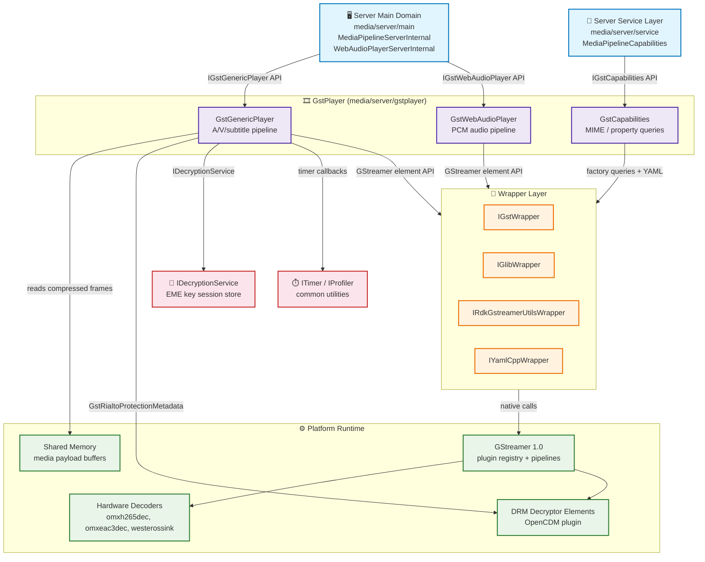
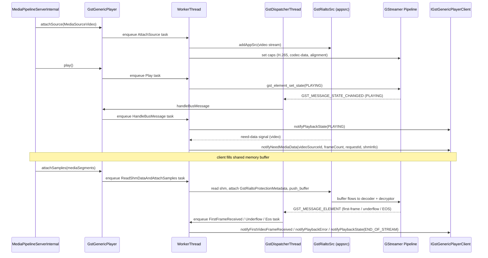
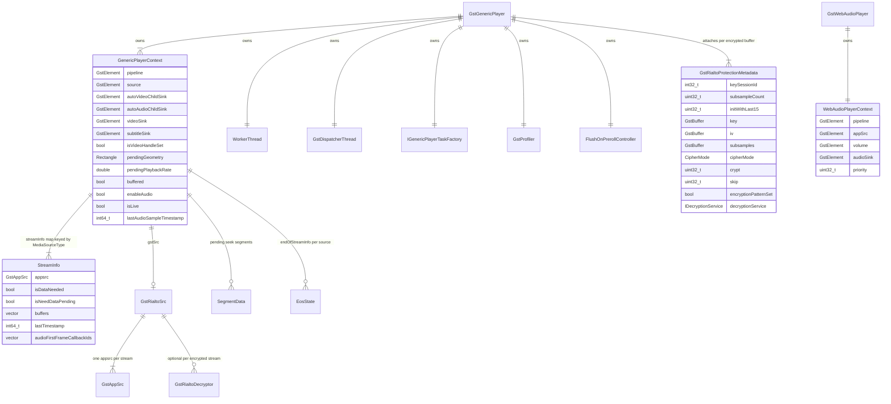

# GstPlayer Architecture Brief

Status: Drafted from source analysis  
Last Updated: 2026-07-29

## Table of Contents
- [Overview](#overview)
- [Problem Definitions and Business Context](#problem-definitions-and-business-context)
  - [Problem Statement](#problem-statement)
  - [Primary Users and Use Cases](#primary-users-and-use-cases)
  - [Non-Functional Requirements](#non-functional-requirements)
  - [Integration Points](#integration-points)
- [C4 System Context Diagram](#c4-system-context-diagram)
- [System Overview](#system-overview)
  - [C4 Container Diagram](#c4-container-diagram)
  - [Container Explanation](#container-explanation)
  - [Critical User Journey Sequence](#critical-user-journey-sequence)
- [Technology Stack](#technology-stack)
- [System Data Models](#system-data-models)
- [API Endpoints](#api-endpoints)
  - [Generic Player API](#generic-player-api)
  - [Web Audio Player API](#web-audio-player-api)
  - [Capabilities API](#capabilities-api)
  - [Player Client Callback API](#player-client-callback-api)
- [Deployment Architecture](#deployment-architecture)
- [Validation Findings](#validation-findings)

---

## Overview

`gstplayer` is the GStreamer pipeline management layer of the Rialto media server. It is responsible for:
- Constructing and driving GStreamer pipelines for audio/video/subtitle/web-audio media.
- Accepting compressed media segments from the server domain (via shared memory) and injecting them into `GstRialtoSrc` `appsrc` elements.
- Managing decryption metadata attachment for EME-protected streams.
- Reporting pipeline events (state changes, underflow, EOS, position, first frame) back to the server domain.
- Enumerating platform-supported MIME types and decoder properties via `GstCapabilities`.

It is used exclusively by the `RialtoServer` process and has no public network surface.

---

## Problem Definitions and Business Context

### Problem Statement

Rialto decouples application-facing media pipeline control from the actual GStreamer/platform execution. The `gstplayer` layer addresses:

1. GStreamer's non-thread-safe element API requires all pipeline mutations to be serialized onto a dedicated worker thread; direct cross-thread access would cause undefined behavior.
2. Encrypted (EME) media frames require protection metadata to be attached to GStreamer buffers before decryption elements process them; this coupling must be transparent to the server domain.
3. Capabilities queries (supported MIME types, decoder properties) require GStreamer initialization to have completed before answers can be returned; async initialization must be hidden from callers.
4. Web audio playback (low-latency PCM) requires a separate, lightweight pipeline path from media-pipeline playback.
5. A GStreamer bus message loop must run independently of pipeline tasks to forward state-change and error events without blocking pipeline mutation tasks.

### Primary Users and Use Cases

Primary consumers:
- `media/server/main` — `MediaPipelineServerInternal` uses `IGstGenericPlayer` for A/V media playback.
- `media/server/main` — `WebAudioPlayerServerInternal` uses `IGstWebAudioPlayer` for web audio playback.
- `media/server/service` — `MediaPipelineCapabilities` uses `IGstCapabilities` for MIME and property queries.

Primary use cases:
1. **Media playback**: Attach audio/video/subtitle sources, inject compressed samples, seek, pause/play, control volume and playback rate.
2. **EME decryption**: Attach per-frame protection metadata so GStreamer decryptor elements can decrypt on-the-fly.
3. **Web audio**: Stream raw PCM buffers through a dedicated pipeline at configurable priority.
4. **Capability discovery**: Query which MIME types and GStreamer element properties the platform supports before exposing them via Rialto IPC.

### Non-Functional Requirements

**Thread Safety**:
- All pipeline mutations (source attach, sample push, seek, state change) are serialized on the `WorkerThread` task queue.
- GStreamer bus message processing runs on a separate `GstDispatcherThread`.
- `GstCapabilities` initialization runs asynchronously in a background thread and gates queries with a condition variable until complete.

**Performance**:
- Sample injection uses the `GstRialtoSrc` custom GStreamer `appsrc`-based source element to minimize copy paths.
- Shared memory read is done inside `ReadShmDataAndAttachSamples` task, staying close to the injection point.

**EME/DRM**:
- `GstProtectionMetadata` (`_GstRialtoProtectionMetadata`) carries per-frame key session ID, IV, subsamples, cipher mode, and crypt/skip pattern fields as GStreamer custom metadata on each buffer.

**Reliability**:
- `FlushOnPrerollController` works around a GStreamer preroll race (gstreamer/gstreamer#150) by synchronizing flush-during-preroll behavior.
- `CheckAudioUnderflow` runs periodically via timer to detect stalled audio and report underflow to the client.

### Integration Points

Actual programmatic integrations only:

| Dependency | Integration type | Purpose |
|---|---|---|
| `wrappers/IGstWrapper` | C++ interface | All GStreamer API calls are routed through this wrapper for testability |
| `wrappers/IGlibWrapper` | C++ interface | GLib utility calls (object ref/unref, type queries, string operations) |
| `wrappers/IRdkGstreamerUtilsWrapper` | C++ interface | RDK-specific GStreamer utility extensions |
| `wrappers/IYamlCppWrapper` | C++ interface | YAML capability config file parsing inside `GstCapabilities` |
| `common/IDecryptionService` | C++ interface | EME key session lookup forwarded to decryptor elements via `GstProtectionMetadata` |
| `common/ITimer` / `ITimerFactory` | C++ interface | Periodic audio underflow checks, position reporting timers |
| `common/IProfiler` | C++ interface | Per-stage timing records exposed via `GstProfiler` |
| GStreamer 1.0 runtime | native DSO | `libgstreamer-1.0.so`, `libgst-app-1.0.so`, `libgst-pbutils-1.0.so`, `libgst-audio-1.0.so` |
| OpenCDM / platform DRM | runtime plugin | GStreamer decryptor elements loaded dynamically by GStreamer plugin registry |
| Platform OMX/hardware decoders | runtime plugin | Loaded by GStreamer element factory; e.g. `omxh265dec`, `omxeac3dec` as seen in logs |

---

## C4 System Context Diagram

---

## System Overview

### C4 Container Diagram

```mermaid
graph TD
    subgraph PublicInterfaces ["Public Interfaces (interface/)"]
        IGstGenericPlayer["IGstGenericPlayer\ninterface/IGstGenericPlayer.h"]
        IGstWebAudioPlayer["IGstWebAudioPlayer\ninterface/IGstWebAudioPlayer.h"]
        IGstCapabilities["IGstCapabilities\ninterface/IGstCapabilities.h"]
        IGstGenericPlayerClient["IGstGenericPlayerClient\ninterface/IGstGenericPlayerClient.h"]
        IGstWebAudioPlayerClient["IGstWebAudioPlayerClient\ninterface/IGstWebAudioPlayerClient.h"]
        IGstInitialiser["IGstInitialiser\ninterface/IGstInitialiser.h"]
    end

    subgraph GenericPlayerUnit ["Generic Player Unit (GstGenericPlayer.cpp)"]
        GstGenericPlayer["GstGenericPlayer\nImplements: IGstGenericPlayer\nIGstGenericPlayerPrivate\nIGstDispatcherThreadClient"]
        GenericPlayerContext["GenericPlayerContext\ninclude/GenericPlayerContext.h\nPipeline state, stream map,\nposition, EOS, segment data"]
        WorkerThread["WorkerThread\ninclude/WorkerThread.h\nTask queue + processing thread"]
        GstDispatcherThread["GstDispatcherThread\ninclude/GstDispatcherThread.h\nGStreamer bus message loop thread"]
        TaskFactory["GenericPlayerTaskFactory\ntasks/generic/GenericPlayerTaskFactory.cpp\nCreates all IPlayerTask instances"]
    end

    subgraph GenericTasks ["Generic Player Tasks (tasks/generic/)"]
        AttachSource["AttachSource.cpp\nConfigure appsrc + GstCaps"]
        AttachSamples["AttachSamples.cpp\nPush GstBuffer to appsrc"]
        ReadShmData["ReadShmDataAndAttachSamples.cpp\nRead shm + push buffer"]
        SetupElement["SetupElement.cpp\nConnect decoder signals,\nfirst-frame probes"]
        CheckAudioUnderflow["CheckAudioUnderflow.cpp\nDetect audio stall"]
        Flush["Flush.cpp\nflush-start/flush-stop events"]
        OtherTasks["Play, Pause, Stop, Shutdown\nSetPosition, Seek, EOS\nSetVolume, SetMute\nSetPlaybackRate, Underflow\nSetVideoGeometry, ReportPosition\n...37 tasks total"]
    end

    subgraph WebAudioUnit ["Web Audio Unit (GstWebAudioPlayer.cpp)"]
        GstWebAudioPlayer["GstWebAudioPlayer\nImplements: IGstWebAudioPlayer\nIGstWebAudioPlayerPrivate"]
        WebAudioContext["WebAudioPlayerContext\ninclude/WebAudioPlayerContext.h"]
        WebAudioTaskFactory["WebAudioPlayerTaskFactory\ntasks/webAudio/WebAudioPlayerTaskFactory.cpp"]
    end

    subgraph WebAudioTasks ["Web Audio Tasks (tasks/webAudio/)"]
        SetCaps["SetCaps.cpp\naudio/x-raw PCM caps"]
        WriteBuffer["WriteBuffer.cpp\nPush PCM frames"]
        WaOther["Play, Pause, Stop\nShutdown, EOS, Ping\nSetVolume, HandleBusMessage"]
    end

    subgraph CapabilitiesUnit ["Capabilities Unit (GstCapabilities.cpp)"]
        GstCapabilities["GstCapabilities\nImplements: IGstCapabilities\nAsync init thread, gated queries"]
    end

    subgraph SupportComponents ["Support Components"]
        GstRialtoSrc["GstRialtoSrc\nsource/GstSrc.cpp\nCustom GstBin with per-stream appsrc\n+ GstRialtoDecryptor pads"]
        CapsBuilder["MediaSourceCapsBuilder\nsource/CapsBuilder.cpp\nBuilds GstCaps from MediaSource"]
        GstProtectionMetadata["GstRialtoProtectionMetadata\nsource/GstProtectionMetadata.cpp\nPer-buffer EME metadata type"]
        GstDecryptor["GstDecryptorElementFactory\nCreates decryptor element per stream"]
        FlushOnPreroll["FlushOnPrerollController\ninclude/FlushOnPrerollController.h\nPreroll race workaround"]
        FlushWatcher["FlushWatcher\ninclude/FlushWatcher.h\nMonitors flush completion"]
        GstLogForwarding["GstLogForwarding\nsource/GstLogForwarding.cpp\nBridge GStreamer log to Rialto logging"]
        GstProfiler["GstProfiler\nsource/GstProfiler.cpp\nPer-stage timing records"]
        GstInitialiser["GstInitialiser\nsource/GstInitialiser.cpp\ngst_init singleton + wait API"]
        GstMimeMapping["GstMimeMapping\nsource/Utils.cpp\nMIME ↔ GstCaps string mappings"]
    end

    IGstGenericPlayer --> GstGenericPlayer
    IGstWebAudioPlayer --> GstWebAudioPlayer
    IGstCapabilities --> GstCapabilities
    GstGenericPlayer --> GenericPlayerContext
    GstGenericPlayer --> WorkerThread
    GstGenericPlayer --> GstDispatcherThread
    GstGenericPlayer --> TaskFactory
    TaskFactory --> AttachSource
    TaskFactory --> AttachSamples
    TaskFactory --> ReadShmData
    TaskFactory --> SetupElement
    TaskFactory --> CheckAudioUnderflow
    TaskFactory --> Flush
    TaskFactory --> OtherTasks
    AttachSource --> CapsBuilder
    AttachSource --> GstRialtoSrc
    AttachSamples --> GstProtectionMetadata
    ReadShmData --> GstProtectionMetadata
    GstRialtoSrc --> GstDecryptor
    GstWebAudioPlayer --> WebAudioContext
    GstWebAudioPlayer --> WebAudioTaskFactory
    WebAudioTaskFactory --> SetCaps
    WebAudioTaskFactory --> WriteBuffer
    WebAudioTaskFactory --> WaOther
    GstGenericPlayer --> FlushOnPreroll
    GstGenericPlayer --> FlushWatcher
    GstGenericPlayer --> GstProfiler
    GstInitialiser --> GstCapabilities

    classDef iface fill:#e1f5fe,stroke:#0277bd,stroke-width:1px
    classDef impl fill:#ede7f6,stroke:#512da8,stroke-width:1px
    classDef task fill:#f3e5f5,stroke:#7b1fa2,stroke-width:1px
    classDef support fill:#e8f5e8,stroke:#2e7d32,stroke-width:1px

    class IGstGenericPlayer,IGstWebAudioPlayer,IGstCapabilities,IGstGenericPlayerClient,IGstWebAudioPlayerClient,IGstInitialiser iface
    class GstGenericPlayer,GstWebAudioPlayer,GstCapabilities,WorkerThread,GstDispatcherThread,TaskFactory,WebAudioTaskFactory impl
    class AttachSource,AttachSamples,ReadShmData,SetupElement,CheckAudioUnderflow,Flush,OtherTasks,SetCaps,WriteBuffer,WaOther task
    class GstRialtoSrc,CapsBuilder,GstProtectionMetadata,GstDecryptor,FlushOnPreroll,FlushWatcher,GstLogForwarding,GstProfiler,GstInitialiser,GstMimeMapping support
```

### Container Explanation

**Generic Player (`GstGenericPlayer.cpp`)**  
The central player implementation. Owns `GenericPlayerContext` (all mutable pipeline state), `WorkerThread` (serialized task queue), `GstDispatcherThread` (bus message loop), and `IGenericPlayerTaskFactory`. Every public API call converts to a task and enqueues it, guaranteeing single-threaded GStreamer access. Implements both `IGstGenericPlayer` (called by server domain) and `IGstGenericPlayerPrivate` (called by tasks internally).

**Generic Player Tasks (`tasks/generic/` — 37 tasks)**  
Each task encapsulates one atomic pipeline operation. Key tasks:
- `AttachSource` — creates `GstCaps` via `MediaSourceCapsBuilder`, adds an appsrc pad to `GstRialtoSrc`, optionally inserts a decryptor element.
- `ReadShmDataAndAttachSamples` — reads compressed data from the shared memory IPC buffer, builds a `GstBuffer`, attaches `GstRialtoProtectionMetadata` for encrypted frames, pushes to the appsrc.
- `SetupElement` — connects decoder element signals (first-frame, audio underflow probes) once the GStreamer pipeline auto-plugs elements.
- `CheckAudioUnderflow` — runs on timer; compares pipeline clock position against last decoded audio timestamp to detect stalls.
- `Flush` — sends `flush-start`/`flush-stop` on the appsrc; coordinate with `FlushOnPrerollController` to avoid the GStreamer preroll race.

**Web Audio Player (`GstWebAudioPlayer.cpp`)**  
Separate, simpler pipeline for PCM web audio. 8 tasks cover the full lifecycle (set caps, write, play, pause, stop, shutdown, EOS, ping).

**GstCapabilities (`GstCapabilities.cpp`)**  
Queries GStreamer element factory registry using `IGstWrapper` to determine supported MIME types and decoder/sink properties. Initialization is async (waits for `GstInitialiser`) to avoid blocking callers before `gst_init` completes. Queries block on a condition variable until ready.

**GstRialtoSrc (`GstSrc.cpp`)**  
Custom `GstBin`-derived GStreamer source element. Contains one `GstAppSrc` per media stream (audio, video, subtitle). For encrypted streams, pads a `GstRialtoDecryptor` element inline. Exposes the `need-data`/`enough-data` signals used by `NeedData`/`EnoughData` tasks.

**Support components**  
- `GstInitialiser` — singleton that calls `gst_init` once and provides a `waitForInitialisation()` gate used by `GstCapabilities` and `GstGenericPlayer`.
- `GstProtectionMetadata` — registers a custom `GstMeta` type (`GstRialtoProtectionMetadata`) carrying all EME per-frame fields needed by decryptor elements.
- `GstLogForwarding` — bridges GStreamer log messages into Rialto's logging system so platform decoder logs appear alongside Rialto server logs.
- `GstProfiler` — records per-stage timing using `IProfiler`; attached to the pipeline for performance measurement.
- `FlushOnPrerollController` — synchronizes `Flush` tasks with the preroll path to prevent a race condition in GStreamer upstream.
- `CapsBuilder` (`CapsBuilder.cpp`) — builds `GstCaps` objects from `IMediaPipeline::MediaSource` descriptors for both audio and video source types.

### Critical User Journey Sequence

---

## Technology Stack

| Category | Component | Detail |
|---|---|---|
| Language | C++17 | All gstplayer source files |
| Build | CMake ≥ 3.10 | `media/server/gstplayer/CMakeLists.txt` |
| Media pipeline | GStreamer 1.0 | `gstreamer-1.0`, `gstreamer-app-1.0`, `gstreamer-pbutils-1.0`, `gstreamer-audio-1.0`, `gstreamer-base-1.0` |
| GLib type system | GLib 2.x | Via `IGlibWrapper`; required for GObject custom metadata type registration |
| DRM/EME | OpenCDM (platform) | Decryptor elements loaded via GStreamer plugin registry; key session via `IDecryptionService` |
| Platform decoders | OMX / hardware | `omxh265dec`, `omxeac3dec`, `westerossink` (platform-specific) |
| YAML parsing | yaml-cpp | Via `IYamlCppWrapper`; for decoder capability config files |
| RDK GStreamer utils | librdk-gstreamer-utils | Via `IRdkGstreamerUtilsWrapper`; RDK-specific pipeline helpers |
| Logging | Rialto logging macros | `RIALTO_SERVER_LOG_*`; forwarded from GStreamer via `GstLogForwarding.cpp` |

---

## System Data Models

### Key data model notes
- `GenericPlayerContext` is the single shared mutable state struct passed by reference to every task; tasks modify it but are always called from `WorkerThread` only.
- `StreamInfo` is stored in an `unordered_map<MediaSourceType, StreamInfo>`; one entry per attached source (audio, video, subtitle).
- `GstRialtoProtectionMetadata` is registered as a custom `GstMeta` type and attached to individual `GstBuffer` objects by `AttachSamples`/`ReadShmDataAndAttachSamples` tasks.

---

## API Endpoints

### Generic Player API (`interface/IGstGenericPlayer.h`)

| Method | Direction | Description |
|---|---|---|
| `attachSource(MediaSource&)` | Server domain → GstPlayer | Configure and add an audio/video/subtitle source stream |
| `removeSource(MediaSourceType)` | Server domain → GstPlayer | Drain and remove a source stream |
| `allSourcesAttached()` | Server domain → GstPlayer | Signal that all sources are ready; triggers pipeline setup |
| `play(async&)` | Server domain → GstPlayer | Transition pipeline to PLAYING |
| `pause(async&)` | Server domain → GstPlayer | Transition pipeline to PAUSED |
| `stop()` | Server domain → GstPlayer | Transition pipeline to NULL and release resources |
| `attachSamples(MediaSegmentVector&)` | Server domain → GstPlayer | Push compressed media frames from shared memory |
| `setPosition(int64_t)` | Server domain → GstPlayer | Seek to absolute position in nanoseconds |
| `getPosition(int64_t&)` | Server domain → GstPlayer | Query current pipeline clock position |
| `setVideoGeometry(Rectangle)` | Server domain → GstPlayer | Set video output rectangle |
| `setEos(MediaSourceType)` | Server domain → GstPlayer | Signal end-of-stream for a source |
| `setVolume(double, uint32_t, EaseType)` | Server domain → GstPlayer | Set audio volume with optional easing |
| `getVolume(double&)` | Server domain → GstPlayer | Query current audio volume |
| `setMute(MediaSourceType, bool)` | Server domain → GstPlayer | Mute/unmute a source |
| `getMute(MediaSourceType, bool&)` | Server domain → GstPlayer | Query mute state |
| `setPlaybackRate(double)` | Server domain → GstPlayer | Set playback speed (trick play) |
| `setImmediateOutput(MediaSourceType, bool)` | Server domain → GstPlayer | Enable low-latency output mode |
| `setLowLatency(bool)` | Server domain → GstPlayer | Toggle pipeline low-latency mode |
| `setSync(bool)` | Server domain → GstPlayer | Set audio/video sync mode |
| `setTextTrackIdentifier(string)` | Server domain → GstPlayer | Select active subtitle track |
| `setSubtitleOffset(int64_t)` | Server domain → GstPlayer | Offset subtitle render clock |
| `renderFrame()` | Server domain → GstPlayer | Request single frame render when paused |
| `ping(heartbeatHandler)` | Server domain → GstPlayer | Health check forwarded through all tasks |

### Web Audio Player API (`interface/IGstWebAudioPlayer.h`)

| Method | Direction | Description |
|---|---|---|
| `setCaps(audioMimeType, WebAudioConfig)` | Server domain → GstWebAudioPlayer | Set audio format (currently `audio/x-raw` PCM only) |
| `play()` | Server domain → GstWebAudioPlayer | Start PCM output |
| `pause()` | Server domain → GstWebAudioPlayer | Pause PCM output |
| `stop()` | Server domain → GstWebAudioPlayer | Stop and release pipeline |
| `setVolume(double)` | Server domain → GstWebAudioPlayer | Set PCM output volume |
| `getVolume(double&)` | Server domain → GstWebAudioPlayer | Query PCM volume |
| `writeBuffer(bytes, frames, mainPtr, wrapPtr)` | Server domain → GstWebAudioPlayer | Push PCM frame buffer into pipeline |
| `getDeviceInfo(WebAudioDeviceInfo&)` | Server domain → GstWebAudioPlayer | Query output device preferred format |
| `getBufferAvailable(uint32_t&, ShmInfo&)` | Server domain → GstWebAudioPlayer | Query available write space |

### Capabilities API (`interface/IGstCapabilities.h`)

| Method | Direction | Description |
|---|---|---|
| `getSupportedMimeTypes(MediaSourceType)` | Service layer → GstCapabilities | Return list of GStreamer-supported MIME type strings |
| `isMimeTypeSupported(string)` | Service layer → GstCapabilities | Check a specific MIME type |
| `getSupportedProperties(MediaSourceType, names)` | Service layer → GstCapabilities | Return subset of property names supported by audio/video elements |
| `isVideoMaster(bool&)` | Service layer → GstCapabilities | Query whether platform operates in video-master clock mode |
| `getSupportedAudioCapabilities()` → `AudioDecoderCapabilities` | Service layer → GstCapabilities | Return per-codec/per-profile audio decoder capabilities from YAML |
| `getSupportedVideoCapabilities()` → `VideoDecoderCapabilities` | Service layer → GstCapabilities | Return per-codec video decoder capabilities from YAML |

### Player Client Callback API (`interface/IGstGenericPlayerClient.h`)

These are callbacks from GstPlayer outward to the server domain:

| Callback | Direction | Description |
|---|---|---|
| `notifyPlaybackState(PlaybackState)` | GstPlayer → Server domain | IDLE / PLAYING / PAUSED / SEEKING / SEEK_DONE / STOPPED / END_OF_STREAM / FAILURE |
| `notifyNeedMediaData(sourceId, frameCount, requestId, shmInfo)` | GstPlayer → Server domain | appsrc needs more compressed data |
| `notifyEnoughData(sourceId)` | GstPlayer → Server domain | appsrc buffer full; stop injecting |
| `notifyBufferUnderflow(sourceId)` | GstPlayer → Server domain | Decoder ran dry of data |
| `notifyQos(mediaSourceType, processed, dropped)` | GstPlayer → Server domain | QoS stats from pipeline |
| `notifyPosition(position)` | GstPlayer → Server domain | Periodic position report |
| `notifyVideoData(hasData)` | GstPlayer → Server domain | Video data availability changed |
| `notifyNetworkState(state)` | GstPlayer → Server domain | BUFFERED / STALLED / FORMAT_ERROR |
| `notifyPlaybackError(error)` | GstPlayer → Server domain | Pipeline error condition |
| `notifySourceFlushed(sourceType)` | GstPlayer → Server domain | Flush completed for a source |
| `notifyFirstVideoFrameReceived(width, height)` | GstPlayer → Server domain | First decoded video frame dimensions |
| `notifyFirstAudioFrameReceived()` | GstPlayer → Server domain | First decoded audio frame |
| `invalidateActiveRequests(sourceType)` | GstPlayer → Server domain | Cancel pending NeedData requests after flush/seek |

---

## Deployment Architecture

- `gstplayer` is compiled as a static library (`RialtoServerGstPlayer`) linked into `RialtoServer` executable.
- It runs entirely inside the `RialtoServer` process — there is no separate deployment unit.
- Each `GstGenericPlayer` instance owns two runtime threads:
  - `WorkerThread` — all pipeline mutations.
  - `GstDispatcherThread` — GStreamer bus message poll loop.
- `GstCapabilities` owns one background init thread that exits after `gst_init` completes.
- There is one `GstInitialiser` singleton per `RialtoServer` process, initialized once.
- Multiple `GstGenericPlayer` instances (one per active application session) can coexist inside the same `RialtoServer` process, each with independent pipelines and threads.

---

## Validation Findings

### Round 1 — Technical accuracy

- All interface methods verified against `interface/IGstGenericPlayer.h`, `IGstWebAudioPlayer.h`, `IGstCapabilities.h`, `IGstGenericPlayerClient.h`.
- Task list verified against `source/tasks/generic/` and `source/tasks/webAudio/` directory listings.
- `GstRialtoProtectionMetadata` fields verified against `include/GstProtectionMetadata.h`.
- `GenericPlayerContext` fields verified against `include/GenericPlayerContext.h`.
- `FlushOnPrerollController` purpose verified against header comment and gstreamer upstream issue reference.
- `GstCapabilities` YAML path verified against `include/GstCapabilities.h` (`IYamlCppWrapper` member).
- Platform decoder names (`omxh265dec`, `omxeac3dec`, `westerossink`) verified against live `sky-messages.log`.

### Round 2 — Diagram syntax

- All Mermaid diagrams use `subgraph id ["Label"]` form with no ` ` in edge labels.
- All `classDef` definitions match node class references.
- No `{}` or unquoted special characters remain in node labels.

### Round 3 — Completeness

- All 6 public interface files in `interface/` are covered.
- All `source/` top-level `.cpp` files are referenced.
- All `source/tasks/generic/` (37) and `source/tasks/webAudio/` (11) task files are accounted for.
- `include/` supporting headers are cross-referenced in the container diagram and data model.
- No placeholders remain; all sections are populated from verified source analysis.
