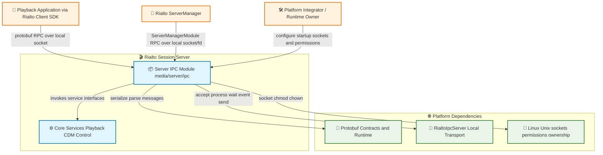
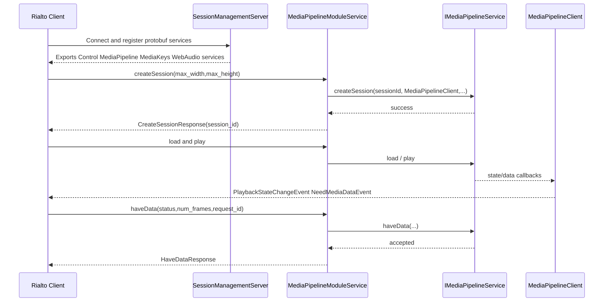
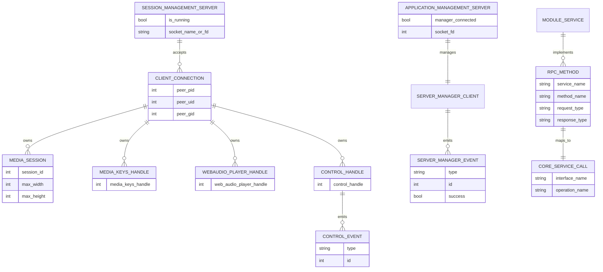
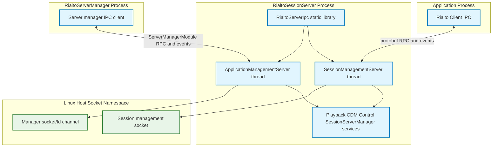

# Rialto Server IPC Architecture Brief

Status: Validation Complete ✅
Last Updated: 2026-08-07

## Table of Contents
- [Overview](#overview)
- [Problem Definitions and Business Context](#problem-definitions-and-business-context)
  - [Problem Statement](#problem-statement)
  - [Primary Users and Use Cases](#primary-users-and-use-cases)
  - [Non Functional Requirements](#non-functional-requirements)
  - [Integration Points](#integration-points)
- [C4 System Context Diagram](#c4-system-context-diagram)
- [System Overview](#system-overview)
  - [C4 Container Diagram](#c4-container-diagram)
  - [Container Explanation](#container-explanation)
  - [Critical User Journey Sequence](#critical-user-journey-sequence)
- [Technology Stack](#technology-stack)
- [System Data Models](#system-data-models)
- [API Endpoints](#api-endpoints)
  - [Public API](#public-api)
  - [Internal IPC API](#internal-ipc-api)
  - [Authentication and Authorization API](#authentication-and-authorization-api)
  - [AI and ML API](#ai-and-ml-api)
  - [Data Processing API](#data-processing-api)
- [Deployment Architecture](#deployment-architecture)
- [Round 1 Validation Findings](#round-1-validation-findings)
- [Round 2 Validation Findings](#round-2-validation-findings)
- [Round 3 Validation Findings](#round-3-validation-findings)
- [Validation Summary](#validation-summary)

## Overview
`media/server/ipc` is Rialto Session Server's IPC facade layer. It bridges transport (`RialtoIpcServer`) and core media/control services by:
- Hosting server-side protobuf services for playback, DRM, capabilities, control, web audio, and server-manager interactions.
- Owning lifecycle of two IPC-facing runtimes:
  - `SessionManagementServer` for application <-> session server calls.
  - `ApplicationManagementServer` for server-manager <-> session server calls.
- Converting protobuf request/response/event objects to service calls on `IPlaybackService`, `ICdmService`, `IControlService`, and `ISessionServerManager`.

This module is not a standalone daemon. It is linked into session server runtime and exposes capabilities over local Unix socket IPC.

## Problem Definitions and Business Context
### Problem Statement
The module addresses the following platform concerns:
1. Provide one consistent IPC contract for media, DRM, capabilities, and control operations.
2. Isolate protobuf and transport concerns from core playback/CDM business services.
3. Ensure per-client session/key lifecycle cleanup on disconnect.
4. Support session server lifecycle control from server manager (configuration, state changes, ping/ack).

### Primary Users and Use Cases
Primary users:
- Rialto client-side libraries invoking media and DRM APIs over IPC.
- Server manager component orchestrating session server lifecycle.
- Platform engineers integrating session server runtime.

Primary use cases:
1. Client registers and drives media session operations (`createSession`, `load`, `play`, `haveData`, etc.).
2. Client performs DRM operations (`createMediaKeys`, key session lifecycle, store/hash queries).
3. Client consumes async events (state changes, data-needed, ping, log-level updates).
4. Server manager configures and supervises session server (`setConfiguration`, `setState`, `ping`, `setLogLevels`).

### Non Functional Requirements
Availability:
- Dedicated processing thread in each server wrapper continuously drives IPC loop.
- Client disconnect callbacks trigger cleanup of allocated sessions/media keys.
- RPC failures are signaled via controller `SetFailed(...)` semantics.

Performance:
- Local Unix socket IPC based on `RialtoIpcServer` transport.
- Shared-memory fd handoff via `ControlModule.getSharedMemory` avoids large media copies.
- Event-driven polling loop (`process()` plus `wait()`) with bounded interval on session path.

Security:
- Local IPC only (no remote network protocol in this layer).
- Optional socket ownership and permission configuration for session management socket path.
- Integration with transport-level peer identity and fd passing rules from base IPC library.

Scalability:
- Supports multiple connected clients per session server instance.
- Per-client resource tracking (session ids, media keys handles) prevents cross-client leakage.
- Session server manager can configure resource limits (`maxPlaybacks`, `maxWebAudioPlayers`).

### Integration Points
Verified programmatic integration points:
1. `RialtoIpcServer` and `RialtoIpcCommon` for transport and event loop mechanics.
2. Protobuf contracts in `proto/*.proto` (`ControlModule`, `MediaPipelineModule`, `MediaKeysModule`, `ServerManagerModule`, `WebAudioPlayerModule`, capability modules).
3. Server main/services APIs:
   - `service::IPlaybackService`
   - `service::ICdmService`
   - `service::IControlService`
   - `service::ISessionServerManager`
4. Common runtime utilities for socket permission/ownership management (`LinuxUtils`, file ops).

## C4 System Context Diagram

## System Overview
### C4 Container Diagram

```mermaid
graph TD
    subgraph SessionRuntime ["Session Server Runtime C++17"]
        Factory["IpcFactory\nmedia/server/ipc/source/IpcFactory.cpp"]

        subgraph SessionPath ["SessionManagementServer"]
            SessionServer["SessionManagementServer\ninitialize start stop"]
            ControlSvc["ControlModuleService"]
            MediaPipeSvc["MediaPipelineModuleService"]
            MediaPipeCapSvc["MediaPipelineCapabilitiesModuleService"]
            MediaKeysSvc["MediaKeysModuleService"]
            MediaKeysCapSvc["MediaKeysCapabilitiesModuleService"]
            WebAudioSvc["WebAudioPlayerModuleService"]
            LogEventSvc["SetLogLevelsService"]
        end

        subgraph ManagerPath ["ApplicationManagementServer"]
            AppMgmtServer["ApplicationManagementServer"]
            SrvMgrSvc["ServerManagerModuleService"]
            AckSender["AckSender"]
        end

        CorePlayback["IPlaybackService and IMediaPipelineService"]
        CoreCdm["ICdmService"]
        CoreControl["IControlService"]
        CoreMgr["ISessionServerManager"]
    end

    subgraph Transport ["Rialto IPC Transport"]
        IpcServer["RialtoIpcServer"]
    end

    subgraph Clients ["External Processes"]
        MediaClient["Rialto Media Client"]
        ServerManager["Rialto ServerManager"]
    end

    Factory --> SessionServer
    Factory --> AppMgmtServer

    SessionServer --> IpcServer
    AppMgmtServer --> IpcServer

    MediaClient <-->|ControlModule MediaPipelineModule MediaKeysModule WebAudioPlayerModule RPC| IpcServer
    ServerManager <-->|ServerManagerModule RPC and StateChanged AckEvent| IpcServer

    SessionServer --> ControlSvc
    SessionServer --> MediaPipeSvc
    SessionServer --> MediaPipeCapSvc
    SessionServer --> MediaKeysSvc
    SessionServer --> MediaKeysCapSvc
    SessionServer --> WebAudioSvc
    SessionServer --> LogEventSvc

    AppMgmtServer --> SrvMgrSvc
    SrvMgrSvc --> AckSender

    ControlSvc --> CorePlayback
    ControlSvc --> CoreControl
    MediaPipeSvc --> CorePlayback
    MediaPipeCapSvc --> CorePlayback
    MediaKeysSvc --> CoreCdm
    MediaKeysCapSvc --> CoreCdm
    WebAudioSvc --> CorePlayback
    SrvMgrSvc --> CoreMgr

    classDef internal fill:#e1f5fe,stroke:#1565c0,stroke-width:2px
    classDef external fill:#e8f5e8,stroke:#2e7d32,stroke-width:2px

    class Factory,SessionServer,ControlSvc,MediaPipeSvc,MediaPipeCapSvc,MediaKeysSvc,MediaKeysCapSvc,WebAudioSvc,LogEventSvc,AppMgmtServer,SrvMgrSvc,AckSender,CorePlayback,CoreCdm,CoreControl,CoreMgr internal
    class IpcServer,MediaClient,ServerManager external
```

### Container Explanation
- `IpcFactory` builds both IPC server wrappers and injects module-service factories.
- `SessionManagementServer` binds socket by name/permissions/owner/group or preopened fd, then exports all media/control/capability services on client connect.
- `ApplicationManagementServer` attaches to an existing socket fd and exports `ServerManagerModuleService` to communicate with server manager.
- Media and DRM modules maintain per-client registries and destroy resources on disconnect to prevent stale server state.
- `SetLogLevelsService` multicasts log-level change events to currently connected clients.
- `ServerManagerModuleService` translates server-manager RPC calls to session server manager API and sends async ack events using `AckSender`.

### Critical User Journey Sequence

## Technology Stack
Runtime and language:
- C++17 build targets in Rialto server stack.
- CMake-based static library output: `RialtoServerIpc`.

IPC and serialization:
- `RialtoIpcServer` and `RialtoIpcCommon` local transport libraries.
- Protocol Buffers RPC stubs (`cc_generic_services = true`) across media/control/server-manager modules.
- Shared memory descriptor transfer via `ControlModule.getSharedMemory` fd field annotation.

Core linked dependencies (from `media/server/ipc/CMakeLists.txt`):
- `RialtoServerMain`, `RialtoServerService`, `RialtoPlayerCommon`, `RialtoWrappers`, `RialtoProtobuf`, `Threads::Threads`.

Operating environment:
- Linux socket filesystem permissions and ownership handling for IPC endpoints.

## System Data Models

Data flow notes:
- Per-client ownership maps are maintained in service modules (for example session ids and media key handles).
- On client disconnection, ownership maps are traversed and resources are released via corresponding core services.
- Event emissions use protobuf event messages over the same IPC client connection.

## API Endpoints
### Public API
`media/server/ipc` exports C++ factory/server interfaces:

| Area | API | Purpose |
| --- | --- | --- |
| Factory | `IIpcFactory::createSessionManagementServer(...)` | Build app-facing IPC server wrapper with media/control module services. |
| Factory | `IIpcFactory::createApplicationManagementServer(...)` | Build server-manager-facing IPC wrapper. |
| Session server | `ISessionManagementServer::initialize(...)` | Initialize named socket (permissions/owner/group) or socket fd. |
| Session server | `ISessionManagementServer::start()/stop()` | Start/stop IPC processing loop. |
| Session server | `ISessionManagementServer::setLogLevels(...)` | Broadcast log-level update events to connected app clients. |
| App management | `IApplicationManagementServer::initialize(int socket)` | Attach server-manager connection socket. |
| App management | `IApplicationManagementServer::sendStateChangedEvent(...)` | Send state transition events to server manager. |

### Internal IPC API
RPC surface is defined in root proto contracts used by this module.

Functional areas and RPCs:

1. Control (`ControlModule`)
- `getSharedMemory`
- `registerClient`
- `ack`

2. Media Pipeline (`MediaPipelineModule`)
- Session lifecycle and playback control: `createSession`, `destroySession`, `load`, `play`, `pause`, `stop`, `setPosition`, `getPosition`, `getDuration`, `setPlaybackRate`.
- Source and rendering: `attachSource`, `removeSource`, `allSourcesAttached`, `setVideoWindow`, `renderFrame`, `haveData`.
- Runtime tuning and stats: `setImmediateOutput`, `getImmediateOutput`, `setReportDecodeErrors`, `getQueuedFrames`, `getStats`, `flush`, buffering and sync setters/getters.
- Audio/subtitle controls: `setVolume`, `getVolume`, `setMute`, `getMute`, `setTextTrackIdentifier`, `getTextTrackIdentifier`, `setSubtitleOffset`.

3. Media Pipeline Capabilities (`MediaPipelineCapabilitiesModule`)
- `getSupportedMimeTypes`
- `isMimeTypeSupported`
- `getSupportedProperties`
- `isVideoMaster`

4. Media Keys (`MediaKeysModule`)
- Media keys lifecycle: `createMediaKeys`, `destroyMediaKeys`, `containsKey`.
- Key session lifecycle and license ops: `createKeySession`, `generateRequest`, `loadSession`, `updateSession`, `setDrmHeader`, `closeKeySession`, `removeKeySession`, `releaseKeySession`.
- Store, metrics, and diagnostics: `deleteDrmStore`, `deleteKeyStore`, `getDrmStoreHash`, `getMetricSystemData`, `getKeyStoreHash`, `getLdlSessionsLimit`, `getLastDrmError`, `getDrmTime`, `getCdmKeySessionId`.

5. Media Keys Capabilities (`MediaKeysCapabilitiesModule`)
- `getSupportedKeySystems`
- `supportsKeySystem`
- `getSupportedKeySystemVersion`
- `isServerCertificateSupported`
- `getSupportedRobustnessLevels`

6. Web Audio (`WebAudioPlayerModule`)
- `createWebAudioPlayer`, `destroyWebAudioPlayer`, `play`, `pause`, `setEos`.
- Buffering and device info: `getBufferAvailable`, `getBufferDelay`, `writeBuffer`, `getDeviceInfo`.
- Audio levels: `setVolume`, `getVolume`.

7. Server Manager control (`ServerManagerModule`)
- `setConfiguration`
- `setState`
- `setLogLevels`
- `ping`

Async event channels handled by this module include:
- Playback/control/media events via `MediaPipelineClient`, `MediaKeysClient`, `WebAudioPlayerClient`, `ControlClientServerInternal`.
- Server-manager-facing events: `StateChangedEvent`, `AckEvent`.

### Authentication and Authorization API
No explicit auth protocol or token exchange exists in this module.

Authorization model:
- Access control is primarily process-local and socket-path based.
- Trust boundary is local machine process boundary with ownership/permission controls on socket file.

### AI and ML API
None. No AI/ML service integration or endpoint is present in `media/server/ipc`.

### Data Processing API
No standalone ETL/data-processing service exists.

Data-processing behavior inside module:
- Request parameter validation and conversion between protobuf enums/structures and service-domain types.
- State/event serialization to protobuf event messages for client notification.
- Shared-memory fd propagation through control channel setup.

## Deployment Architecture

Deployment notes:
- `RialtoServerIpc` is linked as a static library and runs in-session-server process space.
- Session/app IPC and manager IPC are separate logical channels with dedicated server wrappers.
- The app-facing server can be configured via named socket metadata (permissions/owner/group) or inherited fd.

## Round 1 Validation Findings
Focus: technical correctness against implementation.

Findings and actions:
1. Confirmed module hosts two server wrappers (`SessionManagementServer`, `ApplicationManagementServer`) rather than one unified endpoint.
2. Verified that per-client cleanup of sessions/media keys is implemented in disconnect handlers.
3. Verified server-manager ping uses async ack event (`AckSender`) in addition to RPC response.

## Round 2 Validation Findings
Focus: diagram and syntax quality.

Findings and actions:
1. Checked all Mermaid graphs for valid subgraph syntax and balanced blocks.
2. Removed assumptions about protocols not present in code (no HTTP/gRPC references).
3. Ensured diagrams show deployment grouping by runtime boundaries (session process, app process, manager process).

## Round 3 Validation Findings
Focus: completeness and operational usefulness.

Findings and actions:
1. Added complete RPC grouping by module from proto contracts used by `media/server/ipc`.
2. Added NFR coverage including security and scalability implications of socket ownership/per-client maps.
3. Added explicit non-applicable sections for AI/ML and auth protocol scope.
4. Confirmed section coverage matches catalyst architecture brief requirements.

## Validation Summary
- All 9 required architecture sections are present and populated.
- Mandatory 3-round validation completed and documented.
- Document is implementation-aligned with current `media/server/ipc` code and shared proto contracts.
- Scope is specific to server IPC module and its runtime/deployment interactions.