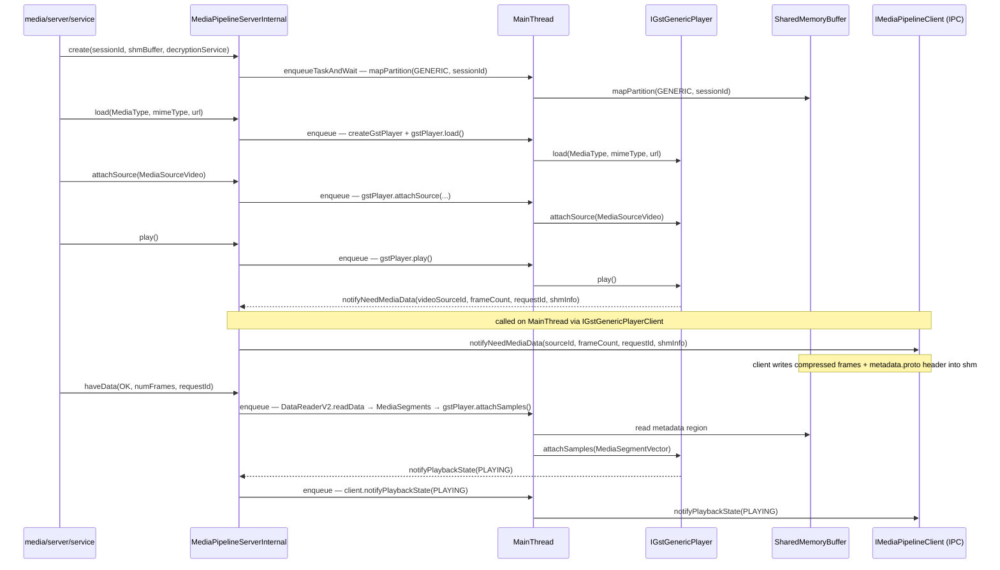
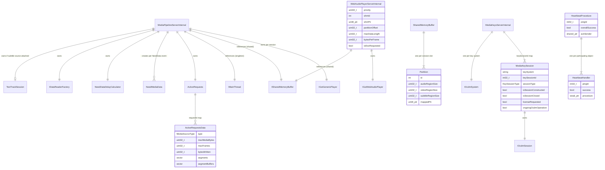

# Server Main Architecture Brief

Status: Drafted from source analysis
Last Updated: 2026-07-31

## Table of Contents
- [Overview](#overview)
- [Problem Definitions and Business Context](#problem-definitions-and-business-context)
  - [Problem Statement](#problem-statement)
  - [Primary Users and Use Cases](#primary-users-and-use-cases)
  - [Non-Functional Requirements](#non-functional-requirements)
  - [Integration Points](#integration-points)
- [C4 System Context Diagram](#c4-system-context-diagram)
- [System Overview](#system-overview)
  - [C4 Container Diagram](#c4-container-diagram)
  - [Container Explanation](#container-explanation)
  - [Critical User Journey Sequence](#critical-user-journey-sequence)
- [Technology Stack](#technology-stack)
- [System Data Models](#system-data-models)
- [API Endpoints](#api-endpoints)
  - [Media Pipeline API](#media-pipeline-api)
  - [Web Audio Player API](#web-audio-player-api)
  - [Media Keys API](#media-keys-api)
  - [Control API](#control-api)
  - [Shared Memory Buffer API](#shared-memory-buffer-api)
- [Deployment Architecture](#deployment-architecture)
- [Validation Findings](#validation-findings)

---

## Overview

`media/server/main` is the server-domain business logic layer of `RialtoServer`. It is responsible for:
- Hosting the server-side implementations of the public Rialto client-facing interfaces (`IMediaPipeline`, `IWebAudioPlayer`, `IMediaKeys`, `IControl`).
- Managing the `SharedMemoryBuffer` — a `memfd`-backed shared memory region partitioned per session and per source type, used to transfer compressed media frames from the client process.
- Serializing all state mutations through a singleton `MainThread` task queue, ensuring thread-safe access to all server-internal objects from multiple IPC handler threads.
- Coordinating end-to-end heartbeat procedures (`HeartbeatProcedure`) across all active server-internal objects and reporting ack back to `serverManager`.
- Delegating actual GStreamer pipeline execution to `media/server/gstplayer` via `IGstGenericPlayer` and `IGstWebAudioPlayer`, and DRM operations to `wrappers/IOcdmSystem`.

It is used exclusively within the `RialtoServer` process. Its public interface layer (`interface/`) is consumed by `media/server/service`.

---

## Problem Definitions and Business Context

### Problem Statement

`media/server/main` addresses the following server-domain concerns:

1. IPC handler threads (one per connected client session) must not mutate shared server state directly; all mutations must be serialized onto a single `MainThread` to avoid data races on pipeline and key-session state.
2. Compressed media frames arrive from the client into a shared memory region; the server must parse per-frame metadata, reconstruct `MediaSegment` objects, and inject them into the GStreamer pipeline without an additional copy through the IPC layer.
3. DRM key sessions have asynchronous lifecycle events (key message, key status change, license renewal) that arrive on OpenCDM callback threads and must be forwarded to the client without blocking the CDM.
4. Web audio requires a periodic write-data loop with a configurable preferred frame count and configurable PCM format negotiation before playback starts.
5. The server must respond to heartbeat pings from `serverManager` by forwarding the ping to every active GstPlayer and CDM session, collecting results, and returning a single ack — failure of any component to respond marks the session as unhealthy.
6. Subtitle/text-track data arrives as part of the media pipeline and must be forwarded to the platform text-track subsystem via `ITextTrackAccessor`.

### Primary Users and Use Cases

Primary consumers:
- `media/server/service` — creates and owns `MediaPipelineServerInternal`, `WebAudioPlayerServerInternal`, `MediaKeysServerInternal`, `ControlServerInternal`, and `SharedMemoryBuffer`.

Primary use cases:
1. **A/V playback**: Load a pipeline, attach audio/video/subtitle sources, receive and inject compressed frames, seek, control volume and playback rate.
2. **EME key management**: Create and manage CDM key sessions; process license requests and responses; associate key sessions with active pipelines for per-frame decryption.
3. **Web audio**: Stream raw PCM frames from shared memory through a dedicated GStreamer pipeline at a configurable priority.
4. **Capability discovery**: Answer MIME type and key-system capability queries on behalf of the service layer.
5. **Heartbeat**: Respond to `serverManager` ping with an ack that confirms all active pipelines and CDM sessions are alive.

### Non-Functional Requirements

**Thread Safety**:
- All calls into `MediaPipelineServerInternal`, `WebAudioPlayerServerInternal`, `MediaKeysServerInternal`, `MediaKeySession`, and `ControlServerInternal` are serialized through the singleton `MainThread` task queue. Each object registers a client ID and enqueues lambdas; the queue is processed on one thread.
- `ActiveRequests` uses its own internal mutex to protect the request map, because NeedData callbacks can arrive concurrently with `haveData` calls from IPC handler threads.
- `SharedMemoryBuffer` is read and written under the `MainThread` constraint; no separate locking is used for partition mapping.

**Performance**:
- Shared memory transfer eliminates a copy of compressed frame data between client and server processes; only a small protobuf metadata header is copied through IPC.
- `NeedDataDelayCalculator` applies adaptive exponential back-off (default 15 ms, max 500 ms) to avoid hammering the client with NeedData requests when it has no data ready.
- `NeedMediaData` sends a smaller frame count (`kPrerollNumFrames`) during pre-roll to minimize pipeline startup latency.

**Reliability**:
- `HeartbeatProcedure` uses reference counting: each server-internal object receives a `HeartbeatHandler` which sets a failure flag on destruction if `error()` was called; the last handler to be destroyed triggers `IAckSender::send()`.
- `ControlServerInternal` forwards the ack to `serverManager` only after all handlers have been collected.

### Integration Points

| Dependency | Integration type | Purpose |
|---|---|---|
| `media/server/gstplayer/IGstGenericPlayer` | C++ interface | Full A/V pipeline lifecycle (attach, inject, seek, state) |
| `media/server/gstplayer/IGstWebAudioPlayer` | C++ interface | PCM web audio pipeline lifecycle |
| `media/server/gstplayer/IGstCapabilities` | C++ interface | MIME type and decoder property queries |
| `wrappers/IOcdmSystem` | C++ interface | OpenCDM system and session creation for DRM |
| `common/ITimer` / `ITimerFactory` | C++ interface | Write-data timer for web audio; NeedData re-request timers |
| `common/IDecryptionService` | C++ interface | Implemented by `MediaKeysServerInternal`; consumed by `gstplayer` decryptor elements |
| `proto/metadata.proto` | protobuf | Per-frame media segment metadata parsed by `DataReaderV2` |
| Linux `memfd_create` / `mmap` | syscall | `SharedMemoryBuffer` creates a sealed anonymous memory file and maps it for both server and client access |

---

## C4 System Context Diagram

```mermaid
graph TD
    ServiceLayer["🔌 Server Service Layer\nmedia/server/service\nPlaybackService, CdmService, ControlModuleService"]

    subgraph ServerMainSystem ["🎬 Server Main (media/server/main)"]
        Pipeline["MediaPipelineServerInternal\nA/V pipeline logic"]
        WebAudio["WebAudioPlayerServerInternal\nPCM audio logic"]
        Keys["MediaKeysServerInternal\nDRM key management"]
        Control["ControlServerInternal\nHeartbeat + app state"]
        ShmBuf["SharedMemoryBuffer\nmemfd shm partitions"]
        MainThr["MainThread\nSerialized task queue"]
    end

    subgraph GstPlayer ["🎞️ GstPlayer (media/server/gstplayer)"]
        GenericPlayer["IGstGenericPlayer"]
        WebAudioPlayer["IGstWebAudioPlayer"]
        Capabilities["IGstCapabilities"]
    end

    subgraph DRM ["🔐 DRM / OpenCDM"]
        OcdmSystem["IOcdmSystem\nplatform CDM runtime"]
    end

    ClientProcess["📦 RialtoClient Process\nwrites compressed frames to shm"]

    ServiceLayer -->|creates / calls| Pipeline
    ServiceLayer -->|creates / calls| WebAudio
    ServiceLayer -->|creates / calls| Keys
    ServiceLayer -->|creates / calls| Control
    ServiceLayer -->|creates / owns| ShmBuf
    Pipeline -->|IGstGenericPlayer| GenericPlayer
    WebAudio -->|IGstWebAudioPlayer| WebAudioPlayer
    ServiceLayer -->|IGstCapabilities| Capabilities
    Keys -->|IOcdmSystem| OcdmSystem
    Keys -->|IDecryptionService| GenericPlayer
    Pipeline -->|maps partition| ShmBuf
    WebAudio -->|maps partition| ShmBuf
    ClientProcess -->|writes shm| ShmBuf
    Pipeline -->|reads shm| ShmBuf
    Pipeline & WebAudio & Keys & Control -->|enqueue tasks| MainThr

    classDef service fill:#e1f5fe,stroke:#0277bd,stroke-width:2px
    classDef main fill:#ede7f6,stroke:#512da8,stroke-width:2px
    classDef gst fill:#e8f5e8,stroke:#2e7d32,stroke-width:2px
    classDef drm fill:#fce4ec,stroke:#c62828,stroke-width:2px
    classDef client fill:#fff3e0,stroke:#ef6c00,stroke-width:2px

    class ServiceLayer service
    class Pipeline,WebAudio,Keys,Control,ShmBuf,MainThr main
    class GenericPlayer,WebAudioPlayer,Capabilities gst
    class OcdmSystem drm
    class ClientProcess client
```

---

## System Overview

### C4 Container Diagram

```mermaid
graph TD
    subgraph PublicInterfaces ["Public Interfaces (interface/)"]
        IMediaPipelineServerInternal["IMediaPipelineServerInternal\ninterface/IMediaPipelineServerInternal.h\nextends IMediaPipeline + haveData()"]
        IWebAudioPlayerServerInternal["IWebAudioPlayerServerInternal\ninterface/IWebAudioPlayerServerInternal.h"]
        IMediaKeysServerInternal["IMediaKeysServerInternal\ninterface/IMediaKeysServerInternal.h\nextends IMediaKeys + ping()"]
        IControlServerInternal["IControlServerInternal\ninterface/IControlServerInternal.h\nextends IControl + ping()"]
        ISharedMemoryBuffer["ISharedMemoryBuffer\ninterface/ISharedMemoryBuffer.h\nmapPartition, getDataPtr, getDataOffset"]
        IDecryptionService["IDecryptionService\ninterface/IDecryptionService.h\ndecrypt, selectKeyId, sessionUsageCounters"]
        IMainThread["IMainThread\ninterface/IMainThread.h\nenqueueTask, enqueueTaskAndWait"]
        IHeartbeatProcedure["IHeartbeatProcedure / IHeartbeatHandler\ninterface/IHeartbeatProcedure.h\ncreatHandler, error, id"]
    end

    subgraph PipelineUnit ["Media Pipeline (MediaPipelineServerInternal.cpp)"]
        MediaPipelineServerInternal["MediaPipelineServerInternal\nImplements: IMediaPipeline\nIMediaPipelineServerInternal\nIGstGenericPlayerClient"]
        ActiveRequests["ActiveRequests\ninclude/ActiveRequests.h\nRequest-ID → frame buffer map"]
        NeedMediaData["NeedMediaData\nsource/NeedMediaData.cpp\nBuilds notifyNeedMediaData message"]
        NeedDataDelayCalc["NeedDataDelayCalculator\nsource/NeedDataDelayCalculator.cpp\nAdaptive backoff for NeedData re-requests"]
        DataReaderFactory["DataReaderFactory\nsource/DataReaderFactory.cpp\nSelects V1 or V2 reader"]
        DataReaderV1["DataReaderV1\nsource/DataReaderV1.cpp\nLegacy shm metadata format"]
        DataReaderV2["DataReaderV2\nsource/DataReaderV2.cpp\nProtobuf metadata.proto format"]
    end

    subgraph WebAudioUnit ["Web Audio (WebAudioPlayerServerInternal.cpp)"]
        WebAudioPlayerServerInternal["WebAudioPlayerServerInternal\nImplements: IWebAudioPlayer\nIWebAudioPlayerServerInternal"]
    end

    subgraph KeysUnit ["Media Keys (MediaKeysServerInternal.cpp)"]
        MediaKeysServerInternal["MediaKeysServerInternal\nImplements: IMediaKeys\nIMediaKeysServerInternal\nIDecryptionService"]
        MediaKeySession["MediaKeySession\nsource/MediaKeySession.cpp\nPer-CDM key session lifecycle via IOcdmSession"]
        MediaKeysCapabilities["MediaKeysCapabilities\nsource/MediaKeysCapabilities.cpp\nKey system / robustness queries via IOcdmSystem"]
    end

    subgraph ControlUnit ["Control (ControlServerInternal.cpp)"]
        ControlServerInternal["ControlServerInternal\nImplements: IControl\nIControlServerInternal"]
        HeartbeatProcedure["HeartbeatProcedure\nsource/HeartbeatProcedure.cpp\nRef-counted multi-object heartbeat coordinator"]
    end

    subgraph ShmUnit ["Shared Memory (SharedMemoryBuffer.cpp)"]
        SharedMemoryBuffer["SharedMemoryBuffer\nImplements: ISharedMemoryBuffer\nmemfd_create + mmap\nPartitioned per session + source type"]
    end

    subgraph ThreadUnit ["Thread Infrastructure"]
        MainThread["MainThread\nsource/MainThread.cpp\nSingleton serialized task queue"]
    end

    subgraph TextTrackUnit ["Text Track"]
        TextTrackSession["TextTrackSession\nsource/TextTrackSession.cpp\nPer-display subtitle session"]
        TextTrackAccessor["TextTrackAccessor\nsource/TextTrackAccessor.cpp\nPlatform text track API wrapper"]
    end

    IMediaPipelineServerInternal --> MediaPipelineServerInternal
    IWebAudioPlayerServerInternal --> WebAudioPlayerServerInternal
    IMediaKeysServerInternal --> MediaKeysServerInternal
    IControlServerInternal --> ControlServerInternal
    ISharedMemoryBuffer --> SharedMemoryBuffer
    IMainThread --> MainThread
    MediaPipelineServerInternal --> ActiveRequests
    MediaPipelineServerInternal --> NeedMediaData
    MediaPipelineServerInternal --> NeedDataDelayCalc
    MediaPipelineServerInternal --> DataReaderFactory
    DataReaderFactory --> DataReaderV1
    DataReaderFactory --> DataReaderV2
    MediaKeysServerInternal --> MediaKeySession
    MediaKeysServerInternal --> MediaKeysCapabilities
    ControlServerInternal --> HeartbeatProcedure
    MediaPipelineServerInternal --> TextTrackSession
    TextTrackSession --> TextTrackAccessor
    MediaPipelineServerInternal & WebAudioPlayerServerInternal & MediaKeysServerInternal & MediaKeySession & ControlServerInternal --> MainThread

    classDef iface fill:#e1f5fe,stroke:#0277bd,stroke-width:1px
    classDef impl fill:#ede7f6,stroke:#512da8,stroke-width:1px
    classDef support fill:#e8f5e8,stroke:#2e7d32,stroke-width:1px

    class IMediaPipelineServerInternal,IWebAudioPlayerServerInternal,IMediaKeysServerInternal,IControlServerInternal,ISharedMemoryBuffer,IDecryptionService,IMainThread,IHeartbeatProcedure iface
    class MediaPipelineServerInternal,WebAudioPlayerServerInternal,MediaKeysServerInternal,ControlServerInternal,SharedMemoryBuffer,MainThread impl
    class ActiveRequests,NeedMediaData,NeedDataDelayCalc,DataReaderFactory,DataReaderV1,DataReaderV2,MediaKeySession,MediaKeysCapabilities,HeartbeatProcedure,TextTrackSession,TextTrackAccessor support
```

### Container Explanation

**`MainThread` (`MainThread.cpp`)**
A per-process singleton (factory returns the same instance via `std::weak_ptr`). Runs one background `std::thread` that processes a task queue. All `MediaPipelineServerInternal`, `WebAudioPlayerServerInternal`, `MediaKeysServerInternal`, `MediaKeySession`, and `ControlServerInternal` objects register a client ID with `MainThread` and submit work as `std::function<void()>` lambdas via `enqueueTask` (fire-and-forget) or `enqueueTaskAndWait` (blocking). This is the single serialization point for all state mutations in the server domain.

**`MediaPipelineServerInternal` (`MediaPipelineServerInternal.cpp`)**
The central A/V pipeline controller. Implements both `IMediaPipeline` (the public client-facing API) and `IMediaPipelineServerInternal` (adds `haveData()` for the server-only shm-read path). Owns:
- One `IGstGenericPlayer` instance per session, created on first `load()` call.
- One `ISharedMemoryBuffer` partition (mapped in constructor, unmapped in destructor).
- `ActiveRequests` — thread-safe map of pending NeedData request IDs to their frame buffers and space limits.
- `NeedMediaData` — constructs `notifyNeedMediaData` messages with correct shm offsets and frame counts.
- `NeedDataDelayCalculator` — computes adaptive delay before re-sending NeedData when the client replies `NO_AVAILABLE_SAMPLES` or `NO_SPACE_FOR_SAMPLES`.
- `DataReaderFactory` / `DataReaderV1` / `DataReaderV2` — reads and deserializes per-frame `MediaSegment` metadata from the shared memory region before forwarding to GstPlayer.
- `TextTrackSession` / `TextTrackAccessor` — manages an optional subtitle session for text-track data written alongside A/V frames.

Implements `IGstGenericPlayerClient` to receive GstPlayer callbacks (`notifyPlaybackState`, `notifyNeedMediaData`, `notifyPosition`, etc.) and forward them to the IPC client.

**`WebAudioPlayerServerInternal` (`WebAudioPlayerServerInternal.cpp`)**
Manages PCM web audio playback via `IGstWebAudioPlayer`. Maps a `WEB_AUDIO` partition in `SharedMemoryBuffer`. Uses a periodic timer (100 ms cadence, `kWriteDataTimeMs`) to drain the shared memory ring buffer into the GStreamer pipeline via `writeBuffer`. Preferred frame count is 640 (`kPreferredFrames`).

**`MediaKeysServerInternal` (`MediaKeysServerInternal.cpp`)**
Implements `IMediaKeys` + `IMediaKeysServerInternal` + `IDecryptionService`. Owns:
- A map of `keySessionId → MediaKeySession` for all active CDM sessions.
- One `IOcdmSystem` instance per key system (e.g., `com.widevine.alpha`).
Implements `IDecryptionService::decrypt()` by delegating to the matching `MediaKeySession`'s OCDM session, allowing `gstplayer`'s decryptor elements to call back into this layer for per-buffer decryption without directly coupling to OCDM.

**`MediaKeySession` (`MediaKeySession.cpp`)**
Wraps one `IOcdmSession` object. Serializes all OCDM calls through `MainThread`. Handles asynchronous OCDM callbacks (`onKeyMessage`, `onKeyStatusesChanged`, `onError`) by receiving them on OCDM callback threads and enqueuing tasks to process them on `MainThread` before forwarding to `IMediaKeysClient`.

**`ControlServerInternal` (`ControlServerInternal.cpp`)**
Implements `IControl` + `IControlServerInternal`. Forwards application state changes (`RUNNING`/`INACTIVE`) to the client. Handles heartbeat pings from `serverManager` by creating a `HeartbeatProcedure` and distributing `HeartbeatHandler` objects to all active server-internal objects registered with the control channel.

**`HeartbeatProcedure` (`HeartbeatProcedure.cpp`)**
Ref-counted coordinator for multi-object heartbeats. Each participating object receives a `HeartbeatHandler` (RAII). On `HeartbeatHandler` destruction, it calls `HeartbeatProcedure::onFinish(success)`. When the last handler is destroyed, `HeartbeatProcedure`'s destructor calls `IAckSender::send(pingId, overallSuccess)`. Failure of any handler (via `handler->error()`) marks the entire procedure as failed.

**`SharedMemoryBuffer` (`SharedMemoryBuffer.cpp`)**
Creates a single anonymous `memfd` file (`rialto_avbuf`) with `F_SEAL_SHRINK | F_SEAL_GROW` seals, then `mmap`s it. The buffer is divided into fixed-size partitions:
- Each generic playback session gets one partition: 7 MB video region + 1 MB audio region + 256 KB subtitle region.
- Each web audio session gets one partition: 10 KB ring buffer.
Partitions are pre-allocated at construction for the configured session counts; `mapPartition`/`unmapPartition` assign and release a partition to a session ID at runtime.

**`NeedMediaData` (`NeedMediaData.cpp`)**
Builds a `notifyNeedMediaData` message for a given source type and session. Looks up the correct shm partition offsets and maximum byte/frame limits from `ISharedMemoryBuffer`, assigns a request ID via `ActiveRequests::insert`, and calls `IMediaPipelineClient::notifyNeedMediaData`. During pre-roll, sends a reduced frame count (`kPrerollNumFrames`) to allow the pipeline to start playing sooner.

**`DataReaderV2` (`DataReaderV2.cpp`)**
Reads per-frame metadata from the shm metadata region using `proto/metadata.proto` (`MediaSegmentMetadata`). Reconstructs `IMediaPipeline::MediaSegment` (or its audio/video/subtitle/text subclass) including DRM protection fields (`keyId`, `iv`, `subsamples`, `cipherMode`, `crypt`, `skip`), codec-specific fields (`codecData`, `width`, `height`, `sampleRate`, `channels`), and segment alignment.

### Critical User Journey Sequence

---

## Technology Stack

| Category | Component | Detail |
|---|---|---|
| Language | C++17 | All source files in `media/server/main` |
| Build | CMake ≥ 3.10 | `media/server/main/CMakeLists.txt`; produces `RialtoServerMain` static library |
| IPC / serialization | protobuf 3 | `proto/metadata.proto` parsed by `DataReaderV2` for per-frame media segment metadata |
| Shared memory | Linux `memfd_create` + `mmap` | Anonymous, sealed file-backed shared memory for zero-copy frame transfer |
| DRM / EME | OpenCDM (platform) | `wrappers/IOcdmSystem` / `IOcdmSession`; platform CDM loaded at runtime |
| Media pipeline | `media/server/gstplayer` | `IGstGenericPlayer`, `IGstWebAudioPlayer`, `IGstCapabilities` |
| Threading | `std::thread` + `std::mutex` + `std::condition_variable` | `MainThread` task queue; `ActiveRequests` internal mutex |
| Logging | Rialto logging macros | `RIALTO_SERVER_LOG_*` throughout |
| Timer | `common/ITimer` | Web audio write-data loop; NeedData re-request backoff timers |

---

## System Data Models

### Key data model notes
- `SharedMemoryBuffer` pre-allocates all partitions at construction time for the configured session count; `mapPartition` assigns a slot to a session ID and `unmapPartition` frees it back. The `memfd` fd is exposed to the client process so it can `mmap` the same memory.
- `ActiveRequests` uses an incrementing integer ID that wraps around at `UINT32_MAX`; the ID is sent to the client in `notifyNeedMediaData` and returned in `haveData` to correlate response to request.
- `MediaPipelineServerInternal` stores a `NeedDataDelayCalculator` per instance; delays are tracked per `MediaSourceType` (audio, video, subtitle) independently.

---

## API Endpoints

### Media Pipeline API (`interface/IMediaPipelineServerInternal.h` + `IMediaPipeline`)

| Method | Direction | Description |
|---|---|---|
| `load(MediaType, mimeType, url, isLive)` | Service → MediaPipeline | Creates the GstGenericPlayer and sets pipeline media type |
| `attachSource(MediaSource&)` | Service → MediaPipeline | Adds an audio, video, or subtitle source stream |
| `removeSource(sourceId)` | Service → MediaPipeline | Removes a source and flushes its appsrc |
| `allSourcesAttached()` | Service → MediaPipeline | Signals all sources are ready; triggers pipeline completion setup |
| `play()` | Service → MediaPipeline | Transitions pipeline to PLAYING |
| `pause()` | Service → MediaPipeline | Transitions pipeline to PAUSED |
| `stop()` | Service → MediaPipeline | Stops and destroys the GstPlayer |
| `haveData(status, numFrames, requestId)` | Service → MediaPipeline | Server-only: reads shm frames for the given request ID and pushes to GstPlayer |
| `seekPosition(position)` | Service → MediaPipeline | Seeks to an absolute position in nanoseconds |
| `setPlaybackRate(rate)` | Service → MediaPipeline | Sets playback speed |
| `getPosition(position&)` | Service → MediaPipeline | Queries current pipeline clock position |
| `setVideoWindow(x, y, width, height)` | Service → MediaPipeline | Sets video output rectangle |
| `setVolume(volume, duration, easeType)` | Service → MediaPipeline | Sets audio volume with optional easing |
| `getVolume(volume&)` | Service → MediaPipeline | Queries current audio volume |
| `setMute(sourceId, mute)` | Service → MediaPipeline | Mutes or unmutes a source |
| `getMute(sourceId, mute&)` | Service → MediaPipeline | Queries mute state for a source |
| `setTextTrackIdentifier(textTrackId)` | Service → MediaPipeline | Selects active subtitle track |
| `getTextTrackIdentifier(textTrackId&)` | Service → MediaPipeline | Queries current subtitle track identifier |
| `setSourcePosition(sourceId, position, resetTime, appliedRate, stopPosition)` | Service → MediaPipeline | Sets per-source seek position for the next buffer push |
| `setImmediateOutput(sourceId, immediateOutput)` | Service → MediaPipeline | Enables low-latency immediate output mode |
| `getImmediateOutput(sourceId, immediateOutput&)` | Service → MediaPipeline | Queries immediate output mode |
| `getStats(sourceId, renderedFrames&, droppedFrames&)` | Service → MediaPipeline | Queries per-source decode statistics |
| `renderFrame()` | Service → MediaPipeline | Requests single-frame render when paused |
| `ping(heartbeatHandler)` | Service → MediaPipeline | Forwards heartbeat to GstPlayer; handler ack sent on destruction |
| `flush(sourceId, resetTime)` | Service → MediaPipeline | Flushes a source and resets its shm request state |

### Web Audio Player API (`interface/IWebAudioPlayerServerInternal.h` + `IWebAudioPlayer`)

| Method | Direction | Description |
|---|---|---|
| `play()` | Service → WebAudioPlayer | Starts PCM output |
| `pause()` | Service → WebAudioPlayer | Pauses PCM output |
| `setEos()` | Service → WebAudioPlayer | Signals end-of-stream |
| `getBufferAvailable(availableFrames&, shmInfo&)` | Service → WebAudioPlayer | Queries available write space in the shm ring buffer |
| `writeBuffer(numberOfFrames, data)` | Service → WebAudioPlayer | Submits PCM frames; called when client indicates data is ready in shm |
| `getDeviceInfo(preferredFrames&, maximumFrames&, supportBitDepths&)` | Service → WebAudioPlayer | Queries platform device format preferences |
| `setVolume(volume)` | Service → WebAudioPlayer | Sets PCM output volume |
| `getVolume(volume&)` | Service → WebAudioPlayer | Queries current PCM volume |
| `ping(heartbeatHandler)` | Service → WebAudioPlayer | Forwards heartbeat to GstWebAudioPlayer |

### Media Keys API (`interface/IMediaKeysServerInternal.h` + `IMediaKeys`)

| Method | Direction | Description |
|---|---|---|
| `createKeySession(sessionType, client, isLDL, keySessionId&)` | Service → MediaKeys | Creates a new OCDM key session |
| `generateRequest(keySessionId, initDataType, initData)` | Service → MediaKeys | Initiates license acquisition (triggers `onKeyMessage` callback) |
| `loadSession(keySessionId)` | Service → MediaKeys | Loads a previously persisted session |
| `updateSession(keySessionId, responseData)` | Service → MediaKeys | Processes a license response |
| `closeKeySession(keySessionId)` | Service → MediaKeys | Closes and removes a key session |
| `removeKeySession(keySessionId)` | Service → MediaKeys | Removes keys associated with a session |
| `getCdmKeySessionId(keySessionId, cdmKeySessionId&)` | Service → MediaKeys | Returns the underlying OCDM session ID string |
| `containsKey(keySessionId, keyId)` | Service → MediaKeys | Checks if a key is loaded in a session |
| `setDrmHeader(keySessionId, drmHeader)` | Service → MediaKeys | Sets a DRM-specific header on a session |
| `getLastDrmError(keySessionId, errorCode&)` | Service → MediaKeys | Queries the last DRM error code |
| `getDrmTime(time&)` | Service → MediaKeys | Queries the DRM system clock time |
| `ping(heartbeatHandler)` | Service → MediaKeys | Forwards heartbeat to all active key sessions |

### Control API (`interface/IControlServerInternal.h` + `IControl`)

| Method | Direction | Description |
|---|---|---|
| `registerClient(client, appState&)` | Service → Control | Registers a client and returns the current application state |
| `ack(ackId)` | Service → Control | Forwards a heartbeat ack for the given ping ID |
| `ping(heartbeatHandler)` | Service → Control | Accepts heartbeat ping; handler ack sent via `IAckSender::send` |

### Shared Memory Buffer API (`interface/ISharedMemoryBuffer.h`)

| Method | Direction | Description |
|---|---|---|
| `mapPartition(playbackType, id)` | Pipeline/WebAudio → ShmBuffer | Assigns a shm partition slot to a session ID |
| `unmapPartition(playbackType, id)` | Pipeline/WebAudio → ShmBuffer | Releases a partition slot |
| `clearData(playbackType, id, sourceType)` | Pipeline → ShmBuffer | Zeros the data region for a source type |
| `getDataOffset(playbackType, id, sourceType)` | Pipeline → ShmBuffer | Returns byte offset of the source type region within the `memfd` |
| `getDataPtr(playbackType, id, sourceType)` | Pipeline → ShmBuffer | Returns mapped pointer to the source type region |
| `getMaxDataLen(playbackType, id, sourceType)` | Pipeline → ShmBuffer | Returns maximum byte capacity of the source type region |
| `getFd()` | Service → ShmBuffer | Returns the `memfd` fd for passing to client process |
| `getSize()` | Service → ShmBuffer | Returns total size of the shm region |

---

## Deployment Architecture

- `media/server/main` is compiled as a static library (`RialtoServerMain`) linked into the `RialtoServer` executable.
- It runs entirely inside the `RialtoServer` process — there is no separate deployment unit.
- There is one `MainThread` singleton per `RialtoServer` process; all server-internal objects (pipeline, web audio, key sessions, control) share this single thread.
- There is one `SharedMemoryBuffer` instance per active application session, pre-allocating partitions for the configured number of concurrent playbacks and web audio players.
- Multiple `MediaPipelineServerInternal` instances (one per active IPC-connected client session) and multiple `MediaKeysServerInternal` instances (one per active CDM key system per session) can coexist simultaneously inside the same `RialtoServer` process.
- Each `MediaKeySession` also registers with `MainThread`; so the number of registered `MainThread` clients scales with the number of active key sessions.

---

## Validation Findings

### Round 1 — Technical accuracy

- All interface methods verified against `interface/` header files (`IMediaPipelineServerInternal.h`, `IWebAudioPlayerServerInternal.h`, `IMediaKeysServerInternal.h`, `IControlServerInternal.h`, `ISharedMemoryBuffer.h`, `IMainThread.h`, `IDecryptionService.h`, `IHeartbeatProcedure.h`).
- All `source/` `.cpp` files are referenced: `MediaPipelineServerInternal.cpp`, `WebAudioPlayerServerInternal.cpp`, `MediaKeysServerInternal.cpp`, `MediaKeySession.cpp`, `MediaKeysCapabilities.cpp`, `MediaPipelineCapabilities.cpp`, `ControlServerInternal.cpp`, `HeartbeatProcedure.cpp`, `MainThread.cpp`, `SharedMemoryBuffer.cpp`, `NeedMediaData.cpp`, `ActiveRequests.cpp`, `DataReaderV1.cpp`, `DataReaderV2.cpp`, `DataReaderFactory.cpp`, `NeedDataDelayCalculator.cpp`, `TextTrackSession.cpp`, `TextTrackAccessor.cpp`.
- `SharedMemoryBuffer` partition sizes verified from constants in `SharedMemoryBuffer.cpp`: video 7 MB, audio 1 MB, subtitle 256 KB, web audio 10 KB.
- `NeedDataDelayCalculator` default delay (15 ms) and max delay (500 ms) verified from source constants.
- `HeartbeatProcedure` ref-counting behavior verified from constructor/destructor and `onFinish` logic in `HeartbeatProcedure.cpp`.
- `MainThread` singleton pattern (factory returns same instance via `std::weak_ptr`) verified from `MainThread.cpp`.

### Round 2 — Diagram syntax

- All Mermaid diagrams use `subgraph id ["Label"]` form.
- All `classDef` definitions match node class references.
- No unquoted special characters remain in node labels.
