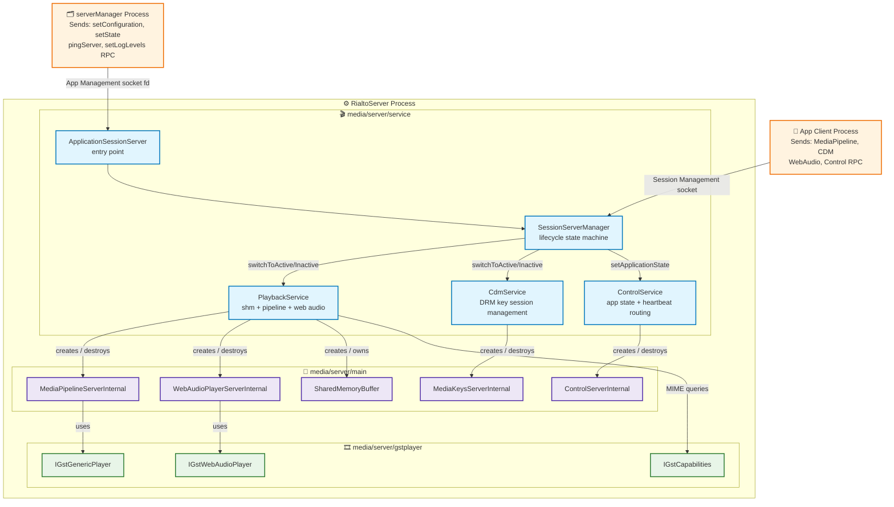
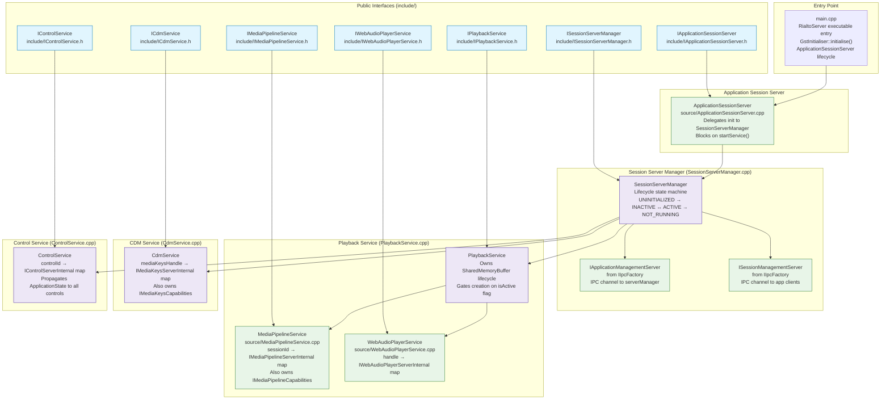
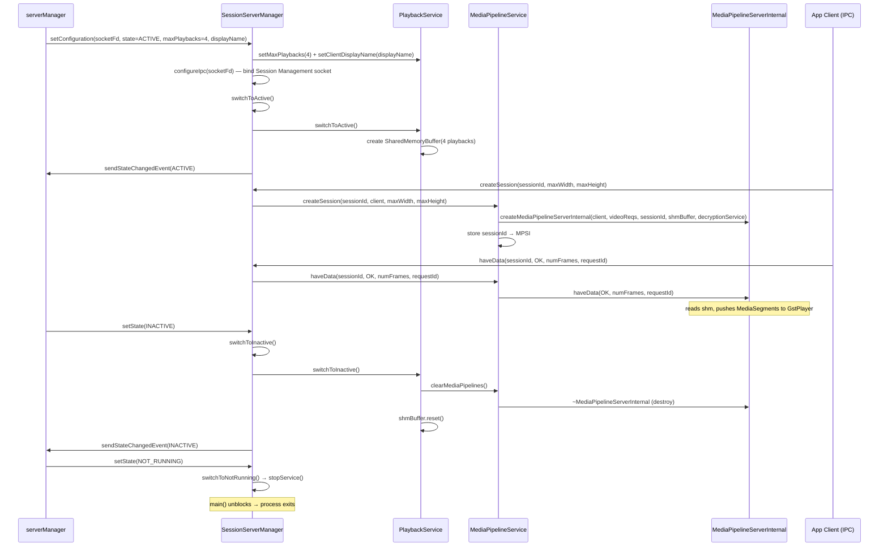
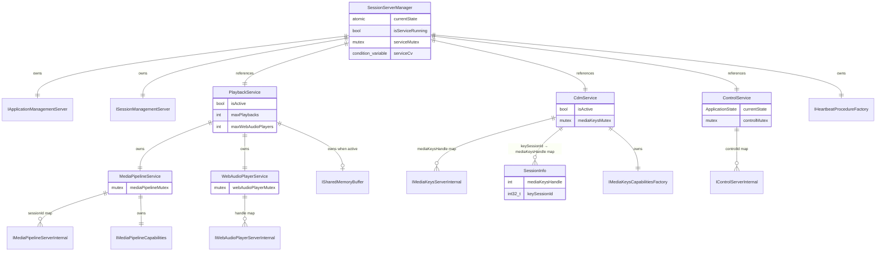

# Server Service Architecture Brief

Status: Drafted from source analysis
Last Updated: 2026-07-31

## Table of Contents
- [Overview](#overview)
- [Problem Definitions and Business Context](#problem-definitions-and-business-context)
  - [Problem Statement](#problem-statement)
  - [Primary Users and Use Cases](#primary-users-and-use-cases)
  - [Non-Functional Requirements](#non-functional-requirements)
  - [Integration Points](#integration-points)
- [C4 System Context Diagram](#c4-system-context-diagram)
- [System Overview](#system-overview)
  - [C4 Container Diagram](#c4-container-diagram)
  - [Container Explanation](#container-explanation)
  - [Critical User Journey Sequence](#critical-user-journey-sequence)
- [Technology Stack](#technology-stack)
- [System Data Models](#system-data-models)
- [API Endpoints](#api-endpoints)
  - [Session Server Manager API](#session-server-manager-api)
  - [Playback Service API](#playback-service-api)
  - [Media Pipeline Service API](#media-pipeline-service-api)
  - [Web Audio Player Service API](#web-audio-player-service-api)
  - [CDM Service API](#cdm-service-api)
  - [Control Service API](#control-service-api)
- [Deployment Architecture](#deployment-architecture)
- [Validation Findings](#validation-findings)

---

## Overview

`media/server/service` is the top-level orchestration layer of `RialtoServer`. It is responsible for:
- Providing the `main()` entry point of the `RialtoServer` executable.
- Receiving and executing lifecycle commands from `serverManager` (`setConfiguration`, `setState`, `ping`, `setLogLevels`) via the `IApplicationManagementServer` IPC channel.
- Serving app-client IPC requests (media pipeline, CDM, control, web audio) via the `ISessionManagementServer` IPC channel.
- Owning the session-level service objects (`PlaybackService`, `CdmService`, `ControlService`) that create, track, and destroy `media/server/main` objects in response to those requests.
- Driving the `UNINITIALIZED → INACTIVE ↔ ACTIVE → NOT_RUNNING` state machine and propagating state changes to all sub-services and connected clients.
- Coordinating end-to-end heartbeat ping/ack by distributing `IHeartbeatHandler` objects across all active pipelines, CDM sessions, and control channels.

It produces two build artefacts: `RialtoServerService` (static library, all service classes) and `RialtoServer` (executable, `main.cpp` + linked libraries).

---

## Problem Definitions and Business Context

### Problem Statement

`media/server/service` addresses the following concerns:

1. `RialtoServer` must be controllable by `serverManager` over an IPC socket (socket fd passed as `argv[1]`); the service layer must bridge those RPC commands into coordinated actions on all sub-services without exposing internal implementation details to the IPC layer.
2. Multiple app clients connect concurrently over a separate client-facing IPC socket; their requests must be dispatched to the correct session-scoped `MediaPipelineServerInternal`, `MediaKeysServerInternal`, or `ControlServerInternal` instance.
3. The `SharedMemoryBuffer` must exist exactly during the ACTIVE state; it is created on `switchToActive` and destroyed on `switchToInactive` so that the client process can map it only when resources are allocated.
4. Playback and CDM resources must be cleanly released (pipelines destroyed, key sessions cleared) before the NOT_RUNNING state change event is sent to `serverManager`, guaranteeing that the server is resource-free before `serverManager` considers it stopped.
5. A heartbeat ping from `serverManager` must propagate to every active GstPlayer (via `PlaybackService`), every CDM key session (via `CdmService`), and every connected app control channel (via `ControlService`), and a single ack must be returned only after all have responded.
6. Log levels for all Rialto components (`default`, `client`, `server`, `ipc`, `serverManager`, `common`) must be adjustable at runtime via the `setLogLevels` command without restarting the server.

### Primary Users and Use Cases

Primary consumers:
- `serverManager` — sends `setConfiguration`, `setState`, `ping`, `setLogLevels` RPC calls over the App Management socket.
- App client processes — send media pipeline, CDM, control, and web audio RPC calls over the Session Management socket.

Primary use cases:
1. **Server lifecycle**: Receive `setConfiguration` from `serverManager`, set up the client-facing IPC socket, allocate shared memory, and transition to the configured initial state (INACTIVE or ACTIVE).
2. **A/V media session**: Create, drive, and destroy a `MediaPipelineServerInternal` per connected client session in response to IPC requests.
3. **DRM key management**: Create, update, and destroy `MediaKeysServerInternal` instances per key system per client in response to CDM IPC requests.
4. **Web audio**: Create and drive `WebAudioPlayerServerInternal` instances per connected web audio client.
5. **Heartbeat**: Respond to ping from `serverManager` by forwarding to all active sub-objects and returning ack.
6. **Graceful shutdown**: On `NOT_RUNNING` command, release all active resources, send state event, then unblock `main()` to allow clean process exit.

### Non-Functional Requirements

**Thread Safety**:
- `MediaPipelineService` guards its `sessionId → IMediaPipelineServerInternal` map with `m_mediaPipelineMutex`; IPC handler threads and service layer calls may race.
- `CdmService` guards its `mediaKeysHandle → IMediaKeysServerInternal` map with `m_mediaKeysMutex`.
- `WebAudioPlayerService` guards its `handle → IWebAudioPlayerServerInternal` map with `m_webAudioPlayerMutex`.
- `ControlService` guards its `controlId → IControlServerInternal` map with `m_mutex`.
- `SessionServerManager::m_currentState` is an `std::atomic` to allow safe concurrent reads from IPC handler threads.

**Reliability**:
- `switchToActive()` rolls back `PlaybackService` and `CdmService` if either fails to activate or if the state event cannot be sent to `serverManager`.
- `switchToInactive()` rolls back `PlaybackService` and `CdmService` to ACTIVE if the INACTIVE state event send fails and the previous state was ACTIVE.
- `switchToNotRunning()` calls `stopService()` as its absolute last action to guarantee that all resources are freed before `SessionServerManager` is destructed.

**Observability**:
- `setLogLevels` applies to all six Rialto log components at runtime, including forwarding to the client-facing IPC session management server for propagation to connected client processes.

### Integration Points

| Dependency | Integration type | Purpose |
|---|---|---|
| `ipc/IIpcFactory` (`RialtoServerIpc`) | C++ interface | Creates `IApplicationManagementServer` and `ISessionManagementServer` |
| `media/server/main/IMediaPipelineServerInternal` | C++ interface | A/V pipeline lifecycle per session |
| `media/server/main/IWebAudioPlayerServerInternal` | C++ interface | Web audio pipeline lifecycle per handle |
| `media/server/main/IMediaKeysServerInternal` | C++ interface | DRM key management per handle |
| `media/server/main/IControlServerInternal` | C++ interface | Heartbeat ack + app state per control ID |
| `media/server/main/ISharedMemoryBuffer` | C++ interface | Created by `PlaybackService`; passed to pipeline + web audio instances |
| `media/server/main/IDecryptionService` | C++ interface | Implemented by `MediaKeysServerInternal`; reference passed to `MediaPipelineService` |
| `media/server/gstplayer/IGstCapabilities` | C++ interface | MIME type / decoder property queries via `MediaPipelineCapabilities` |
| `media/server/gstplayer/IGstInitialiser` | C++ interface | `gst_init` called once in `main()` before any GStreamer use |
| `common/SessionServerCommon` | shared types | `SessionServerState`, `MaxResourceCapabilitites` |
| `logging/RialtoLogging` | runtime call | `setLogLevels()` applied per component in `SessionServerManager::setLogLevels` |

---

## C4 System Context Diagram

---

## System Overview

### C4 Container Diagram

### Container Explanation

**`main.cpp` (RialtoServer entry point)**
The executable entry point. Logs the build commit ID and release tags, then calls `IGstInitialiser::instance().initialise()` to trigger `gst_init` before any GStreamer use. Creates an `IApplicationSessionServer` via its factory, calls `init(argc, argv)` (which connects the App Management socket), then calls `startService()` which blocks until the service is stopped. `main()` returns `EXIT_FAILURE` if `init` fails.

**`ApplicationSessionServer` (`source/ApplicationSessionServer.cpp`)**
A thin RAII entry-point class created by `IApplicationSessionServerFactory`. Owns a `SessionServerManager` by composition. `init()` calls `SessionServerManager::initialize(argc, argv)`; `startService()` calls `SessionServerManager::startService()` and blocks on a condition variable until `stopService()` is called (triggered by `switchToNotRunning()`).

**`SessionServerManager` (`source/SessionServerManager.cpp`)**
The core lifecycle controller for the session server process. Owns:
- `IApplicationManagementServer` — the IPC server end of the App Management channel (socket fd from `argv[1]`). Receives `setConfiguration`, `setState`, `ping`, and `setLogLevels` RPCs from `serverManager`.
- `ISessionManagementServer` — the IPC server end of the Session Management channel (socket name or fd from `setConfiguration`). Serves media pipeline, CDM, control, and web audio RPCs from app clients.
- References to `IPlaybackService`, `ICdmService`, and `IControlService`.
- `IHeartbeatProcedureFactory` for creating heartbeat coordinators.

State transitions:
- `switchToActive()` — calls `playbackService.switchToActive()` (creates `SharedMemoryBuffer`), then `cdmService.switchToActive()`, sends `ACTIVE` state event, sets `ControlService` app state to `RUNNING`. Rolls back both services if the event send fails.
- `switchToInactive()` — calls `playbackService.switchToInactive()` (destroys all pipelines and `SharedMemoryBuffer`) and `cdmService.switchToInactive()` (clears all key sessions), sends `INACTIVE` state event, sets `ControlService` app state to `INACTIVE`. Rolls back to ACTIVE if the event send fails.
- `switchToNotRunning()` — frees resources, sets app state to `UNKNOWN`, sends `NOT_RUNNING` event, then calls `stopService()` as its absolute final action to unblock `main()`.

**`PlaybackService` (`source/PlaybackService.cpp`)**
Manages the active/inactive lifecycle for all playback resources. Creates `SharedMemoryBuffer` (via `ISharedMemoryBufferFactory`) on `switchToActive` using the `maxPlaybacks` and `maxWebAudioPlayers` counts received from `setConfiguration`. Destroys the buffer and clears all pipeline and web audio instances on `switchToInactive`. Also sets `WAYLAND_DISPLAY` from `clientDisplayName` and `ESSRMGR_APPID` from `appName` during initialization (before activation). Owns and delegates to `MediaPipelineService` and `WebAudioPlayerService`.

**`MediaPipelineService` (`source/MediaPipelineService.cpp`)**
Manages the `sessionId → IMediaPipelineServerInternal` map. Guards all map access with `m_mediaPipelineMutex`. On `createSession`, checks that the server is active and that the session count has not reached `maxPlaybacks` before constructing a `MediaPipelineServerInternal` with the shared `ISharedMemoryBuffer` and `IDecryptionService`. Also owns `IMediaPipelineCapabilities` (created at construction) for MIME type queries, which are served independently of pipeline creation.

**`WebAudioPlayerService` (`source/WebAudioPlayerService.cpp`)**
Manages the `handle → IWebAudioPlayerServerInternal` map, guarded by `m_webAudioPlayerMutex`. Checks that the server is active and that the instance count is below `maxWebAudioPlayers` before constructing a `WebAudioPlayerServerInternal` with the shared `ISharedMemoryBuffer`, `IMainThreadFactory`, `IGstWebAudioPlayerFactory`, and `ITimerFactory`.

**`CdmService` (`source/CdmService.cpp`)**
Manages the `mediaKeysHandle → IMediaKeysServerInternal` map, guarded by `m_mediaKeysMutex`. Maintains a secondary `sessionInfo` map (`keySessionId → mediaKeysHandle`) to route key session calls (which arrive with only a `keySessionId`) to the correct `IMediaKeysServerInternal` instance. Checks that the server is active before creating new key instances. Also owns `IMediaKeysCapabilitiesFactory` for key system capability queries. On `switchToInactive`, clears all three maps.

**`ControlService` (`source/ControlService.cpp`)**
Manages the `controlId → IControlServerInternal` map, guarded by `m_mutex`. On `addControl`, creates a `ControlServerInternal` via factory and immediately sets its application state to the current state so newly connected clients receive the correct state without missing a transition. On `setApplicationState`, broadcasts the new state to all registered controls. On `ping`, distributes one `IHeartbeatHandler` to each control's `ping()` call.

### Critical User Journey Sequence

---

## Technology Stack

| Category | Component | Detail |
|---|---|---|
| Language | C++17 | All source files in `media/server/service` |
| Build | CMake ≥ 3.10 | `media/server/CMakeLists.txt`; produces `RialtoServerService` static library and `RialtoServer` executable |
| IPC | `RialtoServerIpc` | `IApplicationManagementServer` (to serverManager) and `ISessionManagementServer` (to app clients) |
| Shared memory | `media/server/main/SharedMemoryBuffer` | Created and owned by `PlaybackService`; lifetime tied to ACTIVE state |
| DRM / CDM | `media/server/main/MediaKeysServerInternal` | Created per key system per handle by `CdmService` |
| Media pipeline | `media/server/main/MediaPipelineServerInternal` | Created per session by `MediaPipelineService` |
| GStreamer init | `media/server/gstplayer/IGstInitialiser` | Called once in `main()` before any GStreamer API |
| Logging | `logging/RialtoLogging` + `RIALTO_SERVER_LOG_*` | Six-component log level control via `setLogLevels` |
| Threading | `std::atomic` + `std::mutex` + `std::condition_variable` | `m_currentState` atomic; per-service map mutexes; `startService`/`stopService` condition variable |

---

## System Data Models

### Key data model notes
- `SessionServerManager::m_currentState` is `std::atomic<SessionServerState>` to allow IPC handler threads to read it without taking a lock.
- `CdmService` maintains two parallel maps: `m_mediaKeys` (handle → instance) and `m_sessionInfo` (keySessionId → handle). Key session RPCs arrive with only a `keySessionId`; the `sessionInfo` map is used to resolve to the correct `IMediaKeysServerInternal`. On `destroyMediaKeys`, all `sessionInfo` entries for that handle are pruned.
- `PlaybackService::m_shmBuffer` is a `std::shared_ptr`; a local copy is taken in `getSharedMemory` and `getShmBuffer` to safely return to callers without holding any lock, allowing `switchToInactive` to `reset()` the owning pointer concurrently.

---

## API Endpoints

### Session Server Manager API (`include/ISessionServerManager.h`)

| Method | Caller | Description |
|---|---|---|
| `initialize(argc, argv)` | `ApplicationSessionServer` | Parses socket fd from argv, initializes and starts `IApplicationManagementServer`, sends UNINITIALIZED state event |
| `startService()` | `ApplicationSessionServer` | Blocks on condition variable until `stopService()` is called |
| `configureIpc(socketName, permissions, owner, group)` | `IApplicationManagementServer` (RPC) | Initializes `ISessionManagementServer` with named socket |
| `configureIpc(socketFd)` | `IApplicationManagementServer` (RPC) | Initializes `ISessionManagementServer` with file descriptor |
| `configureServices(state, maxResource, clientDisplayName, appName)` | `IApplicationManagementServer` (RPC) | Sets resource limits and display name, starts session server, transitions to initial state |
| `setState(state)` | `IApplicationManagementServer` (RPC) | Drives ACTIVE / INACTIVE / NOT_RUNNING state transition |
| `setLogLevels(default, client, server, ipc, serverManager, common)` | `IApplicationManagementServer` (RPC) | Applies log levels to all Rialto components; propagates to session management server |
| `ping(id, ackSender)` | `IApplicationManagementServer` (RPC) | Creates `HeartbeatProcedure`, distributes to `CdmService`, `PlaybackService`, `ControlService`; ack sent when all handlers complete |

### Playback Service API (`include/IPlaybackService.h`)

| Method | Caller | Description |
|---|---|---|
| `switchToActive()` | `SessionServerManager` | Creates `SharedMemoryBuffer`, sets `isActive = true` |
| `switchToInactive()` | `SessionServerManager` | Clears all pipelines and web audio players, resets `SharedMemoryBuffer` |
| `setMaxPlaybacks(n)` | `SessionServerManager` | Stores maximum concurrent pipeline count (used when creating `SharedMemoryBuffer`) |
| `setMaxWebAudioPlayers(n)` | `SessionServerManager` | Stores maximum concurrent web audio count |
| `setClientDisplayName(name)` | `SessionServerManager` | Sets `WAYLAND_DISPLAY` environment variable |
| `setResourceManagerAppName(name)` | `SessionServerManager` | Sets `ESSRMGR_APPID` environment variable |
| `getSharedMemory(fd, size)` | `ISessionManagementServer` (RPC) | Returns `memfd` fd and size for client to mmap |
| `getMediaPipelineService()` | `ISessionManagementServer` | Returns reference to `IMediaPipelineService` for RPC dispatch |
| `getWebAudioPlayerService()` | `ISessionManagementServer` | Returns reference to `IWebAudioPlayerService` for RPC dispatch |
| `ping(heartbeatProcedure)` | `SessionServerManager` | Distributes heartbeat handlers to all active pipelines and web audio players |

### Media Pipeline Service API (`include/IMediaPipelineService.h`)

| Method | Caller | Description |
|---|---|---|
| `createSession(sessionId, client, maxWidth, maxHeight)` | IPC handler | Creates `MediaPipelineServerInternal`; checks active state and session count limit |
| `destroySession(sessionId)` | IPC handler | Removes and destroys the pipeline for the given session |
| `load(sessionId, type, mimeType, url, isLive)` | IPC handler | Forwards to `IMediaPipelineServerInternal::load()` |
| `attachSource(sessionId, source)` | IPC handler | Forwards to `IMediaPipelineServerInternal::attachSource()` |
| `removeSource(sessionId, sourceId)` | IPC handler | Forwards to `IMediaPipelineServerInternal::removeSource()` |
| `allSourcesAttached(sessionId)` | IPC handler | Forwards to `IMediaPipelineServerInternal::allSourcesAttached()` |
| `play(sessionId, async)` | IPC handler | Forwards to `IMediaPipelineServerInternal::play()` |
| `pause(sessionId)` | IPC handler | Forwards to `IMediaPipelineServerInternal::pause()` |
| `stop(sessionId)` | IPC handler | Forwards to `IMediaPipelineServerInternal::stop()` |
| `haveData(sessionId, status, numFrames, requestId)` | IPC handler | Forwards to `IMediaPipelineServerInternal::haveData()`; triggers shm read and frame injection |
| `setPosition(sessionId, position)` | IPC handler | Forwards seek position |
| `setPlaybackRate(sessionId, rate)` | IPC handler | Forwards playback rate |
| `setVideoWindow(sessionId, x, y, width, height)` | IPC handler | Forwards video geometry |
| `setVolume / getVolume / setMute / getMute` | IPC handler | Forwards audio control calls |
| `flush(sessionId, sourceId, resetTime, isAsync)` | IPC handler | Forwards flush + drain request |
| `setSourcePosition(sessionId, sourceId, position, resetTime, appliedRate, stopPosition)` | IPC handler | Forwards per-source seek position |
| `getSupportedMimeTypes / isMimeTypeSupported / getSupportedProperties` | IPC handler | Forwarded to `IMediaPipelineCapabilities` (GstCapabilities-backed) |

### Web Audio Player Service API (`include/IWebAudioPlayerService.h`)

| Method | Caller | Description |
|---|---|---|
| `createWebAudioPlayer(handle, client, mimeType, priority, config)` | IPC handler | Creates `WebAudioPlayerServerInternal`; checks active state and instance count limit |
| `destroyWebAudioPlayer(handle)` | IPC handler | Removes and destroys the web audio player |
| `play(handle)` / `pause(handle)` / `setEos(handle)` | IPC handler | Forwards to `IWebAudioPlayerServerInternal` |
| `getBufferAvailable(handle, frames, shmInfo)` | IPC handler | Returns available write space in shm ring buffer |
| `writeBuffer(handle, frames, data)` | IPC handler | Submits PCM frames into the GStreamer web audio pipeline |
| `getDeviceInfo(handle, preferred, maximum, supportBitDepths)` | IPC handler | Queries platform device format preferences |
| `setVolume / getVolume` | IPC handler | Forwards volume control |
| `ping(heartbeatProcedure)` | `PlaybackService` | Distributes heartbeat handlers to all active web audio players |

### CDM Service API (`include/ICdmService.h`)

| Method | Caller | Description |
|---|---|---|
| `switchToActive()` / `switchToInactive()` | `SessionServerManager` | Sets active flag; on inactive clears all maps |
| `createMediaKeys(handle, keySystem)` | IPC handler | Creates `MediaKeysServerInternal` for the given key system |
| `destroyMediaKeys(handle)` | IPC handler | Removes instance and cleans related `sessionInfo` entries |
| `createKeySession(handle, type, client, keySessionId)` | IPC handler | Forwards to `IMediaKeysServerInternal::createKeySession()` |
| `generateRequest(handle, keySessionId, initDataType, initData)` | IPC handler | Initiates license acquisition |
| `updateSession(handle, keySessionId, responseData)` | IPC handler | Processes license response |
| `closeKeySession / removeKeySession` | IPC handler | Closes or removes a key session |
| `setDrmHeader / getLastDrmError / getDrmTime` | IPC handler | DRM-specific operations |
| `getSupportedKeySystems / supportsKeySystem / getSupportedKeySystemVersion / isServerCertificateSupported` | IPC handler | Key system capability queries via `IMediaKeysCapabilities` |
| `ping(heartbeatProcedure)` | `SessionServerManager` | Distributes heartbeat handlers to all active `MediaKeysServerInternal` instances |

### Control Service API (`include/IControlService.h`)

| Method | Caller | Description |
|---|---|---|
| `addControl(controlId, client)` | IPC handler | Creates `ControlServerInternal`; immediately sets current app state on it |
| `removeControl(controlId)` | IPC handler | Removes and destroys the control for the given ID |
| `ack(controlId, id)` | IPC handler | Forwards heartbeat ack to the matching `ControlServerInternal` |
| `setApplicationState(state)` | `SessionServerManager` | Broadcasts new `ApplicationState` to all registered controls |
| `ping(heartbeatProcedure)` | `SessionServerManager` | Distributes one heartbeat handler to each registered `ControlServerInternal` |

---

## Deployment Architecture

- `RialtoServerService` is compiled as a static library linked into the `RialtoServer` executable.
- `RialtoServer` executable is built from `service/source/main.cpp` and linked with `RialtoServerService`, `RialtoServerIpc`, `RialtoServerMain`, and `protobuf::libprotobuf`.
- One `RialtoServer` process runs per application session managed by `serverManager`. `serverManager` spawns a separate `RialtoServer` process for each app and connects to it over a socketpair.
- The App Management socket fd is passed as `argv[1]`; the Session Management socket name or fd is provided later in the `setConfiguration` RPC.
- The `SharedMemoryBuffer` (`memfd`) is created in `RialtoServer`'s address space; its fd is shared with the app client process via the `getSharedMemory` IPC response so the client can `mmap` it directly.
- `GstInitialiser::initialise()` is called once in `main()` before any service objects are created; all GStreamer initialization completes on the main thread before the App Management socket begins accepting commands.
- There is exactly one `MainThread` singleton per `RialtoServer` process; all pipeline, CDM, web audio, and control operations are serialized through it.

---

## Validation Findings

### Round 1 — Technical accuracy

- All public interface methods verified against `include/` header files: `ISessionServerManager.h`, `IPlaybackService.h`, `IMediaPipelineService.h`, `IWebAudioPlayerService.h`, `ICdmService.h`, `IControlService.h`, `IApplicationSessionServer.h`.
- All `source/` `.cpp` files referenced: `ApplicationSessionServer.cpp`, `SessionServerManager.cpp`, `PlaybackService.cpp`, `MediaPipelineService.cpp`, `WebAudioPlayerService.cpp`, `CdmService.cpp`, `ControlService.cpp`. `main.cpp` documented as executable entry point.
- `switchToActive`/`switchToInactive` rollback behavior verified from `SessionServerManager.cpp`.
- `CdmService` dual-map (`m_mediaKeys` + `m_sessionInfo`) pattern verified from `CdmService.cpp`.
- `PlaybackService` environment variable side effects (`WAYLAND_DISPLAY`, `ESSRMGR_APPID`) verified from `PlaybackService.cpp`.
- `SessionServerManager::switchToNotRunning` `stopService()` ordering requirement verified from `SessionServerManager.cpp` comment.
- Build targets (`RialtoServerService` static library + `RialtoServer` executable) verified from `media/server/CMakeLists.txt`.

### Round 2 — Diagram syntax

- All Mermaid diagrams use `subgraph id ["Label"]` form.
- All `classDef` definitions match node class references.
- No unquoted special characters remain in node labels.
