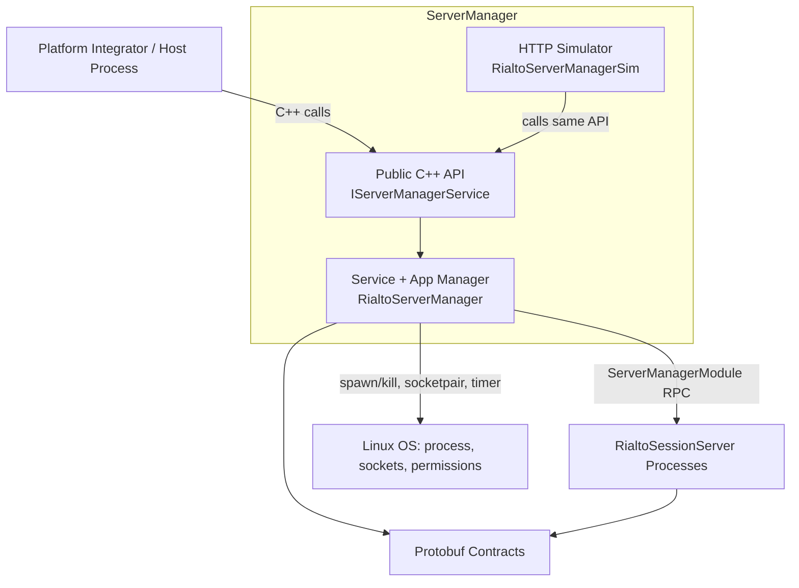
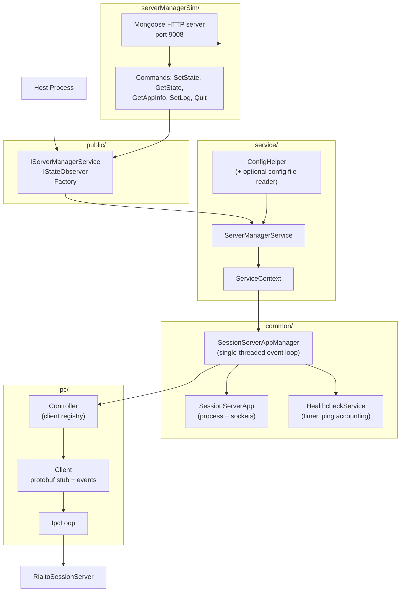

# ServerManager Architecture Brief

Status: Drafted from source analysis
Last Updated: 2026-07-16

## Overview
`serverManager` is the session lifecycle orchestration component of Rialto. It is responsible for:
- Spawning and configuring `RialtoSessionServer` processes.
- Tracking and driving per-application session state transitions.
- Managing health checks (ping/ack) and crash recovery.
- Providing a public C++ API for platform integration.
- Providing a simulator binary (`RialtoServerManagerSim`) with HTTP endpoints for test workflows.

At build time, the module is composed of:
- `RialtoServerManagerPublic` (interface headers).
- `RialtoServerManagerCommon` (session app lifecycle and healthcheck logic).
- `RialtoServerManagerIpc` (protobuf IPC client/controller to session server).
- `RialtoServerManager` (shared library service facade).
- `RialtoServerManagerSim` (HTTP test utility executable).

## Verification Scope
This brief is implementation-verified against the current repository code:
- `serverManager/common`, `serverManager/ipc`, `serverManager/service`, `serverManager/public`, `serverManager/serverManagerSim`
- `proto/servermanagermodule.proto`
- `common/public/include/SessionServerCommon.in`

Design-sequence assumptions from external wiki diagrams were removed or rewritten to match current code behavior.

## Problem Context
ServerManager addresses these platform concerns:
1. Centralized control of session server startup and shutdown per application.
2. Deterministic state transition handling for `UNINITIALIZED`, `INACTIVE`, `ACTIVE`, `NOT_RUNNING`, `ERROR`.
3. Fast and recoverable local IPC wiring between manager and each session server instance.
4. Automatic recovery from process disconnects or repeated healthcheck failures.
5. Consistent propagation of logging levels across manager and managed session servers.

## C4 System Context

## Container View

## Runtime Behavior
### Initialization
1. Host creates service using `create(stateObserver[, config])`.
2. `ConfigHelper` resolves effective configuration (plus optional JSON file overrides).
3. `ServiceContext` constructs `SessionServerAppManager` and IPC `Controller`.
4. `ServerManagerService` preloads session servers if configured.

Detailed initialization behavior from current code paths:
- When config-file support is enabled, config is read in precedence order: base (`RIALTO_CONFIG_PATH`), SoC (`RIALTO_CONFIG_SOC_PATH`), then overrides (`RIALTO_CONFIG_OVERRIDES_PATH`).
- `envVariables` from a more important file replace lower-priority values; `extraEnvVariables` are merged last and can overwrite keys.
- The values of both envVariables and/or extraEnvVariables from the config files from (`RIALTO_CONFIG_PATH`), SoC (`RIALTO_CONFIG_SOC_PATH`) are wiped, if envVariables and/or extraEnvVariables exist in the overrides file (`RIALTO_CONFIG_OVERRIDES_PATH`)
- Effective config includes: number of preloaded servers, session server binary path, startup timeout, and healthcheck interval.
- During preload loop, each server instance performs `NOT_RUNNING -> UNINITIALIZED` and is placed in a free-preload pool only after successful READY signaling.
- Startup timeout failure path performs forced cleanup (kill process, unbind/free socket if created) and reports an error state.

### Application Lifecycle
1. Host calls `initiateApplication(appId, state, appConfig)` for `INACTIVE` or `ACTIVE` startup.
2. App manager either reuses a preloaded process or launches a new one.
3. App manager creates/owns session management socket name (or fd mode when named socket initialized).
4. IPC client connects to the app-management socket pair and sends `setConfiguration` RPC.
5. State changes propagate back through `StateChangedEvent` and observer callback.

Additional lifecycle details from current code paths:
- If no preloaded server is available, manager allocates socketpair, spawns server, starts READY timer, then enters `UNINITIALIZED` pending first server message.
- If preload is enabled and free entries exist, manager allocates the first free preloaded server and skips cold spawn.
- If `clientIpcSocketName` is absent in app config, manager/session-server generates a unique socket name for app-to-session-server IPC.
- `SetConfiguration` carries target startup state, session socket identity, app display metadata, logging level, and resource constraints.
- On successful `UNINITIALIZED -> INACTIVE`, manager can return connection data through `getAppConnectionInfo(appId)` so host/container launch can inject socket details into the app runtime.

### State Transition API
- `changeSessionServerState(appId, state)` sends `setState` RPC for an existing server.
- Transition to `NOT_RUNNING` removes client and server entry from manager registry.

Transition-level semantics:
- `INACTIVE -> ACTIVE`
    - Manager sends `setState(ACTIVE)`.
    - Session server allocates shared-memory transport for media path.
    - On success, state notifications are emitted to both internal and host observers.
    - On failure, partially allocated resources are released and state becomes `ERROR`.
- `ACTIVE -> INACTIVE`
    - Manager sends `setState(INACTIVE)`.
    - Session server releases active playback/CDM/player resources and unmaps shared memory.
    - Final state is `INACTIVE` with observer notification.
- `INACTIVE -> NOT_RUNNING`
    - Manager sends `setState(NOT_RUNNING)`.
    - Session server closes app IPC, emits `NOT_RUNNING`, then self-terminates.
    - Manager receives disconnect/terminal state and removes bookkeeping.
- `ACTIVE -> NOT_RUNNING`
    - Composite of `ACTIVE -> INACTIVE` cleanup plus `INACTIVE -> NOT_RUNNING` termination path.
    - Used for immediate stop flows where app is still holding runtime resources.
- `NOT_RUNNING -> ACTIVE`
    - Same bootstrap steps as `NOT_RUNNING -> INACTIVE`, but target post-config state is `ACTIVE` and shared-memory allocation is included.

### Healthcheck and Recovery
- `HealthcheckService` periodically generates ping IDs and requests pings via IPC.
- Missing/failed ack marks server state as `ERROR`.
- When failures reach configured threshold, manager triggers `restartServer(serverId)`.
- IPC disconnect callback also triggers restart recovery flow.

Detailed ping/ack mechanism:
- Healthcheck runs in a periodic loop (documented example cadence: every 5 seconds) across all tracked application session servers.
- Manager uses one periodic healthcheck timer (`healthcheckInterval`) and tracks which servers still owe an ack for the current ping id.
- Session server propagates ping into its internal threads and, when a client IPC connection exists, forwards ping to the client.
- If no client IPC connection is established yet, the client-forwarding path is skipped and session server can acknowledge directly.
- Ack correlation is strict: only `ack.unique_id == current_ping_id` clears outstanding status; late/stale acks are logged and ignored (or removed from failed history if applicable).
- On each periodic tick, any server still outstanding from the previous ping id is treated as timed out.

Timeout and disconnect branches:
- Timed-out preloaded server (not assigned to app): manager kills and respawns server to maintain preload pool integrity.
- Timed-out assigned server: manager reports `ERROR` via the normal observer callback path and updates failed-ping history.
- Once `numOfFailedPings >= numOfFailedPingsBeforeRecovery`, manager restarts that session server.
- Unexpected manager-session-server socket disconnect is treated as failure input independent of ping timer.
- Disconnect for preloaded server triggers kill+respawn; disconnect for assigned server triggers direct restart flow.

Observed recovery/timeout behavior in implementation:
- READY timeout during startup is treated as initialization failure, followed by process kill and socket cleanup.
- Recovery entry points include both ping-failure threshold breach and unexpected IPC teardown.
- Restarted instances re-enter normal bootstrap path (`NOT_RUNNING -> UNINITIALIZED -> target state`) rather than in-place state patching.

Operational implications for integrators:
- Integrations should treat `stateChanged(appId, ERROR)` and restart-related state churn as failure signals; there is no dedicated `appFailed(application_id)` callback in the current public API.
- Healthcheck false positives can increase if interval is aggressive relative to platform scheduling jitter.
- Preloaded and assigned servers have intentionally different remediation: pool self-healing vs immediate restart/observer-path signaling.

## Detailed State Machine
The following transitions are represented by serverManager runtime and IPC state handling:
1. `NOT_RUNNING -> UNINITIALIZED` (server preloading path)
2. `NOT_RUNNING -> INACTIVE` (cold start without preload)
3. `UNINITIALIZED -> INACTIVE` (configuration + app socket bring-up)
4. `INACTIVE -> ACTIVE` (resource acquisition and shared-memory readiness)
5. `NOT_RUNNING -> ACTIVE` (direct start-to-running)
6. `ACTIVE -> INACTIVE` (resource release without process exit)
7. `INACTIVE -> NOT_RUNNING` (graceful app stop and process exit)
8. `ACTIVE -> NOT_RUNNING` (full cleanup + stop)

Failure handling commonalities across transitions:
- Timeout and spawn failures converge to `ERROR` and cleanup.
- On failure, manager guarantees socket unbind/free when ownership was created in that transition.
- Observer callback propagation is part of the contract and expected at each completed transition edge.

Startup handshake specifics from implementation:
- Manager treats the first message from session server as proof of successful startup readiness.
- READY timer is canceled only after that startup acknowledgment path is reached.
- On startup failure branch, session server performs local cleanup then exits; manager also emits app-level error notification when transition was user-initiated.

## Resource and Socket Contracts
Sequence details add practical contracts for integrators:
- Manager-to-session-server control channel uses socketpair point-to-point IPC.
- App-to-session-server IPC socket may be caller-provided or auto-generated.
- Display integration may set `WAYLAND_DISPLAY` when display name is provided.
- Resource descriptor sent in configuration currently models playback-count and web-audio capability, with extension points for richer capability classes (for example HD/UHD tiers).
- For active sessions, shared memory setup is part of readiness and must be mapped by the app client.

Connection-info contract detail:
- After transition out of not-running, app manager is expected to query `getAppConnectionInfo()` promptly so the socket name can be passed into container/app launch context.
- If app manager provided socket name up front, returned connection info acts as confirmation rather than discovery.
- out of Uninitialized. Preloaded servers do not have socket name assigned yet.

## Transition Matrix
| Transition | Trigger/API | Preconditions | Core actions | Success path/events | Failure path/events |
| --- | --- | --- | --- | --- | --- |
| `NOT_RUNNING -> UNINITIALIZED` (preload) | Internal preload loop during `create(...)` | Preloading enabled; free preload slot target | Create manager/server socketpair; spawn session server; start READY timer | First server startup message received; cancel READY timer; server enters `UNINITIALIZED` and is available in preload pool | Init failure or READY timeout: kill/exit process, unbind/free socket (if created), state converges to `ERROR` for failed instance |
| `NOT_RUNNING -> INACTIVE` (cold or via preloaded) | `initiateApplication(appId, INACTIVE, appConfig)` | App not currently managed; either free preloaded server or spawn capability available | If no preload: socketpair + spawn + READY timer + wait for `UNINITIALIZED`; if preload: pick first free preloaded server | Manager emits app-level state update progression (`UNINITIALIZED` then `INACTIVE` after config stage); app becomes launch-ready | Spawn/init failure or timeout: cleanup resources, emit `stateChanged(appId, ERROR)` |
| `UNINITIALIZED -> INACTIVE` | Internal continuation after initiation (or direct for preloaded) via `SetConfiguration(...)` | Session server process alive; manager has app config | Resolve/generate session socket name; send config (target state, resources, log level, display name); create/listen/bind app IPC socket; optionally set `WAYLAND_DISPLAY` | Session server enters `INACTIVE`; emits state event; manager notifies observer; app manager can call `getAppConnectionInfo(appId)` and retrieve socket name | Bind/config/transition failure: unbind/free session socket if created, emit `ERROR`, terminate failed process path |
| `INACTIVE -> ACTIVE` | `changeSessionServerState(appId, ACTIVE)` | Valid appId/server mapping exists; server reachable over IPC | Manager routes `SetState(ACTIVE)` to owning server; server allocates shared-memory buffer | Session server enters `ACTIVE`; emits state event; manager forwards observer event; app side obtains/maps shared memory | Allocation/state failure: free partially allocated shared memory; emit `stateChanged(appId, ERROR)` |
| `NOT_RUNNING -> ACTIVE` | `initiateApplication(appId, ACTIVE, appConfig)` | Same as cold/preloaded start | Bootstrap as `NOT_RUNNING -> INACTIVE` plus active target behavior | App reaches running/active readiness with shared memory setup | Any bootstrap/config/allocation failure follows cleanup + `ERROR` notification path |
| `ACTIVE -> INACTIVE` | `changeSessionServerState(appId, INACTIVE)` | App currently active/running | Send `SetState(INACTIVE)`; free CDM resources; free player resources (for example active pipelines); unmap/free shared memory | Session server enters `INACTIVE`; emits state event; manager forwards observer event | If deactivation fails, system may emit error state (implementation-dependent branch), with partial cleanup applied where possible |
| `INACTIVE -> NOT_RUNNING` | `changeSessionServerState(appId, NOT_RUNNING)` | App currently inactive; mapped server exists | Send `SetState(NOT_RUNNING)`; close app IPC; session server emits not-running then self-terminates | Observer receives `stateChanged(appId, NOT_RUNNING)`; manager removes registry/client bookkeeping | If IPC/process termination is abnormal, disconnect/recovery logic may trigger restart/error handling |
| `ACTIVE -> NOT_RUNNING` | `changeSessionServerState(appId, NOT_RUNNING)` | App active and mapped | Composite cleanup: perform active-resource teardown (as in `ACTIVE -> INACTIVE`) then close app IPC/terminate (as in `INACTIVE -> NOT_RUNNING`) | App ends in not-running with resource cleanup complete; manager updates observer and removes mapping | Failure in either sub-stage may surface as `ERROR` and/or disconnect-triggered recovery path |

### Matrix Notes
- Observer contract: each completed transition edge should result in manager-to-host `stateChanged(appId, state)` notification.
- Connection info usage: after leaving Uninitialized, app manager should query `getAppConnectionInfo(appId)` promptly unless socket name was pre-supplied.

## Healthcheck Outcome Matrix
| Condition | Detection point | Manager action | Notification | Recovery behavior |
| --- | --- | --- | --- | --- |
| Ping acknowledged with matching unique id | Ack received for current ping id | Remove server from outstanding ack set; clear failed-ping counter | None beyond normal operation | Continue periodic healthcheck loop |
| Ack missing (timer fires), server preloaded/unassigned | Healthcheck timer expiry | Kill session server and spawn replacement | No app-level failure event (no app assigned) | Rebuild preload pool entry |
| Ack missing (timer fires), server assigned to app, below threshold | Healthcheck timer expiry | Mark server `ERROR`; increment failed-ping history | Observer callback `stateChanged(appId, ERROR)` | No immediate restart; continue monitoring |
| Ack missing (timer fires), server assigned to app, threshold reached | Healthcheck timer expiry with `numOfFailedPings >= numOfFailedPingsBeforeRecovery` | Restart session server | Observer receives restart-related state transitions (including `NOT_RUNNING`) | Full server recovery path for that app |
| Unexpected socket disconnect, server preloaded/unassigned | IPC disconnect callback | Kill and respawn session server | None | Restore preload availability |
| Unexpected socket disconnect, server assigned to app | IPC disconnect callback | Invoke restart flow for disconnected server | Observer receives restart-related state transitions | Recovery performed by manager restart path |

### Healthcheck Notes
- The ping id correlation check prevents stale or reordered ack messages from falsely clearing watchdog state.
- Healthcheck path and startup READY path are separate timers with different intent: runtime liveness vs boot readiness.
- Runtime healthcheck timeout is derived from the next periodic tick while a server remains outstanding, not from dedicated per-server timer objects.

## Key Design Decisions
- Single event-thread serialization in `SessionServerAppManager` prevents state races around process and IPC lifecycle.
- Per-server IPC clients are guarded by a mutexed controller map.
- Preloaded server pool reduces startup latency for first-use apps.
- Recovery is policy-based (`numOfFailedPingsBeforeRecovery`) rather than immediate hard reset on first signal.
- Socket path strategy supports autogenerated, absolute-path, and name-only input forms.

## Key Decisions
Architectural decisions and rationale for `RialtoServerManager`:
- Why local protobuf IPC + Unix sockets (instead of network/database-backed orchestration)?
    - Session orchestration is local to the host runtime and tightly coupled to process lifecycle, fd passing, and socket permissions.
    - Local IPC keeps latency and failure surface small and avoids introducing network/database dependencies into startup and recovery paths.
- Why asynchronous/event-driven processing for this workflow?
    - State changes, ping/ack healthchecks, process exits, and IPC disconnects are all asynchronous events.
    - A serialized event-thread model provides deterministic ordering while avoiding coarse global locks around lifecycle operations.
- Why this service boundary (public API + common manager + IPC controller + simulator)?
    - Public API isolates integrator-facing contracts (`IServerManagerService`, `IStateObserver`).
    - Common layer owns lifecycle state machine and recovery policy.
    - IPC layer encapsulates protobuf client/event plumbing to session servers.
    - Simulator remains test-only and reuses the same service API, reducing divergence between test and production behavior.

## Patterns & Conventions
How code is organized and written in this subsystem:
- File naming conventions:
    - Public interfaces are exposed in `public/` using interface-style headers.
    - Implementation types in `common/`, `service/`, and `ipc/` use PascalCase file names aligned with class names.
    - Supporting test utility code lives under `serverManagerSim/`.
- Error handling patterns:
    - Explicit state-machine error transitions to `ERROR` for failed lifecycle operations.
    - Timeout/disconnect failures trigger deterministic cleanup (socket unbind/free, process restart/termination path).
    - Healthcheck and startup timers are treated as first-class failure detectors with policy-driven recovery.
- Testing approaches:
    - Unit tests in `tests/unittests/` validate lifecycle logic, configuration behavior, and edge-case handling.
    - Component/integration tests are not available for Rialto Server Manager.
    - `RialtoServerManagerSim` provides HTTP-driven integration workflows for state/control-path validation.

## Public API Surface
Primary host-facing API from `IServerManagerService`:
- `initiateApplication(appId, state, appConfig)`
- `changeSessionServerState(appId, state)`
- `getAppConnectionInfo(appId)`
- `setLogLevels(logLevels)`
- `registerLogHandler(handler)`

Observer callback from `IStateObserver`:
- `stateChanged(appId, state)`

## Internal IPC Contract
`ServerManagerModule` protobuf service (`proto/servermanagermodule.proto`) methods:
- `setConfiguration(SetConfigurationRequest)`
- `setState(SetStateRequest)`
- `setLogLevels(SetLogLevelsRequest)`
- `ping(PingRequest)`

Asynchronous events consumed by manager IPC client:
- `StateChangedEvent`
- `AckEvent`

## Data Model
Key entities and relationships:
- `SessionServerState`
    - Enum lifecycle model: `UNINITIALIZED`, `INACTIVE`, `ACTIVE`, `NOT_RUNNING`, `ERROR`.
    - Used as the canonical state for transition commands and observer notifications.
- `AppConfig`
    - Per-application startup parameters including `clientIpcSocketName` and `clientDisplayName`.
    - Binds application identity to connection details consumed by app/container launch.
- `ServerManagerConfig`
    - Global policy/config object controlling preload count, server binary path, startup timeout, healthcheck interval, socket permissions, and recovery threshold.

Entity relationships:
- One server manager instance controls many session server processes.
- Each managed application maps to one active session server instance at a time.
- Session server instances reference both global manager config and per-app config during `setConfiguration`.
- Healthcheck bookkeeping (outstanding-ack set and failed-ping history) is maintained per session server instance.

IPC request model notes:
- `SetConfigurationRequest` supports both socket-name and socket-fd forms (`sessionManagementSocketName` or `sessionManagementSocketFd`).
- Socket ownership and group (`socketOwner`, `socketGroup`) are part of configuration contract when name-based socket setup is used.
- Protobuf also includes `subtitleClockResyncInterval`, which is currently part of contract surface even if not central to manager flow documentation.

Core shared model (`SessionServerCommon`) fields used by orchestration:
- `sessionServerEnvVars`
- `numOfPreloadedServers`
- `sessionServerPath`
- `sessionServerStartupTimeout`
- `healthcheckInterval`
- `sessionManagementSocketPermissions`
- `numOfFailedPingsBeforeRecovery`

## Simulator Interface
`RialtoServerManagerSim` exposes an HTTP test control plane on `0.0.0.0:9008`:
- `POST /SetState/<AppName>/<NewState>`
- `GET /GetState/<AppName>`
- `GET /GetAppInfo/<AppName>`
- `POST /SetLog/<component>/<level>`
- `POST /Quit`

This simulator is intended for integration/testing workflows and drives the same service API used by production integrations.

SME operational notes for deployment and troubleshooting:
- [RialtoServerManager SME Notes](SME-notes.md)

## Deployment
How and where this runs:
- Runtime model:
    - `RialtoServerManager` is a shared library embedded by a host/platform process.
    - It manages multiple child `RialtoSessionServer` processes on the same Linux host.
- Communication:
    - Manager-to-session-server control uses local socketpair/protobuf IPC.
    - App-to-session-server connection details are provided through `getAppConnectionInfo()`.
- Environment assumptions:
    - POSIX process/signal/socket APIs are available.
    - Socket permission/ownership settings can be applied by deployment policy.
- Optional test deployment:
    - `RialtoServerManagerSim` runs as an HTTP utility on port `9008` for integration environments.

## Operational Characteristics
- Process model: one manager instance controlling multiple session server child processes.
- IPC transport: local socketpair plus protobuf RPC/events.
- Socket ownership/permissions can be configured and applied on bind.
- Startup timeout is optional; when triggered it marks state `ERROR` and performs cleanup.
- Logging can be routed via registered custom log handler and propagated to managed servers.

## Risks and Trade-offs
- Restart behavior uses `SIGKILL`, which is robust but can skip graceful session teardown.
- Hardcoded max resource defaults (`maxPlaybacks=2`, `maxWebAudioPlayers=1`) in `SessionServerApp` are noted as temporary.
- Healthcheck policy depends on timer scheduling and ack timing; very aggressive intervals can create false positives.

## Known Limitations
What this subsystem does not do well or cannot guarantee yet:
- Graceful shutdown is not guaranteed in all recovery paths because restart logic can use hard process kill.
- Healthcheck can produce false positives on heavily loaded systems if timing policy is too aggressive.
- Resource capability modeling is currently coarse (for example playback count and web-audio flag), with richer tiers still future-facing.
- Current behavior relies on strict callback/event ordering assumptions that should be validated continuously under stress.

## Validation Pointers
For future hardening, validate:
1. Concurrent app initiation and state transitions under stress.
2. Recovery behavior for repeated IPC disconnect loops.
3. Socket permission/ownership handling across deployment environments.
4. Config precedence when JSON config file support is enabled.
5. End-to-end observer callback ordering guarantees during restart.
